# 任務 2：建立並配置 Redshift 集群

 

## 配置 `Redshift`

1. 進入 `Redshift`。

    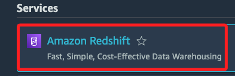

 

2. 點擊進入 Cluster；`Redshift 集群` 是數據倉庫的主要基礎設施組件，由一個或多個計算節點組成。集群的領導節點負責與客戶端應用程式交互，其他節點則進行計算。

    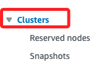

 

3. 在下方 `Clusters` 區塊中點擊 `Create cluster`。

    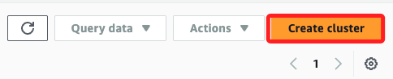

 

4. `Cluster identifier` 使用預設名稱 `redshift-cluster-1` 集群。

    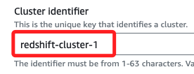

 

5. `Node type` 切換為為 `dc2.large`

    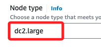

 

6. `Number of nodes` 使用預設值 `2`。

    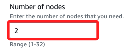

 

7. 在 `Database configurations` 區塊，使用預設的名稱 `awsuser`，並切換為手動建立密碼 `Manually add the admin password`；在 `Admin user password` 下方框中輸入自訂密碼，特別注意，密碼必須八個字元以上，並且至少包含一個大寫字母、一個小寫字母。

    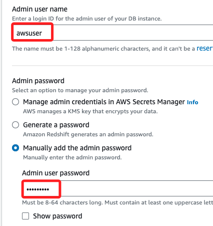

 

## 關於 Database encryption

_教程中並未提及這個部分_

 

1. 這裡勾選 `AWS managed key`，因為 Lab 並未被授權使用 `Customer managed key`；相關操作細節後補。

    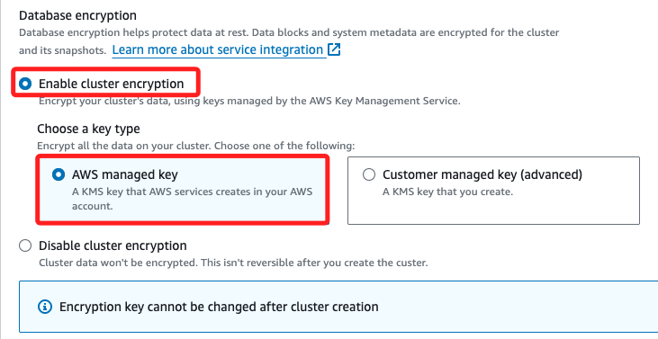

 

## 回到 Redshift

_教程內容與面板略有不同，這裡將以實際操作作為筆記_

 

1. 在 `Cluster permissions` 下的 `Associated IAM roles` 區塊，下拉 `Actions` 選單，點擊 `Associate IAM roles`。

    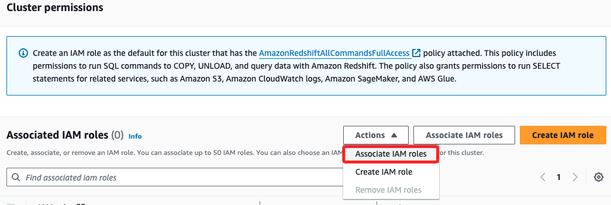

 

2. 在彈窗中選取 `MyRedshiftRole`，然後點擊 `Associate IAM roles`。

    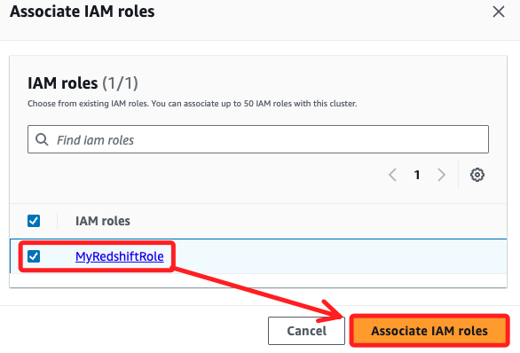

 

3. 完成後，在 `Associated IAM roles` 會顯示 `(1/1)`，沒勾選時會顯示 `(1)`。

    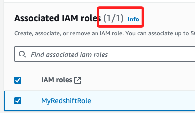

 

4. 完成以上步驟，點擊右下角 `Create cluster`；這需要幾分鐘時間來完成，過程中 `Status` 會顯示 `Creating`。

    

 

5. 顯示 `Available` 後表示完成；點擊 `Cluster` 的名稱 `redshift-cluster-1` 處進入。

    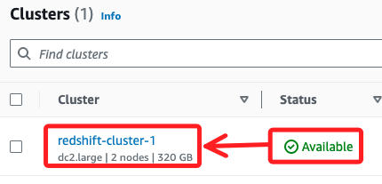

 

6. 上方會出現彈窗，官方教程特別提到，請忽略這些提示。

    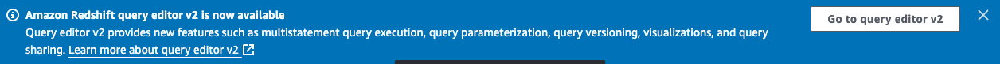

 

## 配置 VPC

1. 說明提到接下來要配置託管 Redshift 叢集的 VPC，允許流量通過預設連接埠 5439，也就是為 VPC 配置一個安全性群組，並將 Redshift Cluster 新增至該安全性群組。

    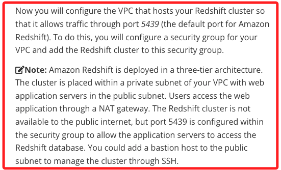

 

2. 特別注意，說明中提到 Redshift 部署在 `三層架構` 中，這類模式在 AWS 文件中經常提到，也就是將部署在 `公共子網` 的網頁伺服器作為 `表示層`，與 `私有子網` 中的 `應用程式資料庫層` 進行互動，其中 `應用層` 是處理業務邏輯的伺服器與資料庫進行互動，在 AWS 中就是網頁應用伺服器對 Redshift 資料庫進行查詢或儲存數據；最後的 `資料層` 是資料庫所在的層級，通常位於 `私有子網` 中，不直接暴露於公網；`應用層` 的伺服器通過設置好的安全組和端口來訪問這些私有的資源，在 `Redshift` 預設的端口號為 `5439`。

 

3. 另外，說明也提到使用者是透過 NAT 網關存取 Web 應用程式，也就是說用戶的請求是間接到達 `私有子網` 中的數據庫資源，確保數據庫不會直接暴露給公網。

 

4. 說明最後提到可將 `堡壘主機（bastion host）` 新增至 `公用子網` 以透過 SSH 管理叢集，u=也就是可通過在 `VPC` 的 `公共子網` 中部署一個 `堡壘主機` 來實現對 `私有子網` 中 `Redshift Cluster` 的安全訪問和管理，堡壘主機可作為管理者登錄 `私有子網` 中資源的唯一入口，確保不直接暴露私有資源。

 

## 建立安全性群組

_配置對 Redshift 資料庫的存取_

 

1. 進入 `EC2`。

    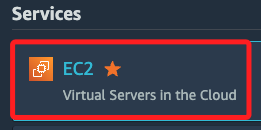

 

2. 點擊 `Security Groups`。

    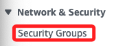

 

3. 當前有三個安全組。

    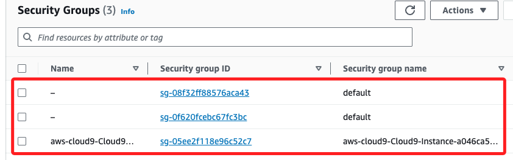

 

4. 點擊右上角 `Create security group`。

    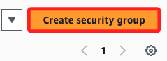

 

5. 命名為 `Redshift security group`，描述則填入 `Security group for my Redshift cluster`。

    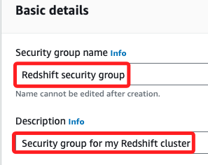

 

6. VPC 使用預設的設定不用變動。

    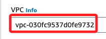

 

7. 在 `Inbound rules` 區塊點擊 `Add rule` 添加入站規則。

    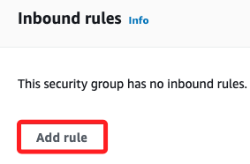

 

7. Type 選擇 `Redshift`，`Source` 選擇 `Anywhere-IPv4`，這預設會帶入 `0.0.0.0/0`，描述則填入 `Redshift inbound rule`。

    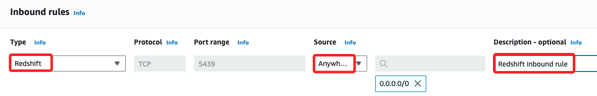

 

8. 然後點擊右下角 `Create security group`。

    

 

## 將 Cluster 新增至安全性群組

_回到 Redshift 主控台_

 

1. 點擊進入前面步驟建立的 Cluster。 

    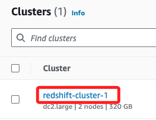

 

2. 切換頁籤到 `properties`。

    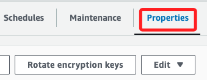

 

3. 在 `Network and security settings` 區塊，點擊右側 `Edit`。

    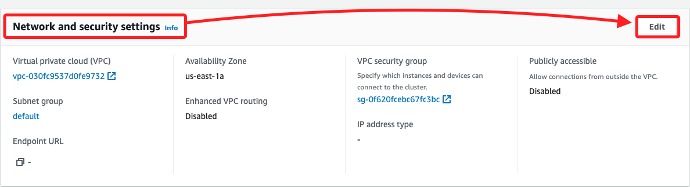

 

4. 在 `VPC security groups` 區塊，在下拉選單中勾選 `Redshift security group`，並取消勾選 `default`。

    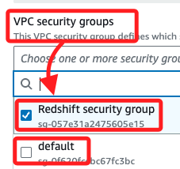

 

5. 其餘不變，點擊右下角 `Save changes`。

    

 

6. 這實在 Clusters 區塊進行刷新，會發現 Cluster 狀態改變為 `Modifying`；要等候五分鐘左右，讓狀態重新恢復到 `Available`。

    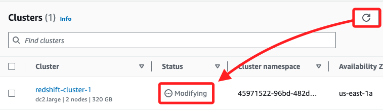

 

___

_END_
