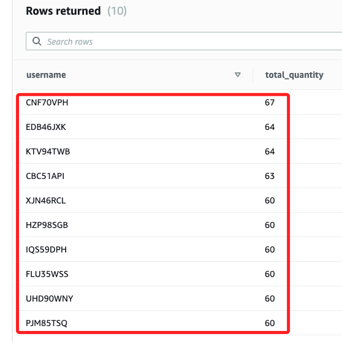

# 任務 5：查詢數據

_資料集已成功匯入 Redshift Cluster，接下來要編寫 Query 來產生所需報告。_

<br>

## 預覽資料

1. 在前面步驟已經操作過，透過 `Preview data` 可查看資料，資料內容如下，不再贅述。

    

<br>

2. 透過以下語句可查詢並計算 `2008/01/05` 當天銷售的 `商品總數（qtysold）`。

    ```sql
    SELECT sum(qtysold)
    FROM sales, date
    WHERE sales.dateid = date.dateid
    AND caldate = '2008-01-05';
    ```

    _查詢結果_

    

<br>

3. 以下是按數量尋找前 10 位買家。

    ```sql
    SELECT username, total_quantity
    FROM
    (SELECT buyerid, sum(qtysold) total_quantity
    FROM  sales
    GROUP BY buyerid
    ORDER BY total_quantity desc limit 10) Q, users
    WHERE Q.buyerid = userid
    ORDER BY Q.total_quantity desc;
    ```

<br>

4. 查詢傳回客戶使用者名稱以及銷售給每位客戶的總數量，按 `total_quantity` 欄位排序，並且限制為 `10` 個結果。

    

<br>

___

_END_