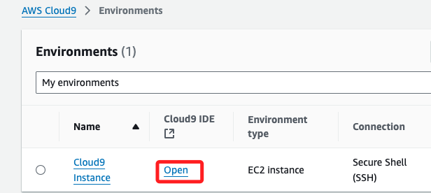
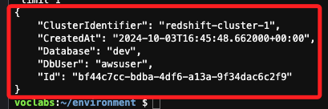
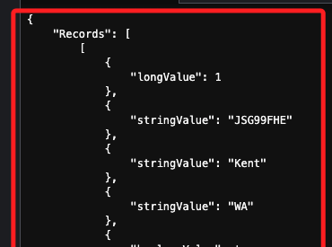

# 任務 6：使用 AWS CLI 運行查詢

_除了在控制台運行查詢，還可以使用 Amazon Redshift API、AWS SDK 庫和 AWS CLI 來執行操作。以下將使用 Cloud9 終端執行 AWS CLI 指令，來查詢 Redshift 集群中的數據。_

<br>

## 步驟

1. 進入 `Cloud9`，並開啟 Lab 準備好的實例，細節不贅述。

    

<br>

2. 在終端機運行以下指令，這指令是在 Redshift Cluster 中執行 SQL 查詢，從 `dev` 數據庫中的 `users` 表中查詢並返回一行數據。

    ```bash
    aws redshift-data execute-statement --region us-east-1 --db-user awsuser --cluster-identifier redshift-cluster-1 --database dev --sql "select * from users limit 1"
    ```

    

<br>

3. 使用前一個步驟取得的 id 值 `bf44c7cc-bdba-4df6-a13a-9f34dac6c2f9` 運行以下指令，這個指令會使用 `ID` 來檢索之前查詢的數據，也就是返回查詢的結果集，類似於在 SQL 查詢編輯器中查看結果的效果。

    ```bash
    aws redshift-data get-statement-result  --id <填入 ID> --region us-east-1
    ```

    _實際命令_

    ```bash
    aws redshift-data get-statement-result  --id bf44c7cc-bdba-4df6-a13a-9f34dac6c2f9 --region us-east-1
    ```

<br>

4. 回傳數據很長，請自行運行指令查看。

    

<br>

___

_END_