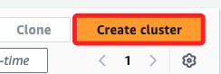

# Task 1：啟動 EMR cluster

_使用 Amazon EMR 處理日誌_

 

## 開始

1. 搜尋並進入 `EMR`。

    

 

2. 點擊右上角 `Create cluster`。

    

 

3. 命名為 `Hive EMR cluster`。

    

 

4. `Amazon EMR release` 選擇 `emr-5.29.0`。

    

 

5. 在 `Application bundle` 區塊勾選 `Hadoop 2.8.5` 及 `Hive 2.3.6`。

    

 

## 設定硬體

1. `Primary` 選擇 `m4.large`。

    

 

2. `Core` 也選擇相同規格。

    

 

3. 展開 `Cluster scaling and provisioning`，其中 Core 的 Instance size 必須設置為 `2`。

    

 

4. 展開 `Networking`，先點擊 `Browse` 設定 `VPC`。

    

 

5. 選取 `Lab VPC`，然後點擊 `Choose`。

    

 

6. `Subnet` 預設已經是 `Lab subnet`。

    

 

7. 展開 `Cluster termination and node replacement`，確認 `Use termination protection` 未被勾選。

    

 

8. 展開 `Cluster logs`，點擊 `Browse S3`。

    

 

9. 勾選前綴為 `hive-output-xxxxxx` 的 Bucket，然後點擊 `Choose`。

    

 

10. 展開 `Security configuration and EC2 key pair Info`，在 `Amazon EC2 key pair for SSH to the cluster` 部分，從下拉選單中選取預設的 `vockey`；稍後會下載這個密鑰對文件 `labsuser.pem`。

    

 

11. 展開 `Identity and Access Management (IAM) roles`，在 `Amazon EMR service role` 部分，使用預設的 `Choose an existing service role` 選項，然後在 `Service role` 中從下拉選單中選取 `EMR_DefaultRole`。

    

 

12. 在下方的 `EC2 instance profile for Amazon EMR` 中，則選取 `EMR_EC2_DefaultRole`。

    

 

13. 完成以上設置，點擊右下角的 `Create cluster`。

    

 

## 確認安全群組

1. 滑動到最下方並展開 `EC2 security groups (firewall)`，點擊 `Primary node` 中的安全群組；這會開啟新的瀏覽頁籤並進入 `EC2` 主控台。

    

 

2. 在 `Inbound rules` 頁籤中點擊右側的 `Edit inbound rules`。

    

 

3. 點擊最下方的 `Add rule` 添加入站規則。

    

 

4. `Type` 選取 `SSH`，`Source` 選取 `Anywhere-IPv4`，這會自動帶入 `0.0.0.0/0`；然後點擊 `Save rules`。

    

 

## 返回 EMR

1. 在 `Clusters` 中，確認實體狀態是 `Waiting`。

    

 

2. 勾選後點擊 `View details`。 

    

 

3. 切換到 `Instances` 頁籤，確認狀態都是 `Running`。

    

 

___

_END_
