# Task 2：透過SSH連接Hadoop主節點

<br>

## 在 EMR 複製 DNS

1. 可複製 `Primary node public DNS` 備用；或保留畫面稍後再進行複製。

    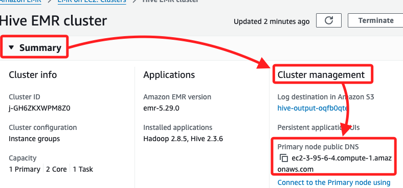

<br>

## 前往 Cloud9

1. 進入 Cloud9，點擊 `Open` 開啟預設的 IDE。

    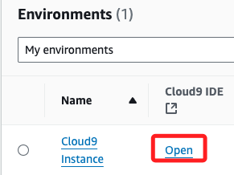

<br>

2. 開啟新文件 `New File`；特別注意，這裡這份文件僅用作貼上前面複製的 DNS 備用，除此並無編輯任何腳本。

    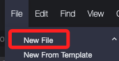

<br>

3. 把前面複製的 DNS 貼在文件中。

    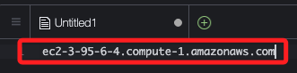

<br>

## 開啟 Lab 首頁

1. 在 Lab 簡介頁面中，點擊上方 `! AWS Details`。

    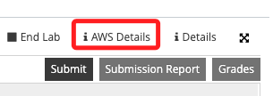

<br>

2. 點擊其中的 `Download PEM` 下載文件。

    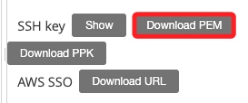

<br>

3. 會下載文件到本地。

    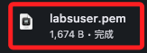

<br>

## 回到 Cloud9

1. 展開 `File`，點擊 `Upload Local Files...` 上傳文件。

    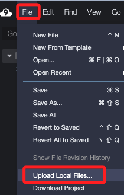

<br>

2. 上傳前一個步驟下載的 `labsuser.pem`；完成後點擊 `X` 關閉彈窗。

    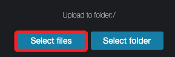

<br>

3. 完成後，在 Cloud9 的左側會看到。

    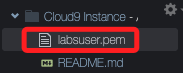

<br>

4. 在終端機中使用 `ls` 指令確認文件在當前路徑中。

    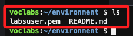

<br>

5. 依照 AWS 規範，要對密鑰文件降低權限。

    ```bash
    chmod 400 labsuser.pem
    ```

<br>

6. 透過指令 `ls -l` 可查看當前路徑中文件的權限設定。

    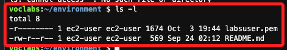

<br>

## 連線

1. 運行以下指令進行連線，要替換其中的 `<公共DNS>`，就是前面步驟複製並貼在上方文件中的 DNS。

    ```bash
    ssh -i labsuser.pem hadoop@<公共DNS>
    ```

<br>

2. 輸入 `yes` 完成連線。

    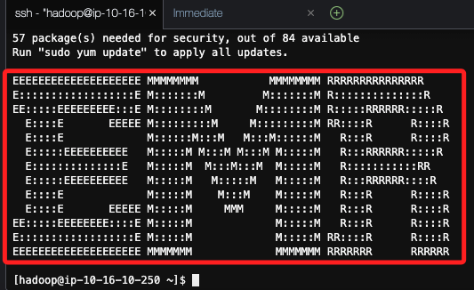

<br>

___

_END_