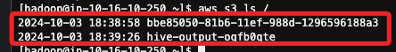
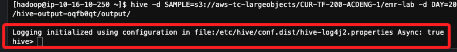

# Task 3：運行 Hive

<br>

## 步驟

1. 為 Hive 建立日誌記錄目錄。

    ```bash
    sudo chown hadoop -R /var/log/hive
    mkdir /var/log/hive/user/hadoop
    ```

<br>

## 配置 Hive

1. 取得要儲存 Hive 輸出的 S3 Bucket 的名稱，以下查詢的結果是 `hive-output-oqfb0qte`。

    ```bash
    aws s3 ls /
    ```

    

<br>

2. 運行以下指令，替換其中 `<取得的名稱>` 的為前面步驟得到的名稱。

    ```bash
    hive -d SAMPLE=s3://aws-tc-largeobjects/CUR-TF-200-ACDENG-1/emr-lab -d DAY=2009-04-13 -d HOUR=08 -d NEXT_DAY=2009-04-13 -d NEXT_HOUR=09 -d OUTPUT=s3://<取得的名稱>/output/
    ```

    _實際指令如下_

    ```bash
    hive -d SAMPLE=s3://aws-tc-largeobjects/CUR-TF-200-ACDENG-1/emr-lab -d DAY=2009-04-13 -d HOUR=08 -d NEXT_DAY=2009-04-13 -d NEXT_HOUR=09 -d OUTPUT=s3://hive-output-oqfb0qt/output/
    ```

<br>

3. 這個指令需要幾秒鐘才能運行，然後顯示如下的輸出，表示已連線到互動式 Hive 用戶端。

    

<br>

___

_END_
