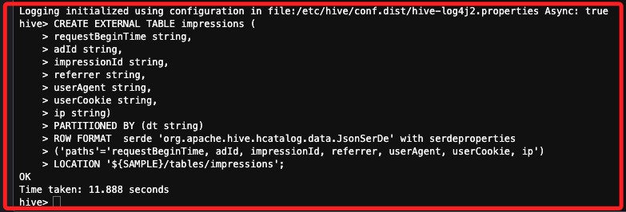

# Task 4：使用 Hive 從來源資料建立表

<br>

## 步驟

1. 若要建立名為 `impressions` 的外部表，可在 Cloud9 終端機中執行下列程式碼；這個表結構定義了 `7` 個欄位，Hive 指定使用 `JsonSerDe` 來將 `JSON` 格式的數據解析成結構化數據，並將其映射到表的定義中；S3 中存儲的 JSON 數據包含 16 個頂層鍵值對，如 `number`、`referrer`、`processId` 等，但是在創建表時只引用了其中的 `7` 個欄位，因此這個表只會引用部分 JSON 數據。

    ```sql
    CREATE EXTERNAL TABLE impressions (
    requestBeginTime string,
    adId string,
    impressionId string,
    referrer string,
    userAgent string,
    userCookie string,
    ip string)
    PARTITIONED BY (dt string)
    ROW FORMAT  serde 'org.apache.hive.hcatalog.data.JsonSerDe' with serdeproperties
    ('paths'='requestBeginTime, adId, impressionId, referrer, userAgent, userCookie, ip')
    LOCATION '${SAMPLE}/tables/impressions';
    ```

<br>

2. 完成時顯示如下。

    

<br>

## 更新 `impressions` 表的 Hive 元數據以包含所有分區

1. 執行以下命令來查看 `impressions` 表目前有多少個分區。

    ```sql
    describe formatted impressions;
    ```

<br>

2. 該命令將輸出列名、數據位置、分區數量以及其他與表相關的元數據。`numPartitions` 一行應顯示 0。

<br>

3. 執行以下命令來忽略路徑驗證並修復表的分區；特別注意，`MSCK REPAIR TABLE` 命令會掃描 Amazon S3 中的新分區，這些分區是在表創建後添加的，若發現分區，這些分區將被加入到表的元數據中，此命令是 AWS 版本 Hive 的擴展功能。

    ```sql
    set hive.msck.path.validation=ignore;
    MSCK REPAIR TABLE impressions;
    ```

<br>

4. 當命令完成後，輸出應類似如下。

    ```
    Repair: Added partition to metastore impressions:dt=2009-04-14-12-10
    Repair: Added partition to metastore impressions:dt=2009-04-14-12-15
    Repair: Added partition to metastore impressions:dt=2009-04-14-12-20
    Repair: Added partition to metastore impressions:dt=2009-04-14-13-00
    Time taken: ...[truncated]
    ```

<br>

5. 再次運行以下命令來確認分區數量，輸出應顯示表中現在包含 241 個分區。

    ```sql
    describe formatted impressions;
    ```

<br>

## 創建另一個外部表並發現其分區

1. 執行以下命令來創建一個名為 `clicks` 的外部表，並將其指向存儲在 Amazon S3 中的點擊流日誌數據。

    ```sql
    CREATE EXTERNAL TABLE clicks (impressionId string, adId string)
    PARTITIONED BY (dt string)
    ROW FORMAT  serde 'org.apache.hive.hcatalog.data.JsonSerDe'
    WITH SERDEPROPERTIES ('paths'='impressionId')
    LOCATION '${SAMPLE}/tables/clicks';
    ```

<br>

2. 為了返回來自點擊流日誌數據的所有分區，執行以下命令，該命令會掃描 S3 中的點擊流數據，並將新發現的分區加載到 Hive 的元數據中。

    ```sql
    MSCK REPAIR TABLE clicks;
    ```

<br>

3. 與 `impressions` 表類似，`clicks` 表引用的是存儲在 S3 中的日誌數據，並且只導入了部分字段，通過使用 `MSCK REPAIR TABLE` 命令，Hive 會自動查找並修復 S3 中的分區，將其加入元數據存儲中，以確保查詢時能夠正確訪問數據。

<br>

4. 驗證這兩個表現在存在。

    ```sql
    show tables;
    ```

<br>

5. 描述點擊表。

    ```sql
    describe formatted clicks;
    ```

<br>

___

_END_