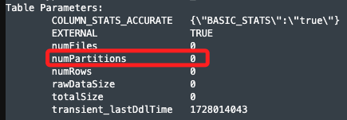
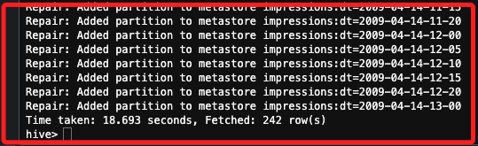
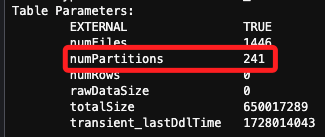
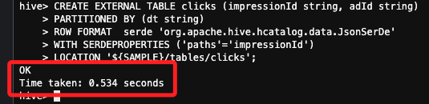
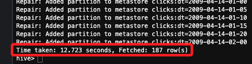
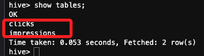

# Task 4：使用 Hive 從來源資料建立表

<br>

## 步驟

1. 若要建立名為 `impressions` 的外部表，可在 Cloud9 終端機中執行下列程式碼；這個表結構定義了 `7` 個欄位，Hive 指定使用 `JsonSerDe` 來將 `JSON` 格式的數據解析成結構化數據，並將其映射到表的定義中；S3 中存儲的 JSON 數據包含 16 個頂層鍵值對，如 `number`、`referrer`、`processId` 等，但是在建立表時只引用了其中的 `7` 個欄位，因此這個表只會引用部分 JSON 數據。

    ```sql
    CREATE EXTERNAL TABLE impressions (
    requestBeginTime string,
    adId string,
    impressionId string,
    referrer string,
    userAgent string,
    userCookie string,
    ip string)
    PARTITIONED BY (dt string)
    ROW FORMAT  serde 'org.apache.hive.hcatalog.data.JsonSerDe' with serdeproperties
    ('paths'='requestBeginTime, adId, impressionId, referrer, userAgent, userCookie, ip')
    LOCATION '${SAMPLE}/tables/impressions';
    ```

<br>

2. 完成時會顯示 `OK`。

    

<br>

## 更新 `impressions` 表的 Hive 元數據以包含所有分區

1. 執行以下指令來查看 `impressions` 表目前有多少個分區。

    ```sql
    describe formatted impressions;
    ```

<br>

2. 輸出的結果包含列名、數據位置、分區數量以及其他與表相關的元數據；其中 `numPartitions` 一行應顯示 `0`，這是 Hive 表格中目前存在的分區數量，分區是用來對大規模資料進行邏輯上的分段，這樣可以提高查詢的性能；查詢結果顯示 `numPartitions` 為 `0` 表示目前這個表格還沒有任何分區。

    

<br>

3. 執行指令設定 Hive 忽略路徑驗證；後續會運行 `MSCK REPAIR TABLE` 指令，屆時 Hive 會掃描外部存儲 `S3` 的路徑來搜尋符合 Hive 分區結構的資料，如果某些路徑不符合預期，預設會產生錯誤訊息，此指令設定 Hive 忽略這些檢查，允許繼續進行分區修復；特別注意，這個指令運行後不會有任何回傳。

    ```sql
    set hive.msck.path.validation=ignore;
    ```

<br>

4. 這個指令告訴 Hive 檢查指定的表 `impressions` 的資料路徑，並修復元數據中的分區資訊，如果表格存儲在外部資料來源如 `S3`，Hive 將掃描資料夾，並將找到的分區添加到表格的元數據中，從而允許查詢這些分區中的資料；特別注意，`MSCK REPAIR TABLE` 指令會掃描 `S3` 中的新分區，這些分區是在表建立後添加的，若發現分區，這些分區將被加入到表的元數據中，此指令是 AWS 版本 Hive 的擴展功能。

    ```sql
    MSCK REPAIR TABLE impressions;
    ```

<br>

5. 當指令完成後，輸出應類似如下。

    

<br>

6. 再次運行以下指令來確認分區數量，輸出應顯示表中現在包含 `241` 個分區。

    ```sql
    describe formatted impressions;
    ```

<br>

7. 運行 `MSCK REPAIR TABLE impressions;` 指令後，Hive 掃描了資料所在的路徑，並檢查這些路徑中的分區結構，結果 Hive 找到了 `241` 個符合分區規則的資料夾或檔案，並將這些分區資訊更新到表的元數據中，因此 `numPartitions` 變成 `241`，這表示 Hive 現在識別了表格中有 241 個分區；這是因為 `MSCK REPAIR TABLE` 指令會掃描資料存儲位置，找到之前未被 Hive 表格元數據所記錄的分區，並將這些新分區添加進去，使得可查詢這些分區中的資料。

    

<br>

## 建立另一個外部表並發現其分區

1. 執行以下指令來建立一個名為 `clicks` 的外部表，並將其指向存儲在 Amazon S3 中的點擊流日誌數據。

    ```sql
    CREATE EXTERNAL TABLE clicks (impressionId string, adId string)
    PARTITIONED BY (dt string)
    ROW FORMAT  serde 'org.apache.hive.hcatalog.data.JsonSerDe'
    WITH SERDEPROPERTIES ('paths'='impressionId')
    LOCATION '${SAMPLE}/tables/clicks';
    ```

    

<br>

2. 執行以下指令返回來自點擊流日誌數據的所有分區，該指令會掃描 `S3` 中的點擊流數據，並將新發現的分區加載到 Hive 的元數據中；與 `impressions` 表類似，`clicks` 表引用的是存儲在 S3 中的日誌數據，並且只導入了部分字段，通過使用 `MSCK REPAIR TABLE` 指令，Hive 會自動搜尋並修復 S3 中的分區，將其加入元數據存儲中，以確保查詢時能夠正確訪問數據。

    ```sql
    MSCK REPAIR TABLE clicks;
    ```

    

<br>

3. 顯示這兩個表。

    ```sql
    show tables;
    ```

    

<br>

4. 描述 `clicks`。

    ```sql
    describe formatted clicks;
    ```

<br>

___

_END_