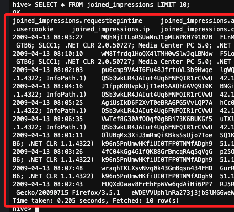
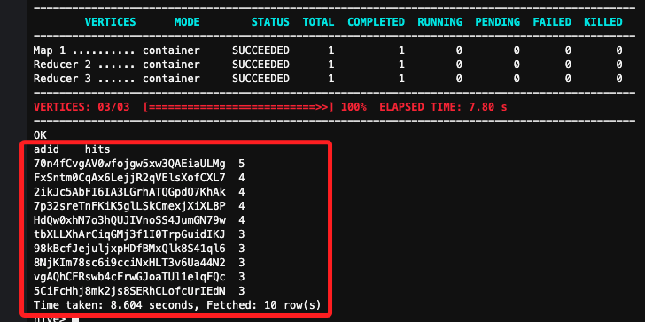
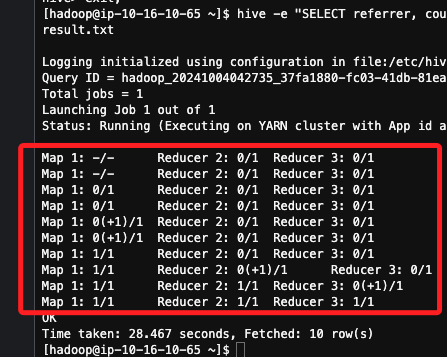
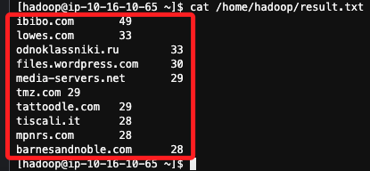

# Task 6：Querying the resulting dataset

_使用 Hive 來查詢 `joined_impressions` 表中的數據，以分析哪些展示轉化成了廣告點擊。_

<br>

## 步驟

1. 指示 Hive CLI 在查詢結果中顯示欄位名稱，執行這個指令後，運行查詢並返回結果時，Hive 會在結果的頂部顯示每個欄位的名稱；這個指令無回傳值。

    ```sql
    set hive.cli.print.header=true;
    ```

<br>

2. 查詢 `joined_impressions` 表中的前 10 行數據。

    ```sql
    SELECT * FROM joined_impressions LIMIT 10;
    ```

    

<br>

3. 查詢點擊最多的 10 個廣告。

    ```sql
    SELECT adid, count(*) AS hits 
    FROM joined_impressions 
    WHERE clicked = true 
    GROUP BY adid 
    ORDER BY hits DESC 
    LIMIT 10;
    ```

    

<br>

4. 退出 Hive CLI。

    ```sql
    exit;
    ```

<br>

5. 查詢來自哪個網站的用戶點擊了最多的廣告。

    ```bash
    hive -e "SELECT referrer, count(*) as hits FROM joined_impressions WHERE clicked = true GROUP BY referrer ORDER BY hits DESC LIMIT 10;" > /home/hadoop/result.txt
    ```

    

<br>

6. 使用 `cat` 指令查看結果。

    ```bash
    cat /home/hadoop/result.txt
    ```

    

<br>

## 總結

1. 讓 Hive CLI 顯示查詢結果的欄位名稱，這讓查看結果時能清楚辨識每個欄位的內容，方便分析。

```bash
set hive.cli.print.header=true;
```

<br>

2. 從 `joined_impressions` 表中返回前 10 行數據，檢查數據是否成功寫入表中，並確認其結構。

```bash
SELECT * FROM joined_impressions LIMIT 10;
```

<br>

3. 統計 `joined_impressions` 表中每個廣告的點擊次數，並顯示點擊次數最多的前 10 個廣告，提供對哪些廣告表現最佳的洞察。

```bash
SELECT adid, count(*) AS hits FROM joined_impressions...
```

<br>

4. 使用 `hive -e` 命令從 Hive 外部執行查詢，結果被保存到 `/home/hadoop/result.txt` 文件中，這個查詢列出了哪些來源網站帶來了最多的點擊數。

```bash
hive -e "SELECT referrer, count(*) as hits ..."
```

<br>

___

_END_