# Task 2：訂閱並啟動 Hudi 連接器

_配置 Hudi 連接器，用於 AWS Glue 與 S3 進行交互，實現動態數據更新。_

 

## 步驟

1. 進入 `AWS Glue Studio`，注意，這與 `AWS Glue` 不同。

    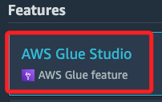

 

2. 點擊左下角的 `AWS Marketplace`。

    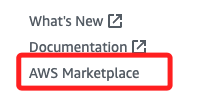

 

3. 在 `Search AWS Glue Studio products` 下的搜尋框內輸入 `Hudi`，點擊 `Apache Hudi Connector for AWS Glue`。

    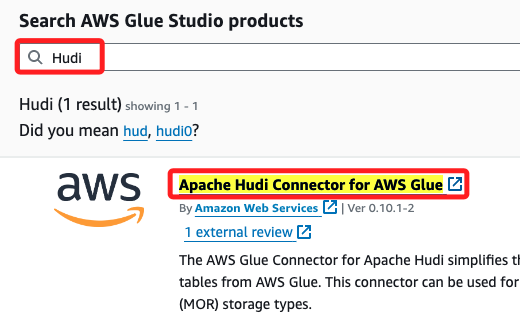

 

4. 會自動開啟新的瀏覽頁籤，點擊右上角 `Continue to Subscribe`。

    

 

5. 點擊 `Accept Terms`。

    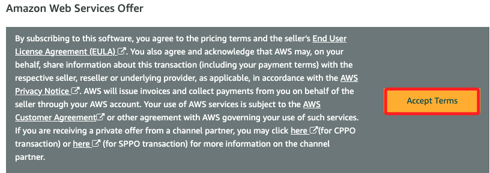

 

6. 畫面下方的 `Effective date` 會顯示 `Pending`，而且右上角的 `Continue to Configuration` 按鈕會呈現反白不可點擊，稍作等待。

    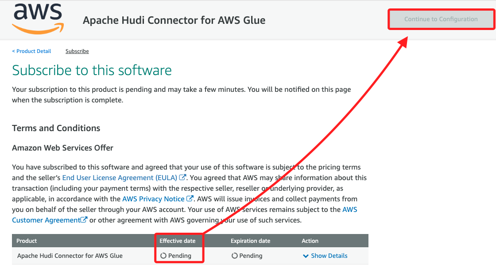

 

7. 點擊 `Continue to Configuration`。

    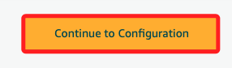

 

8. `Fulfillment option` 選擇 `Glue 3.0`，`Software version` 選擇 `0.10.1 (Jun 13, 2022)`，然後點擊右上角 `Continue to Launch`。

    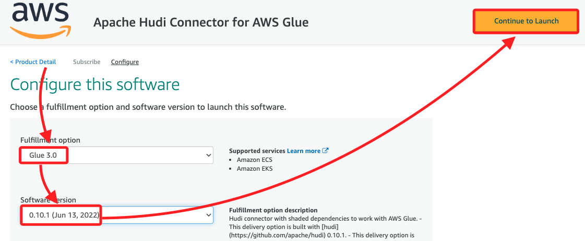

 

9. 點擊畫面中央的 `Usage instructions`。

    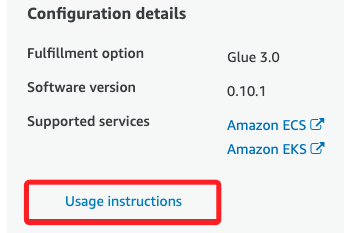

 

10. 在彈窗中點擊首行中的連結。

    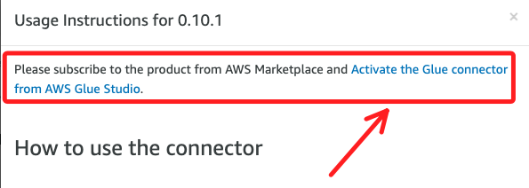

 

11. 會開啟新的頁面，畫面上方有個藍色彈窗，右側有個 `Activate connector only` 按鈕，不予理會。

    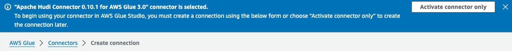

 

12. 在 `Connector` 命名為 `hudi-connection`，然後點擊右下角的 `Create connection and activate connector`。

    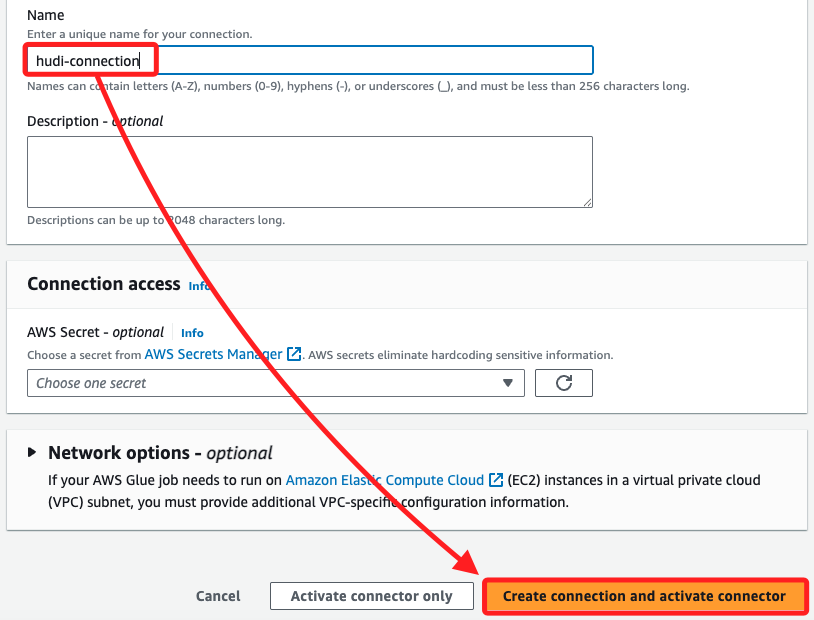

 

13. 點擊連結可查看詳情。

    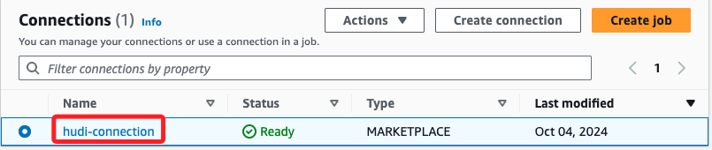

 

___

_END_