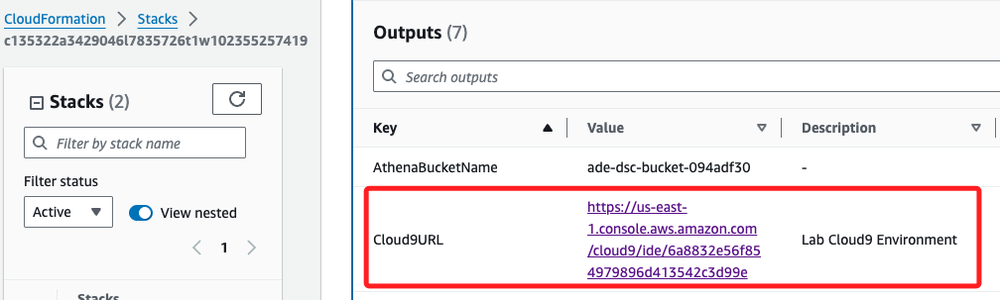
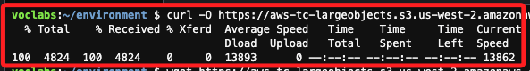
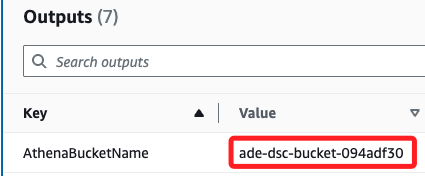
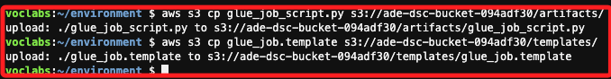

# Task 3：配置 AWS Glue 作業腳本

_檢索並配置 AWS Glue 作業所需的文件_

<br>

## 進入 `Cloud9`

1. 之前在 Stacks 中記錄的文件中，包含一組 Key 為 `Cloud9URL` 的數據，複製 Value。

    

<br>

2. 將這段值 `https://us-east-1.console.aws.amazon.com/cloud9/ide/6a8832e56f854979896d413542c3d99e` 貼到瀏覽器開啟，這會啟動 Cloud9 中預設的 IDE。

<br>

## 下載文件

1. 依據官網指示，要下載兩個文件 [glue_job_script.py](https://
aws-tc-largeobjects.s3.us-west-2.amazonaws.com/CUR-TF-200-ACDENG-1-91570/lab-06-hudi/s3/glue_job_script.py)、[glue_job_script.py](https://aws-tc-largeobjects.s3.us-west-2.amazonaws.com/CUR-TF-200-ACDENG-1-91570/lab-06-hudi/s3/glue_job.template) 備用，網址如下。

    ```html
    # glue_job_script.py
    https://
    aws-tc-largeobjects.s3.us-west-2.amazonaws.com/CUR-TF-200-ACDENG-1-91570/lab-06-hudi/s3/glue_job_script.py

    # glue_job_script.py
    https://aws-tc-largeobjects.s3.us-west-2.amazonaws.com/CUR-TF-200-ACDENG-1-91570/lab-06-hudi/s3/glue_job.template
    ```

<br>

2. 方法一，使用 `curl -O` 下載。

    ```bash
    curl -O https://aws-tc-largeobjects.s3.us-west-2.amazonaws.com/CUR-TF-200-ACDENG-1-91570/lab-06-hudi/s3/glue_job_script.py
    ```

    

<br>

3. 方法二，使用 `wget` 指令下載。

    ```bash
    wget https://aws-tc-largeobjects.s3.us-west-2.amazonaws.com/CUR-TF-200-ACDENG-1-91570/lab-06-hudi/s3/glue_job.template
    ```

    

<br>

## 複製文件到 S3

1. 在 Outputs 中記錄了 Bucket name 如 `ade-dsc-bucket-094adf30`。

    

<br>

2. 運行以下指令，替換其中的 `<Bucket name>` 為 `ade-dsc-bucket-094adf30`。

    ```bash
    aws s3 cp glue_job_script.py s3://<Bucket name>/artifacts/
    aws s3 cp glue_job.template s3://<Bucket name>/templates/
    ```

    _實際指令如下_

    ```bash
    aws s3 cp glue_job_script.py s3://ade-dsc-bucket-094adf30/artifacts/
    aws s3 cp glue_job.template s3://ade-dsc-bucket-094adf30/templates/
    ```

    
