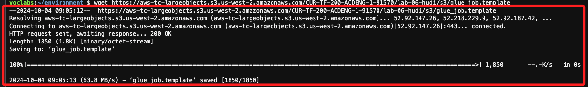

# Task 3：配置 AWS Glue 作業腳本

_檢索並配置 AWS Glue 作業所需的文件_

<br>

## 進入 `Cloud9`

_特別注意，這裡不是搜尋服務進入 `Cloud9` 主控台，請依以下說明操作_

<br>

1. 之前進入 `CloudFormation` 的 `Stacks` 時查看了 `Outputs`，可使用記錄下的內文或展開未關閉的網頁；其中有一組 Key 是 `Cloud9URL`，點擊 Value 中的連結就會進入 Cloud9 中預設的 IDE。

    

<br>

2. 若是複製並保存的網址，可貼到瀏覽器開啟，同樣這會啟動 Cloud9 中預設的 IDE。

    ```bash
    https://us-east-1.console.aws.amazon.com/cloud9/ide/<這只是網址範例>
    ```

<br>

## 下載文件

1. 依據官網指示，要下載兩個文件 `glue_job_script.py`、`glue_job_script.py`，這裡將示範兩種下載方式，網址如下。

    ```html
    # glue_job_script.py
    https://
    aws-tc-largeobjects.s3.us-west-2.amazonaws.com/CUR-TF-200-ACDENG-1-91570/lab-06-hudi/s3/glue_job_script.py

    # glue_job_script.py
    https://aws-tc-largeobjects.s3.us-west-2.amazonaws.com/CUR-TF-200-ACDENG-1-91570/lab-06-hudi/s3/glue_job.template
    ```

<br>

2. 方法一，使用 `curl -O` 下載。

    ```bash
    curl -O https://aws-tc-largeobjects.s3.us-west-2.amazonaws.com/CUR-TF-200-ACDENG-1-91570/lab-06-hudi/s3/glue_job_script.py
    ```

    

<br>

3. 方法二，使用 `wget` 指令下載。

    ```bash
    wget https://aws-tc-largeobjects.s3.us-west-2.amazonaws.com/CUR-TF-200-ACDENG-1-91570/lab-06-hudi/s3/glue_job.template
    ```

    

<br>

4. 完成後可在左側導覽中看到這兩個文件已經下載。

    

<br>

## 複製文件到 S3

1. 再次回到 `Stacks` 的 `Outputs`，其中有個 Key 是 `HUDIBucketName`，其值記錄 S3 的 Bucket 名稱 `ade-dsc-bucket-094adf30`。

    

<br>

2. 運行以下指令，分別將文件複製到 S3 Bucket 中的 `artifacts` 及 `templates` 資料夾；特別注意，要替換下方的 `<Bucket name>` 為自己查詢的名稱，這裡是 `ade-dsc-bucket-094adf30`。

    ```bash
    aws s3 cp glue_job_script.py s3://<Bucket name>/artifacts/
    aws s3 cp glue_job.template s3://<Bucket name>/templates/
    ```

    _實際指令如下_

    ```bash
    aws s3 cp glue_job_script.py s3://ade-dsc-bucket-094adf30/artifacts/
    aws s3 cp glue_job.template s3://ade-dsc-bucket-094adf30/templates/
    ```

<br>

3. 完成上傳，顯示資訊如下。

    

<br>

## 檢索

_從 S3 Bucket 中檢索已上傳的 CloudFormation 模板 (`glue_job.template`) 的 URL_

<br>

1. 進入 S3 主控台，點擊進入包含 `ade-hudi-bucket` 名稱的 S3 Bucket。

    

<br>

2. 點擊進入 `templates`。

    

<br>

3. 選擇 `glue_job.template`，然後點擊 `Copy URL` 來複製模板的 URL，將此 `URL` 保存備用。

    

<br>

___

_END_
