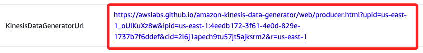
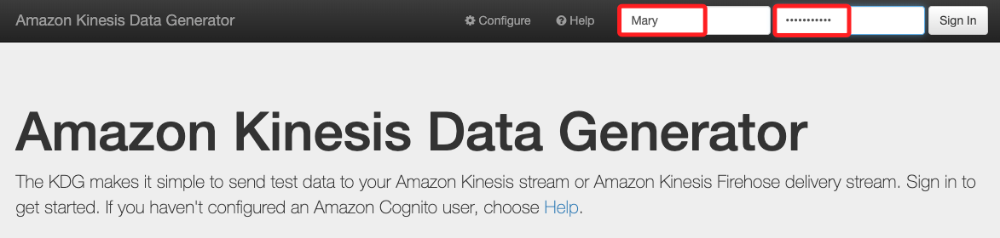
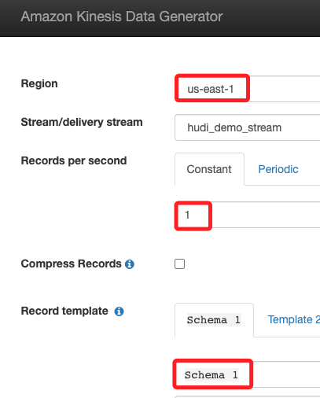
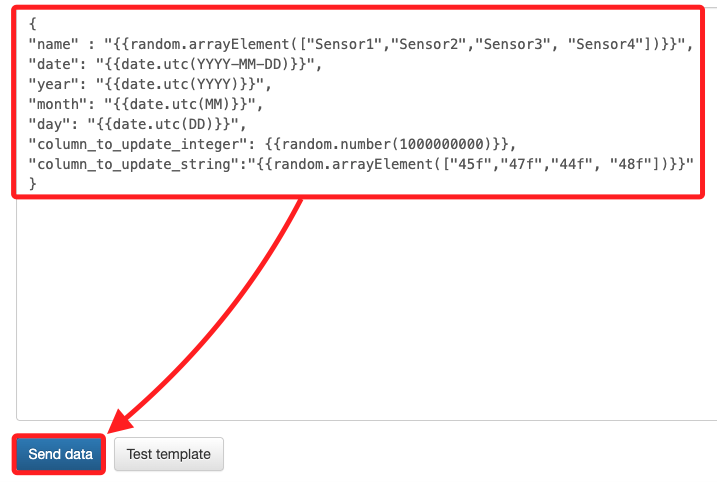
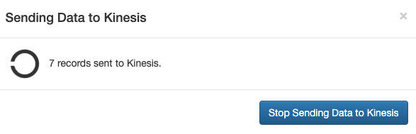

# Task 5：使用 KDG 向 Kinesis 發送數據

_使用 Kinesis Data Generator（KDG）工具生成並模擬 IoT 設備的隨機數據，並發送至 Kinesis_

<br>

## 訪問 KDG 並發送數據

1.  回到 `CloudFormation` 的 `Outputs` 中，點擊 Key 為 `KinesisDataGeneratorUrl` 的值，這會開啟 `Amazon Kinesis Data Generator`。

    

<br>

2. 在畫面中輸入預設的帳號 `Mary`、密碼 `Welcome1234`，然後點擊 `Sign In`。

    

<br>

3. 在接下來的設定畫面中，Region 選取 `us-east-1`、Records per second 改為 `1`、Record template 使用 `Template 1`，名稱改為 `Schema 1`，更改後頁籤也會變更；其餘維持不變。

    

<br>

4. 接著在下方的欄位中輸入腳本。

    ```json
    {
    "name" : "{{random.arrayElement(["Sensor1","Sensor2","Sensor3", "Sensor4"])}}", 
    "date": "{{date.utc(YYYY-MM-DD)}}",
    "year": "{{date.utc(YYYY)}}",
    "month": "{{date.utc(MM)}}",
    "day": "{{date.utc(DD)}}",
    "column_to_update_integer": {{random.number(1000000000)}},
    "column_to_update_string":"{{random.arrayElement(["45f","47f","44f", "48f"])}}"
    }
    ```

<br>

5. 點擊下方 `Send data`。

    

<br>

6. 點擊後會出現彈窗，其中顯示運行了多少時間，這表示數據正持續發送到 `Kinesis`；保持這個瀏覽視窗開啟，以便在後續過程中繼續向 Kinesis 發送資料。

    

<br>

_特別注意，不要關閉這個頁面_

<br>

___

_END_