# Task 3：文件轉型與上傳


_接下來要使用文件 `SAU-EEZ-242-v48-0.csv`，因為該文件與已上傳的數據欄位不匹配，需要先修改然後再上傳。_

<br>

## 查看數據結構

_進入 Cloud9 檢查結構差異_

<br>

1. 啟動虛擬環境。

    ```bash
    source envCapstone/bin/activate
    ```

<br>

2. 安裝新套件，這將用於格式化輸出以利觀察資料結構。

    ```bash
    python3 -m pip install tabulate
    ```

    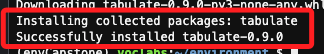

<br>

3. 啟動 Python 互動環境。

    ```bash
    python3
    ```

<br>

4. 運行以下腳本。 

    ```python
    import pandas as pd
    from tabulate import tabulate

    # 讀取每個 CSV 文件的前幾行，並取得欄位名稱
    df_global = pd.read_csv('SAU-GLOBAL-1-v48-0.csv', nrows=0)
    df_highseas = pd.read_csv('SAU-HighSeas-71-v48-0.csv', nrows=0)
    df_eez = pd.read_csv('SAU-EEZ-242-v48-0.csv', nrows=0)

    # 提取欄位名稱
    columns_global = df_global.columns.tolist()
    columns_highseas = df_highseas.columns.tolist()
    columns_eez = df_eez.columns.tolist()

    # 建立一個欄位名稱的集合，以確保所有唯一的欄位名稱都會被比較
    all_columns = sorted(set(columns_global + columns_highseas + columns_eez))

    # 將每個欄位的名稱與對應的 CSV 文件進行匹配，沒有匹配的補空字串
    global_match = [col if col in columns_global else "" for col in all_columns]
    highseas_match = [col if col in columns_highseas else "" for col in all_columns]
    eez_match = [col if col in columns_eez else "" for col in all_columns]

    # 構建表格進行展示
    table = list(zip(global_match, highseas_match, eez_match))
    headers = ["SAU-GLOBAL-1-v48-0", "SAU-HighSeas-71-v48-0", "SAU-EEZ-242-v48-0"]

    # 使用 tabulate 進行表格化輸出
    print(tabulate(table, headers=headers, tablefmt="grid"))
    ```

<br>

5. 得到以下結果。

    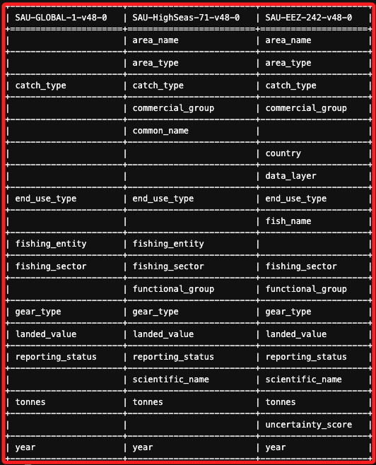

<br>

6. `SAU-EEZ-242-v48-0` 數據集確實包含一些在其他數據集中不存在的獨有欄位，如 `data_layer` 和 `uncertainty_score`，這些欄位在 `SAU-GLOBAL-1-v48-0` 和 `SAU-HighSeas-71-v48-0` 中均未出現。此外，`SAU-EEZ-242-v48-0` 的 `fish_name` 和 `country` 欄位也沒有出現在其他兩個數據集中。`SAU-HighSeas-71-v48-0` 和 `SAU-EEZ-242-v48-0` 提供了更多關於區域與魚種分類的資訊，例如 `area_name` 和 `functional_group`，而這些欄位並不存在於 `SAU-GLOBAL-1-v48-0` 中。另一方面，這三個數據集中存在共同欄位（如 `catch_type`、`fishing_sector`、`tonnes` 等），這些欄位在合併時需要確保名稱和結構的一致性。欄位名稱之間的差異顯示出，在合併數據集時，需要進行適當的欄位映射和名稱轉換，尤其是在處理區域和分類信息時，應特別留意這些欄位的對齊和匹配。

<br>

## 轉換

1. 根據官方指引的相關說明，需要將 `fish_name` 映射為 `common_name`、將 `country` 映射為 `fishing_entity`。

    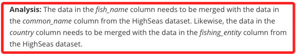

<br>

2. 延續上一點，根據官方指引，`fish_name` 欄位需要映射為 `common_name`，而 `country` 欄位則需要映射為 `fishing_entity`；根據這些規則對原始腳本進行的優化，但僅用於輸出，不修改原始文件，文件修正的作業留給教程中指引的其他步驟來完成。

    ```python
    import pandas as pd
    from tabulate import tabulate

    # 讀取每個 CSV 文件的前幾行，並取得欄位名稱
    df_global = pd.read_csv('SAU-GLOBAL-1-v48-0.csv', nrows=0)
    df_highseas = pd.read_csv('SAU-HighSeas-71-v48-0.csv', nrows=0)
    df_eez = pd.read_csv('SAU-EEZ-242-v48-0.csv', nrows=0)

    # 提取欄位名稱
    columns_global = df_global.columns.tolist()
    columns_highseas = df_highseas.columns.tolist()
    columns_eez = df_eez.columns.tolist()

    # 欄位映射規則
    column_mapping = {
        'fish_name': 'common_name',
        'country': 'fishing_entity'
    }

    # 根據映射規則修改 EEZ 的欄位名稱（僅用於顯示）
    columns_eez_mapped = [column_mapping.get(col, col) for col in columns_eez]

    # 建立一個欄位名稱的集合，以確保所有唯一的欄位名稱都會被比較
    all_columns = sorted(set(columns_global + columns_highseas + columns_eez_mapped))

    # 將每個欄位的名稱與對應的 CSV 文件進行匹配，沒有匹配的補空字串
    global_match = [col if col in columns_global else "" for col in all_columns]
    highseas_match = [col if col in columns_highseas else "" for col in all_columns]
    eez_match = [col if col in columns_eez_mapped else "" for col in all_columns]

    # 構建表格進行展示
    table = list(zip(global_match, highseas_match, eez_match))
    headers = ["SAU-GLOBAL-1-v48-0", "SAU-HighSeas-71-v48-0", "SAU-EEZ-242-v48-0 (Mapped)"]

    # 使用 tabulate 進行表格化輸出
    print(tabulate(table, headers=headers, tablefmt="grid"))
    ```

<br>

3. 輸出結果如下圖。

    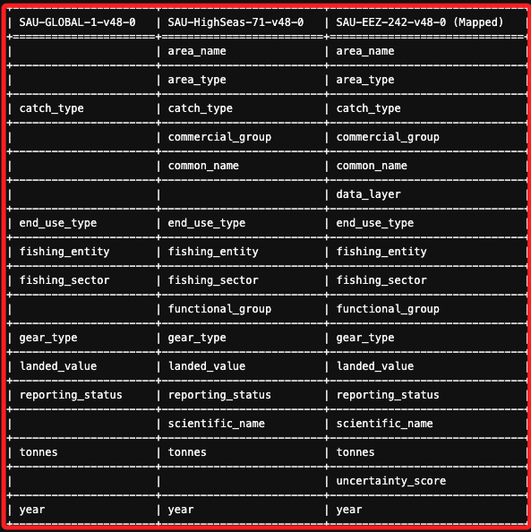

<br>

## 修正欄位名並將文件轉換為 Parquet 格式

1. 建立文件備份。

    ```bash
    cp SAU-EEZ-242-v48-0.csv SAU-EEZ-242-v48-0-old.csv
    ```

    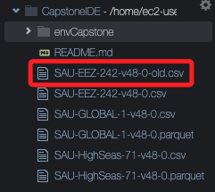

<br>

2. 啟動虛擬環境。

    ```bash
    source envCapstone/bin/activate
    ```

<br>

3. 開啟 python 互動環境。

    ```bash
    python3
    ```

<br>

4. 執行以下腳本完成欄位名修正及文件轉換；特別說明，這個官方範例腳本直接修改原始文件的欄位名，將 `fish_name` 改為 `common_name`、`country` 改為 `fishing_entity`，並且保存了變更，前面僅將欄位名稱進行映射，以便輸出在終端機上進行查看。

    ```python
    import pandas as pd

    # 加載備份文件
    data_location = 'SAU-EEZ-242-v48-0-old.csv'
    df = pd.read_csv(data_location)

    # 查看現有的欄位名
    print(df.head(1))

    # 修改欄位名
    # 將 fish_name  common_name
    # 將 country 修正為 fishing_entity
    df.rename(
        columns = {
            "fish_name": "common_name",
            "country": "fishing_entity"
        }, inplace = True
    )

    # 確認欄位名已經修正
    print(df.head(1))

    # 保存 CSV 及 Parquet 格式文件
    df.to_csv(
        'SAU-EEZ-242-v48-0.csv',
        header=True,
        index=False
    )
    df.to_parquet('SAU-EEZ-242-v48-0.parquet')
    ```

    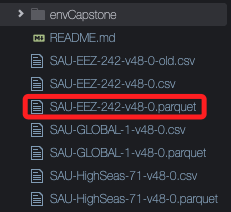

<br>

5. 退出 Python 環境。

    ```bash
    exit()
    ```

<br>

6. 如有需要結束虛擬環境。

    ```bash
    deactivate
    ```

<br>

## 上傳轉換後的文件至 Amazon S3 Bucket

1. 將生成的 `SAU-EEZ-242-v48-0.parquet` 文件上傳至先前建立的 S3 Bucket。

    ```bash
    aws s3 cp SAU-EEZ-242-v48-0.parquet s3://data-source-99991
    ```

    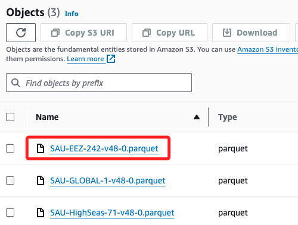

<br>

## 使用 Boto3

_若要實測，請先刪除使用 CLI 上傳的文件_

<br>

1. 安裝套件。

    ```bash
    python3 -m pip install boto3
    ```

<br>

2. 上傳至先前建立的 S3 Bucket。

    ```python
    import boto3

    # 初始化 S3 客戶端
    s3 = boto3.client('s3')

    # 設定桶名稱和文件路徑
    bucket_name = 'data-source-99991'
    file_path = 'SAU-EEZ-242-v48-0.parquet'
    # S3 中的路徑，將文件直接放入根目錄
    s3_key = 'SAU-EEZ-242-v48-0.parquet'

    # 上傳文件到 S3
    s3.upload_file(file_path, bucket_name, s3_key)

    print(f"{file_path} 已成功上傳至 S3 桶: {bucket_name}/{s3_key}")
    ```

    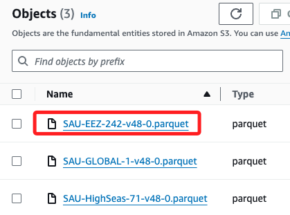

<br>

## 更新 AWS Glue 中的表元數據

_元數據指的就是 Table 的結構_

<br>

1. 再次運行 `fishcrawler` Crawler 就會更新 Table 的元數據；因為新上傳文件的結構和內容未被 AWS Glue 的數據目錄識別和更新，通過再次運行 Crawler，AWS Glue 會重新掃描 S3 中的數據文件，並自動更新數據目錄中的表結構，以確保後續查詢操作能正確識別和使用最新的數據內容。

    

<br>

2. 完成後進入 `Tables` 確認表格已更新並顯示新加入的數據列；進一步說明，執行 Crawler 不僅會更新表格的欄位，還會更新表格中的數據，因為執行 Crawler 時，Glue 會掃描指定的 S3 資料來源，並根據新文件的內容更新 Glue Data Catalog 中的表結構，並且使得新上傳的數據可以被查詢工具如 `Athena` 訪問。

<br>

## 在 Athena 中運行查詢以驗證數據

_使用已經開啟的 Query Editor_

<br>

1. 使用以下查詢來驗證 `area_name` 列的值。

    ```sql
    SELECT DISTINCT area_name FROM fishdb.data_source_99991;
    ```

<br>

2. 此查詢會返回三個結果，包括來自 `EEZ` 文件的數據，此查詢之前只返回兩個結果；`Fiji` 來自於 `EEZ` 文件中的數據，顯示了 `專屬經濟區 (EEZ)` 相關的漁業數據，`Pacific, Western Central` 則是來自於 `HighSeas` 文件，表示某特定高海域區域。

    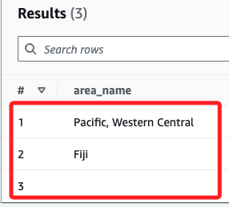

<br>

3. 查詢 Fiji 自 2001 年以來在 `開放海域` 捕撈魚類的美元價值，按年份組織。

    ```sql
    SELECT 
        year,
        fishing_entity AS Country, 
        CAST(CAST(SUM(landed_value) AS DOUBLE) AS DECIMAL(38,2)) AS ValueOpenSeasCatch
    FROM
        fishdb.data_source_99991
    WHERE
        area_name IS NULL 
        AND fishing_entity='Fiji' 
        AND year > 2000
    GROUP BY 
        year, 
        fishing_entity
    ORDER BY 
        year;
    ```

<br>

4. 查詢 Fiji 自 2001 年以來在 `Fiji 專屬經濟區（EEZ）` 捕撈魚類的美元價值，按年份組織。

    ```sql
    SELECT 
        year, 
        fishing_entity AS Country, 
        CAST(CAST(SUM(landed_value) AS DOUBLE) AS DECIMAL(38,2)) AS ValueEEZCatch
    FROM 
        fishdb.data_source_99991
    WHERE 
        area_name LIKE '%Fiji%' 
        AND fishing_entity='Fiji' 
        AND year > 2000
    GROUP BY 
        year, 
        fishing_entity
    ORDER BY 
        year;
    ```

<br>

5. 查詢 Fiji 自 2001 年以來在 `EEZ` 和 `高海域` 捕撈魚類的總價值，按年份組織。

    ```sql
    SELECT 
        year, 
        fishing_entity AS Country, 
        CAST(CAST(SUM(landed_value) AS DOUBLE) AS DECIMAL(38,2)) AS ValueEEZAndOpenSeasCatch
    FROM 
        fishdb.data_source_99991
    WHERE 
        (area_name LIKE '%Fiji%' OR area_name IS NULL) 
        AND fishing_entity='Fiji' 
        AND year > 2000
    GROUP BY 
        year, 
        fishing_entity
    ORDER BY 
        year;
    ```

<br>

## 分析結果

1. 如果數據格式正確，且 AWS Glue 的 Crawler 已正確更新元數據表，則前三個查詢的結果應該加總一致。例如， `2001` 年的 `ValueOpenSeasCatch` 和 `ValueEEZCatch` 的總和應等於 `2001` 年的 `ValueEEZAndOpenSeasCatch`。

<br>

## 在 Athena 中建立視圖

1. 運行下列查詢，將視圖命名為 `MackerelsCatch`，並用來檢視數據。

    ```sql
    CREATE OR REPLACE VIEW MackerelsCatch AS
    SELECT 
        year, 
        area_name AS WhereCaught, 
        fishing_entity as Country, 
        SUM(tonnes) AS TotalWeight
    FROM 
        fishdb.data_source_99991
    WHERE 
        common_name LIKE '%Mackerels%' 
        AND year > 2014
    GROUP BY 
        year, area_name, 
        fishing_entity, 
        tonnes
    ORDER BY 
        tonnes DESC;
    ```

<br>

2. 添加視圖。

    

<br>

## 查詢視圖數據

1. 驗證視圖是否正確地返回數據，並使用視圖進行後續分析。例如，可以查詢每年 mackerel 捕撈數量最多的國家。

    ```sql
    SELECT 
        year, 
        Country, 
        MAX(TotalWeight) AS Weight
    FROM 
        fishdb.mackerelscatch
    GROUP BY 
        year, 
        Country
    ORDER BY 
        year, 
        Weight DESC;
    ```

    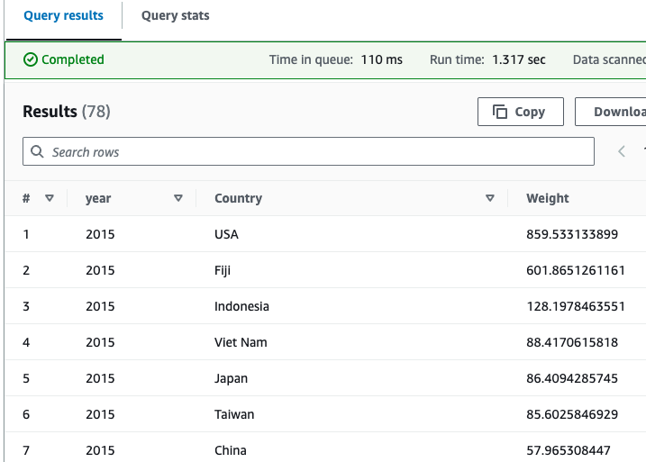

<br>

## 使用 Boto3 實踐

1. 將查詢結果輸出到 S3。

    ```python
    import boto3
    import time

    # 初始化 Athena 客戶端
    athena_client = boto3.client('athena')

    # 設定查詢語句
    query = """
        SELECT 
            year,
            fishing_entity AS Country, 
            CAST(CAST(SUM(landed_value) AS DOUBLE) AS DECIMAL(38,2)) AS ValueOpenSeasCatch
        FROM
            fishdb.data_source_99991
        WHERE
            area_name IS NULL 
            AND fishing_entity='Fiji' 
            AND year > 2000
        GROUP BY 
            year, 
            fishing_entity
        ORDER BY 
            year;
    """

    # 替換為之前建立的 Athena 工作組
    workgroup = 'primary'
    # 替換為 S3 Bucket 名稱和路徑
    s3_output = 's3://query-results-99991/results/'

    # 執行 Athena 查詢
    response = athena_client.start_query_execution(
        QueryString=query,
        QueryExecutionContext={'Database': 'fishdb'},
        ResultConfiguration={'OutputLocation': s3_output}
    )

    # 查詢執行 ID
    query_execution_id = response['QueryExecutionId']

    # 輸出執行 ID
    print(f"Query executed with ID: {query_execution_id}")

    # 輪詢查詢結果狀態，直到查詢完成或失敗
    while True:
        query_status = athena_client.get_query_execution(QueryExecutionId=query_execution_id)
        status = query_status['QueryExecution']['Status']['State']
        
        if status == 'SUCCEEDED':
            print("Query succeeded.")
            break
        elif status == 'FAILED':
            print(f"Query failed with status: {status}")
            break
        else:
            print(f"Query is still running with status: {status}. Waiting for completion...")
            # 每隔5秒檢查一次狀態
            time.sleep(5)
    ```

    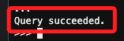

<br>

2. 運行後前往 S3 進行查看。

    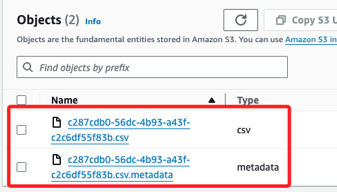

<br>

## 使用 Python 腳本

_內容複雜的代碼在互動環境中常因縮排問題而出錯，可改為上傳腳本後運行_

<br>

1. 在本地編輯以下腳本，查詢結果會被寫入到 `S3 Bucket`，同時在終端機中也會顯示數據；任意命名儲存如 `test01.py`。

    ```python
    import boto3
    import time
    import pandas as pd

    # 初始化 Athena 客戶端
    athena_client = boto3.client('athena')

    # 設定查詢語句
    query = """
        SELECT 
            year,
            fishing_entity AS Country, 
            CAST(CAST(SUM(landed_value) AS DOUBLE) AS DECIMAL(38,2)) AS ValueOpenSeasCatch
        FROM
            fishdb.data_source_99991
        WHERE
            area_name IS NULL 
            AND fishing_entity='Fiji' 
            AND year > 2000
        GROUP BY 
            year, 
            fishing_entity
        ORDER BY 
            year;
    """

    # Athena 工作組
    workgroup = 'primary'
    # S3 Bucket 名稱和路徑
    s3_output = 's3://query-results-99991/results/'

    # Athena 查詢
    response = athena_client.start_query_execution(
        QueryString=query,
        QueryExecutionContext={'Database': 'fishdb'},
        ResultConfiguration={'OutputLocation': s3_output}
    )

    # 查詢執行 ID
    query_execution_id = response['QueryExecutionId']
    print(f"Query executed with ID: {query_execution_id}")

    # 輪詢查詢結果狀態，直到查詢完成
    while True:
        query_status = athena_client.get_query_execution(QueryExecutionId=query_execution_id)
        status = query_status['QueryExecution']['Status']['State']
        
        if status in ['SUCCEEDED', 'FAILED', 'CANCELLED']:
            break
        
        print(f"Query is still running. Current status: {status}")
        # 等待 5 秒後重新檢查狀態
        time.sleep(5)

    if status != 'SUCCEEDED':
        print(f"Query failed with status: {status}")
    else:
        print("Query succeeded. Fetching results...")

        # 取得查詢結果
        result_response = athena_client.get_query_results(QueryExecutionId=query_execution_id)

        # 解析結果
        rows = result_response['ResultSet']['Rows']
        headers = [col['VarCharValue'] for col in rows[0]['Data']]
        data = [[col.get('VarCharValue', 'NULL') for col in row['Data']] for row in rows[1:]]

        # 使用 Pandas 顯示結果
        df = pd.DataFrame(data, columns=headers)
        print(df)
    ```

<br>

2. 在 `Cloud9` 上方功能欄位中，點擊 `File` 並選取 `Upload Local Files...`。

    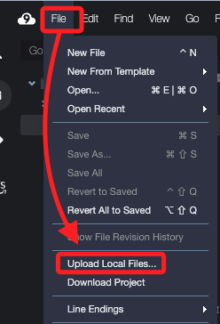

<br>

3. 點擊 `Select files` 後，選取本地的 `test01.py` 腳本。

    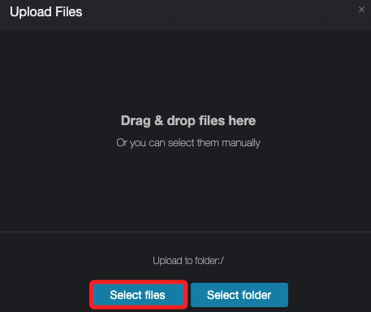

<br>

4. 開啟會直接完成上傳，無需點擊任何確認。

    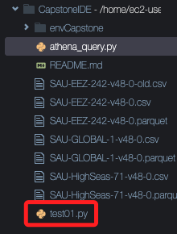

<br>

5. 運行。

    ```bash
    python3 test01.py
    ```

<br>

6. 取得運行結果；這樣的運行效率比起在 `Cloud9` 的互動環境中運行要來得高效。

    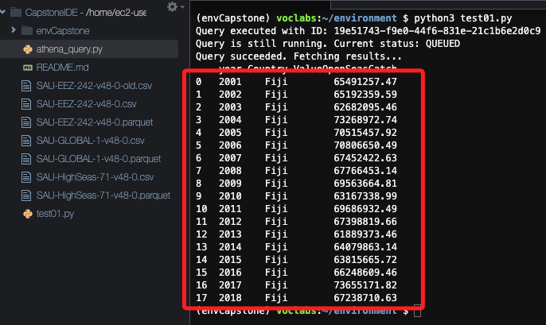

<br>

## 完成

1. 全部通過。

    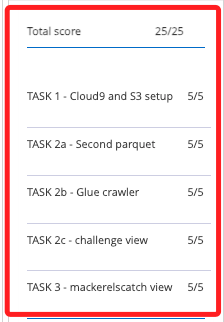

<br>

2. 自動化刪除使用中的資源，避免 Lab 額度耗盡；另外，Cloud9 及 Athena 的 Query 必須手動進行刪除或清理；至於預設的 Role 及 Workgroup 是無法進行刪除的。

    ```python
    import boto3

    # 初始化 AWS 服務的客戶端
    s3_client = boto3.client("s3")
    rds_client = boto3.client("rds")
    glue_client = boto3.client("glue")


    # 1. 刪除 S3 Bucket 
    def delete_s3_buckets():
        buckets = s3_client.list_buckets()["Buckets"]
        for bucket in buckets:
            bucket_name = bucket["Name"]
            try:
                # 刪除Bucket 中的對象
                s3_client.delete_objects(
                    Bucket=bucket_name,
                    Delete={
                        "Objects": [
                            {"Key": obj["Key"]}
                            for obj in s3_client.list_objects_v2(
                                Bucket=bucket_name).get(
                                "Contents", []
                            )
                        ]
                    },
                )
                # 刪除Bucket 
                s3_client.delete_bucket(Bucket=bucket_name)
                print(f"S3 Bucket {bucket_name} 刪除成功。")
            except Exception as e:
                print(f"無法刪除Bucket  {bucket_name}: {e}")


    # 2. 刪除 RDS 資料庫實例
    def delete_rds_instances():
        instances = rds_client.describe_db_instances()["DBInstances"]
        for db_instance in instances:
            db_instance_identifier = db_instance["DBInstanceIdentifier"]
            rds_client.delete_db_instance(
                DBInstanceIdentifier=db_instance_identifier,
                SkipFinalSnapshot=True,  # 跳過最終快照
            )
            print(f"RDS 資料庫實例 {db_instance_identifier} 刪除成功。")


    # 3. 刪除 Glue Crawler 和 Database
    def delete_glue_resources():
        crawlers = glue_client.get_crawlers()["Crawlers"]
        for crawler in crawlers:
            glue_client.delete_crawler(Name=crawler["Name"])
            print(f"Glue Crawler {crawler['Name']} 已刪除。")

        databases = glue_client.get_databases()["DatabaseList"]
        for db in databases:
            glue_client.delete_database(Name=db["Name"])
            print(f"Glue Database {db['Name']} 已刪除。")


    # 執行自動化刪除資源的腳本
    if __name__ == "__main__":
        # 刪除 S3 Bucket 
        delete_s3_buckets()

        # 刪除 RDS 資料庫實例
        delete_rds_instances()

        # 刪除 Glue 資源
        delete_glue_resources()

        print("所有資源已經被刪除。請手動刪除 Cloud9 環境。")
    ```

    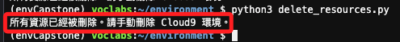

<br>

___

_END_