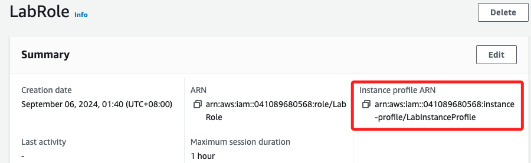

# 限制與查詢

_以下說明 Lab 的限制以及各種查詢指令_

<br>

## 關於 Lab 操作的各種限制

_在 Lab 中的操作是有侷限性的，官方對此也加以提示_

<br>

1. 首先，Lab 的所有操作在區域選擇上僅限於 `us-east-1`。

<br>

2. `EC2` 同時運行的實例數量最多為 `9` 個，超過限制的實例將自動終止。

<br>

3. 在建立 AWS 資源時，使用預設的 `LabRole` 角色

    

<br>

4. 這個角色有預設的 `LabInstanceProfile` 進行訪問和權限控制；`Instance Profile` 是一個容器，用於將 `IAM Role` 連接到 EC2 實例，這樣該實例可以通過角色獲得 AWS 服務的訪問權限。

    

<br>

5. 可查看其中的 `Trust relationships`，這也是 `IAM Role` 的一部分，用於定義哪些實體可以假設這個 Role。

    

<br>

## 與 EC2 相關的終端指令

_接著將示範在 Cloud9 終端中進行相關查詢指令，若嘗試在遠端連線的終端中運行將會出錯，因為 `EC2InstanceRole` 預設不具備相關權限，這裡先嘗試在 Cloud9 中執行，並體驗遠端並無權限後，將在後面步驟進行各種限制的排除與說明。_

<br>

1. 查詢 Instance Profile 的詳細信息。

    ```bash
    aws iam get-instance-profile --instance-profile-name LabInstanceProfile
    ```

<br>

2. 查詢 IAM 角色 的 Trust Relationships。

    ```bash
    aws iam get-role --role-name LabRole
    ```

<br>

3. 列出當前區域內的所有 EC2 實例。

    ```bash
    aws ec2 describe-instances
    ```

<br>

4. 查看特定 EC2 實例的狀態，這裡以這個 `Bastion Host` 為例。 

    ```bash
    aws ec2 describe-instance-status --instance-ids i-0c3135f2500a4443e
    ```

<br>

5. 查看 EC2 配額。

    ```bash
    aws ec2 describe-account-attributes
    ```

<br>

___

_END_