# 透過跳板連線目標

_以下示範如何從外部透過堡壘實例進入 Cloud9 中的目標實例；特別注意，這樣的操作在實務上並無功能性，僅是藉此了解相關運作原理。_

<br>

## 添加權限

_為了排除相關限制，嘗試在允許範圍內對預設的 IAM 進行設定_

<br>

1. 進入 IAM 服務。

    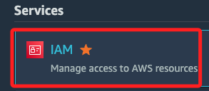

<br>

2. 進入 Roles，搜尋並點擊進入與 EC2 實例關聯的 IAM 角色 `EC2InstanceRole`。

    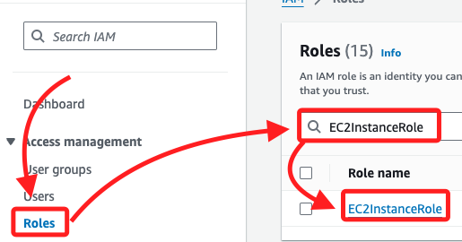

<br>

3. 為角色添加政策。

    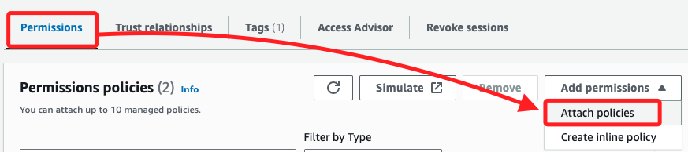

<br>

4. 搜尋並勾選 `AmazonEC2ReadOnlyAccess`，點擊 `Add permissions`。

    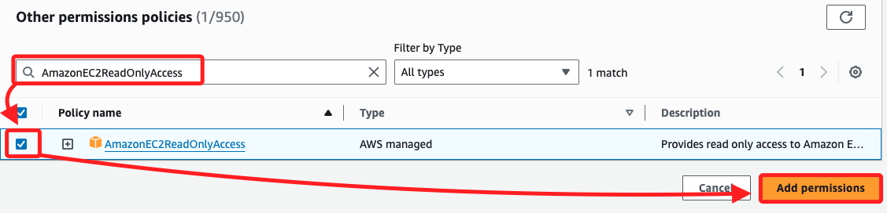

<br>

## 查詢

_完成以上步驟後，可在本機連線跳板主機後的終端機中進行以下查詢_

<br>

1. 查詢跳板與目標 EC2 實例的資訊；得到正確訊息代表設定皆正確，然後繼續以下步驟。

    ```bash
    aws ec2 describe-instances \
    --filters "Name=instance-state-name,Values=running" \
    --query 'Reservations[*].Instances[*].[InstanceId, PublicIpAddress, PrivateIpAddress, Tags[?Key==`Name`].Value | [0]]' \
    --output table

    ```

    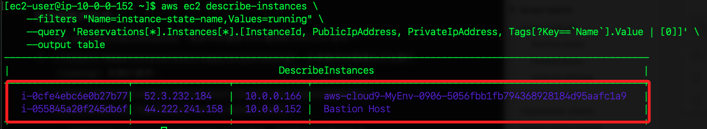

<br>

## 本地連線目標 EC2

_從本地經由跳板 EC2 輾轉進入目標 EC2，特別注意，外部是無法直接進入目標主機的。_

<br>

1. 先在主控台中點擊 `目標 EC2` 的 ID 進入實例頁面。

    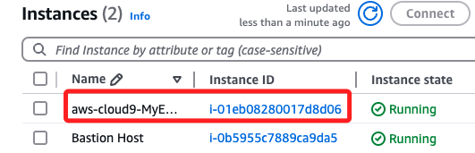

<br>

2. 接著切換到頁籤 `Security`，並點擊進入 `安全群組`。 

    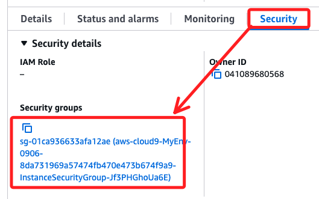

<br>

3. 在 `Inbound rules` 頁籤點擊 `Edit inbound rules`。

    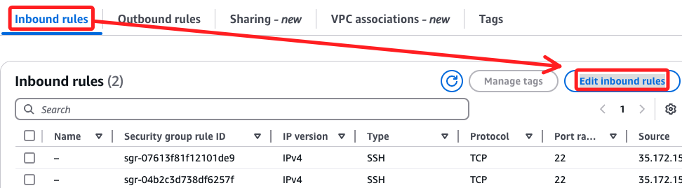

<br>

4. 點擊 `Add rule` 添加規則。

    

<br>

5. 在 `安全群組` 設定 `白名單`；這步驟與前面相同不再贅述，惟先前做查詢時，跳板中已預設開啟 `0.0.0.0`；完成時點擊右下角的 `Save rules`。

    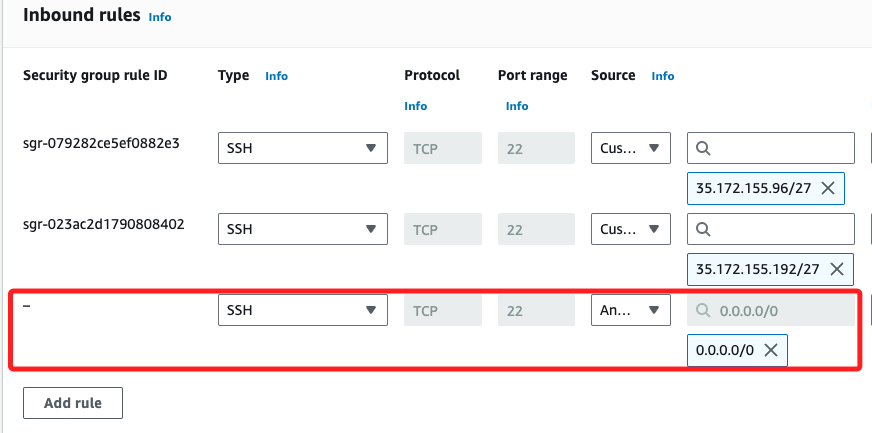

<br>

## 連線

1. 在 EC2 主控台中進入 `目標 EC2`，點擊連線 `Connect` 以確認可連入目標 EC2。

    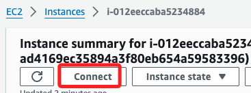

<br>

2. 特別注意，預設是 `root`，這裡要修改使用者名稱為 `ec2-user` 連線；不要使用預設的 `root`。

    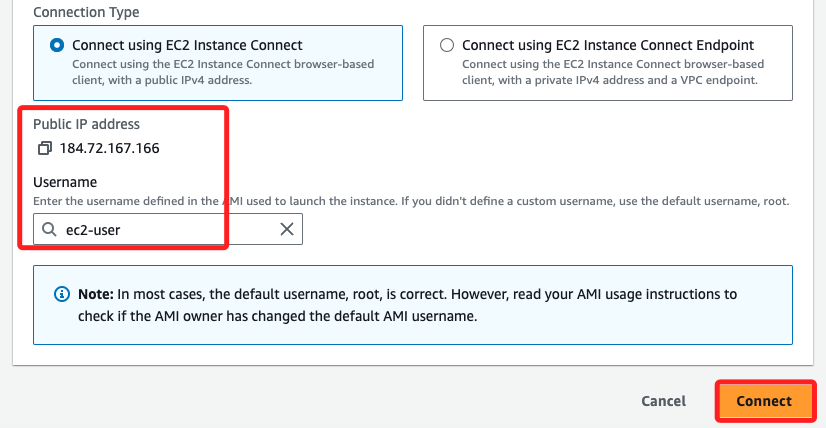

<br>

3. 完成連線時顯示如下。

    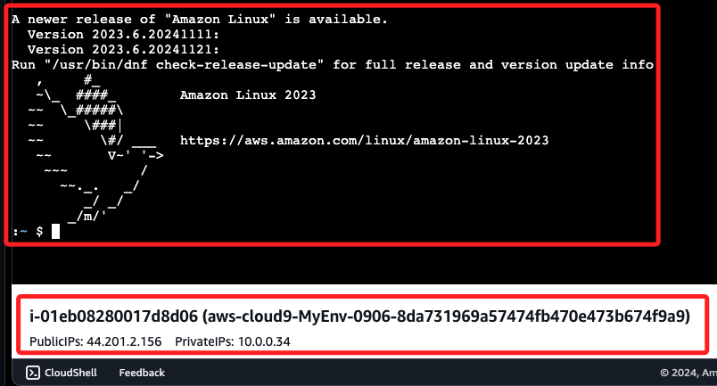

<br>

## 建立密鑰對

_將跳板主機的公鑰複製到 `目標主機`；特別注意，這時候本機電腦開啟的終端機是連線在 `跳板主機`。_

<br>

1. 先在 `跳板主機` 的終端機中運型以下指令以建立密鑰對，所有提示後都按下 `ENTER` 即可；這就是在後面步驟要複製到目標實例的公鑰，如此便可免除輸入密碼並通過驗證。

    ```bash
    ssh-keygen
    ```

    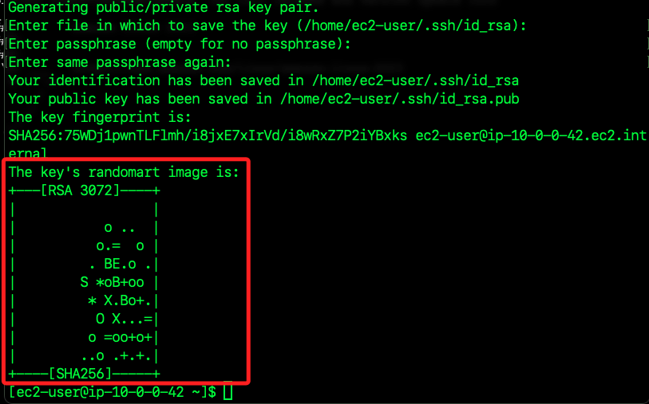

<br>

2. 建立完成後，使用以下指令進入密鑰路徑，並透過 `cat` 指令將指定的公鑰內容輸出在畫面上。

    ```bash
    cd ~/.ssh && cat id_rsa.pub
    ```

<br>

3. 先將畫面保留在此，之後需要複製這個公鑰的內容；特別注意，假如有多組公鑰，可任意複製一組到遠端作為驗證，但務必確保本地存在私鑰。

    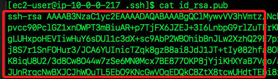

<br>

## 金鑰驗證

_回到 Cloud9 的目標 EC2 的終端機中_

<br>

1. 使用 nano 編輯授權文件 `authorized_keys`。

    ```bash
    sudo nano ~/.ssh/authorized_keys
    ```

<br>

2. 複製前面步驟在 `堡壘 EC2` 建立的公鑰，並貼在 `目標 EC2` 的授權文件上；特別注意，文件中的每一列就是一組公鑰，每一列末端無需斷行符號；編輯完成後，使用 NANO 的組合鍵進行 `儲存（control+O）`、`退出（control+X）`。

    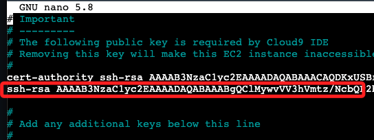

<br>

3. 在 `目標 EC2` 終端機畫面下方會顯示 `目標 EC2` 的 `公共 IP` 與 `私有 IP`，複製其中的 `PublicIPs`。

    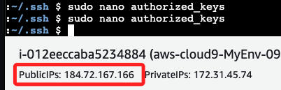

<br>

4. 回到 `堡壘 EC2` 的終端機中，輸入以下指令進行連線；因為已經複製了公鑰，無需使用參數指定密鑰文件。

    ```bash
    ssh ec2-user@<目標-EC2-PublicIPs>
    ```

    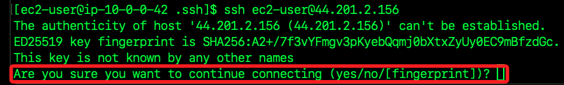

<br>

5. 輸入 `yes` 之後會進行連線，若成功會顯示如下畫面。

    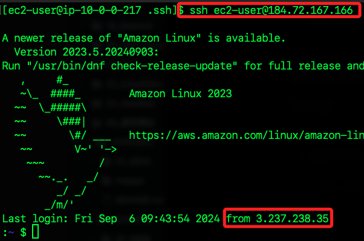

<br>

## 驗證連線成功

1. 進入 `目標 EC2` 的目錄 `~/environment`，這就是在 `Cloud9` 終端機所顯示的資料夾，接著使用 `cat` 指令輸出 `README.md` 文件內容。

    ```bash
    cd ~/environment && cat README.md
    ```

    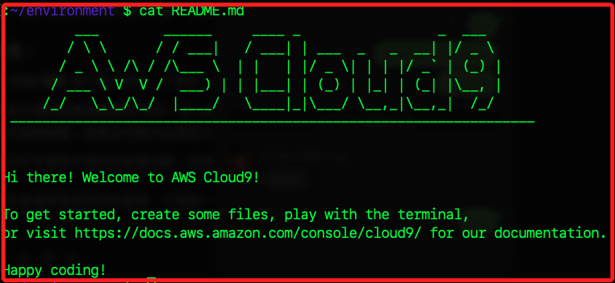

<br>

2. 進入 Cloud9 的終端機中，使用相同指令並比對輸出結果是否一致。

    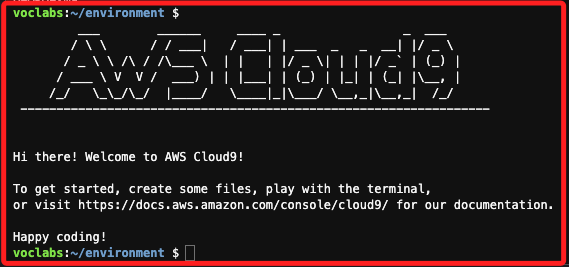

<br>

___

_END_