# Task 1：配置開發環境

_從配置環境開始_

<br>

## 觀察 CapstoneGlueRole 角色

1. 進入 IAM，在 Roles 中搜尋預先建立好提供 Lab 使用的角色 `CapstoneGlueRole`，並點擊查看詳細信息。

    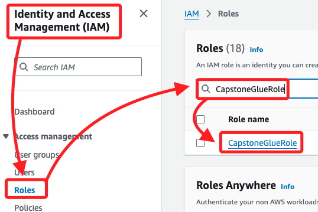

<br>

2. 在 Permissions 頁籤中可看到三個 Policy，這三個都是 AWS 預設的；其中 `AmazonAthenaFullAccess` 允許對 Athena 的完全存取權限，`AmazonS3FullAccess` 允許對 Amazon S3 Bucket 的完全存取權限，`AWSGlueServiceRole` 則是提供 AWS Glue 服務進行爬網、ETL 操作時所需的執行角色和權限。

    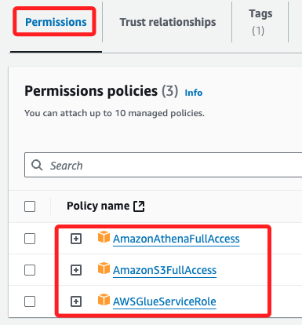

<br>

3. `Trust relationship` 是定義哪些實體被授權扮演特定的 IAM 角色，被授權的信任實體能夠以該角色的身份執行操作，這個實體可以是服務、使用者或另一個角色；以下的信任關係設定允許 `AWS Glue` 服務根據需求來假設該角色的權限，進而執行諸如資料爬網、ETL 等任務。

    ```json
    {
        "Version": "2012-10-17",
        "Statement": [
            {
                "Effect": "Allow",
                "Principal": {
                    "Service": "glue.amazonaws.com"
                },
                "Action": "sts:AssumeRole"
            }
        ]
    }
    ```

<br>

## 補充說明

_針對前項 IAM 的補充_

<br>

1. AWS 的 Policy 分為 `預設（Managed Policies）` 和 `自訂（Custom Policies）` 兩類，預設的 Policy 由 AWS 提供和管理，自訂的 Policy 由使用者自行建立和管理。

<br>

2. 在 AWS 中，`假設（Assume）角色` 指的是一個實體 _暫時獲得_ 該角色的權限，這個實體並不長久持有該角色的權限，而是透過 _**假設**_ 這個角色來臨時擁有其權限；這種機制是透過 AWS 的 `STS（Security Token Service）` 完成的，它會向實體提供一個臨時的安全憑證，使其能夠以該角色的身份執行操作。因此，在信任關係中，`AWS Glue` 等服務是 _**假設**_ 這個角色來獲得必要的權限進行操作，也就是說 Glue 服務並不永久擁有該角色的權限，而是根據需求在指定的操作期間臨時使用該角色的權限。

<br>

## 進入 Cloud9

_建立開發環境_

<br>

1. 建立新環境。

    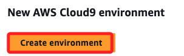

<br>

2. 設置環境名稱為 `CapstoneIDE`，其餘使用預設，包含選擇建立新的 EC2 實例、使用 t2.micro 型號實例。

    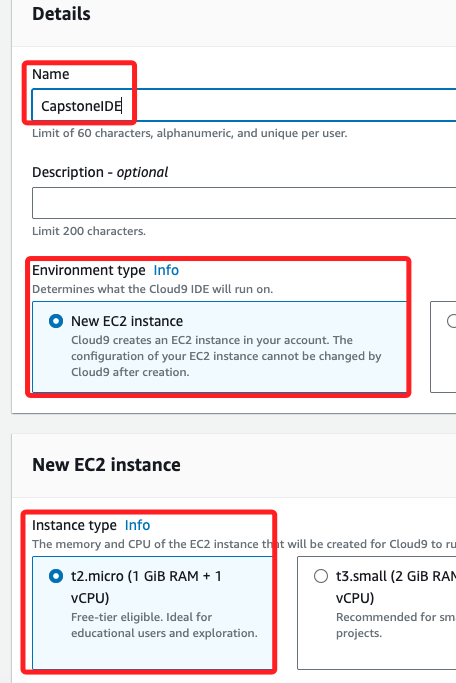

<br>

3. 在 Network settings 中，選擇 `Secure Shell(SSH)`。

    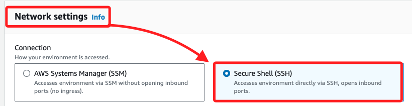

<br>

4. 展開 VPC settings，在下拉選單中分別選取 `Capstone VPC`、`Capstone public subnet`；這是 Lab 預先準備好的設定。

    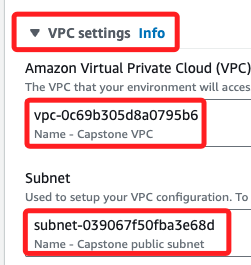

<br>

5. 然後點擊右下角的 `Create`。

    

<br>

## 進入 S3

_在 `us-east-1` 區域中建立兩個 S3 Bucket，這是 Lab 預設的區域_

<br>

1. 確認當前所在區域為 `N.Virginia`，也就是 `us-east-1`。

    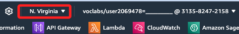

<br>

2. 點擊 `Create bucket` 並命名為 `data-source-99991`；`99991` 可以是隨機數字，其餘使用預設，然後點擊右下角 `Create bucket`；這裡依據教程的指引使用 _五碼_ 自訂數字，實務上只要名稱可唯一識別即可。

    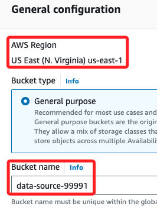

<br>

3. 比照前一步驟模式建立第二個 Bucket，命名使用相同尾綴 `99991`，完整命名為 `query-results-99991`；其餘不贅述。

    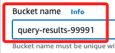

<br>

4. 完成時可在清單中再次確認兩個 Bucket 的命名與區域正確無誤。

    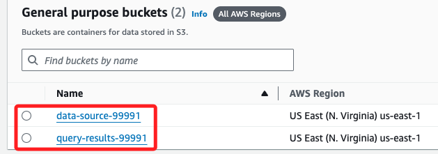

<br>

## 返回 Cloud9

_下載三個 .csv 源數據文件_

<br>

1. 進入 Cloud9 後，在前面步驟建立的 `CapstoneIDE` 環境對象中點擊 `Open` 開啟 IDE。

    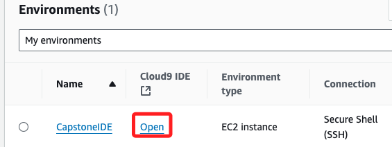

<br>

2. 在終端中運行以下命令，這會下載所需的三個 CSV 檔案；這裡加上 `&&` 只是懶得再逐一按 `ENTER`，不是必須的。

    ```bash
    wget https://aws-tc-largeobjects.s3.us-west-2.amazonaws.com/CUR-TF-200-ACDENG-1-91570/lab-capstone/s3/SAU-GLOBAL-1-v48-0.csv && \
    wget https://aws-tc-largeobjects.s3.us-west-2.amazonaws.com/CUR-TF-200-ACDENG-1-91570/lab-capstone/s3/SAU-HighSeas-71-v48-0.csv && \
    wget https://aws-tc-largeobjects.s3.us-west-2.amazonaws.com/CUR-TF-200-ACDENG-1-91570/lab-capstone/s3/SAU-EEZ-242-v48-0.csv
    ```

    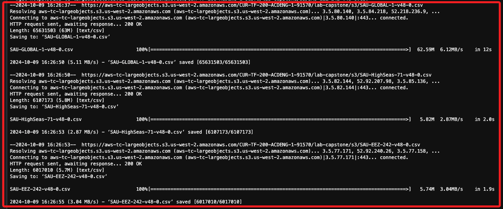

<br>

3. 下載完成在左側欄中可看到這三個文件。

    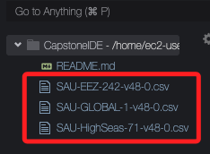

<br>

4. 使用 `head` 指令查看其中 `SAU-GLOBAL-1-v48-0.csv` 文件的欄位標題和前五行數據。

    ```bash
    head -6 SAU-GLOBAL-1-v48-0.csv
    ```

    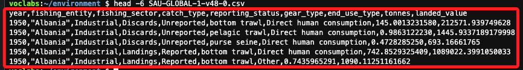

<br>

5. 可串接 `column` 命令來進行格式化顯示。

    ```bash
    head -6 SAU-GLOBAL-1-v48-0.csv | column -t -s ","
    ```

    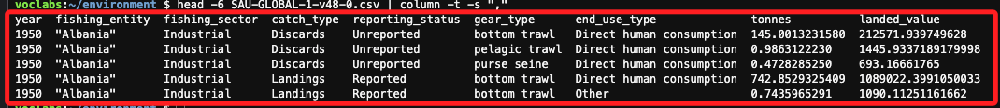

<br>

## 數據集簡介

_僅說明結構，詳細內容請參考 `README`_

<br>

1. 當前使用的數據集包含 `561,675` 行，欄位有 `捕撈年份`、`捕撈國家（fishing_entity）`、`捕撈噸數` 和 `捕撈價值`，其中價值是以 `2010 年美元` 計算；這些數據涵蓋了 `1950` 年至 `2018` 年之間全球高海域的捕撈數據，不包括任何國家 `專屬經濟區（EEZ）內` 的捕撈活動。

<br>

2. 可以使用以下命令確認 `行數(lines)`；正確說，這應該是 `列數(rows)`。

    ```bash
    wc -l SAU-GLOBAL-1-v48-0.csv
    ```

    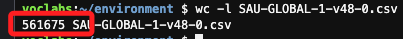

<br>

3. 補充說明，俗話說 `盡信書不如無書`，AWS 還是有很多描述不是太精準，這裡針對文件中的描述 `This dataset contains 561,675 lines` 補充說明；更精確的表達應該是 `This dataset contains 561,675 rows.`，因為在數據庫或數據集中，`row` 是用來描述數據集中的每一列記錄，而 `Line` 是比較口語的說法，在繁中表達裡也容易與欄位產生混淆。

<br>

## 轉換數據格式

_將 `CSV` 文件轉換為 `Parquet` 格式；該格式具備空間效率、查詢性能、高效壓縮、高度兼容等特性_

<br>

1. 安裝所需工具；依據官方說明是使用以下指令。

    ```bash
    sudo pip3 install pandas pyarrow fastparquet
    ```

<br>

2. 依照官方指引安裝會出現以下錯誤；錯誤訊息主要表達了版本衝突，以及使用 root 身份運行 pip 可能造成的問題，雖然安裝有完成，但不能確保後續的操作不受影響。

    

<br>

## 修正教程指引

_排除以上錯誤並完成安裝與後續操作；以下操作同樣在 Cloud9 的終端進行。_

<br>

1. 在當前目錄中建立虛擬環境，自訂名稱為 `envCapstone`；特別說明，在 Cloud9 中必須明確使用 `python3` 指令，而不是使用 `python`。

    ```bash
    python3 -m venv envCapstone
    ```

    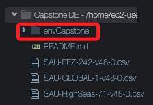

<br>

2. 啟用虛擬環境。

    ```bash
    source envCapstone/bin/activate
    ```

    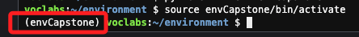

<br>

3. 更新 pip；特別注意，這只是使用虛擬環境時的良好習慣，不贅述。

    ```bash
    python3 -m pip install --upgrade pip
    ```

    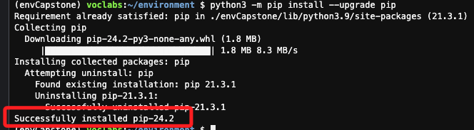

<br>

4. 在虛擬環境中安裝套件；在這不加入 `python3 -m` 的效果是相同的，但建議養成良好習慣避免不必要的潛在問題。

    ```bash
    python3 -m pip install pandas pyarrow fastparquet
    ```

    _無暇完成安裝_

    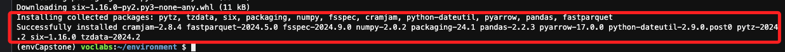

<br>

5. 開啟 Python 交互式環境。

    ```bash
    python3
    ```

<br>

6. 使用以下 Python 代碼將 `CSV` 文件 `SAU-GLOBAL-1-v48-0.csv` 轉換為 `Parquet` 格式；特別注意，共有三個 `CSV` 文件，這裡僅先針對其一進行轉換。

    ```bash
    import pandas as pd
    df = pd.read_csv('SAU-GLOBAL-1-v48-0.csv')
    df.to_parquet('SAU-GLOBAL-1-v48-0.parquet')
    ```

<br>

7. 運行後可在左側欄中看到新添加的文件 `SAU-GLOBAL-1-v48-0.parquet`，相同主檔名，只是副檔名是 `.parquet`。

    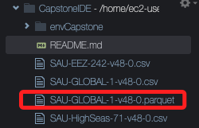

<br>

8. 退出交互式環境。

    ```bash
    exit()
    ```

<br>

9. 若要關閉虛擬環境可運行以下指令；這裡可先不用關閉虛擬環境，後續還會使用到。

    ```bash
    deactivate
    ```

<br>

## 上傳文件到 S3 Bucket 

_上傳前一個步驟轉換的文件_

<br>

1. 上傳 `SAU-GLOBAL-1-v48-0.parquet` 文件至 `data-source` Bucket。

    ```bash
    aws s3 cp SAU-GLOBAL-1-v48-0.parquet s3://data-source-99991
    ```

<br>

2. 前往 S3 的 `data-source-99991` Bucket 中查看是否存在該文件。

    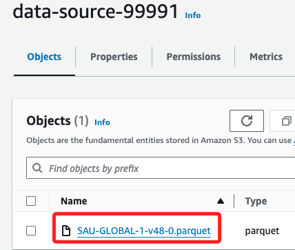

<br>

___

_END_