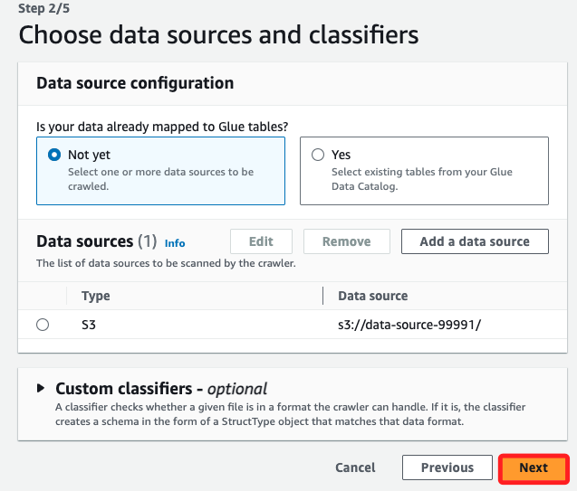
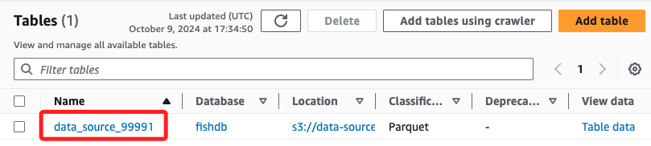
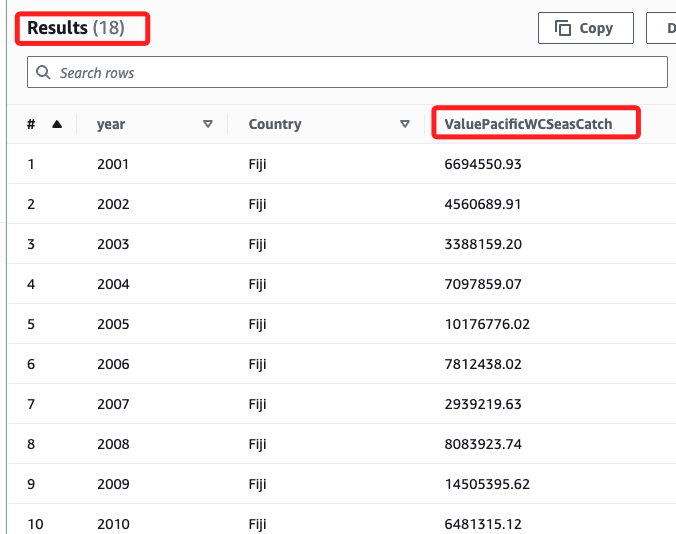

# Task 2：查詢文件

_配置 AWS Glue Crawler 來探索數據的結構，然後使用 Athena 查詢這些數據。_

<br>

## 查看數據結構與內容

_`head -6 SAU-GLOBAL-1-v48-0.csv` 及 `SAU-HighSeas-71-v48-0.csv`_

<br>

1. 使用 `head` 命令查看該 CSV 文件的欄位和前幾列數據；`SAU-HighSeas-71-v48-0.csv` 文件包含了 `SAU-GLOBAL-1-v48-0.csv` 文件所有的欄位，另外還有其他額外的欄位；特別注意，這裡使用終端機指令確實不容易觀察數據格式，這在下一個 Task 中將使用 Python 腳本進行輸出，這裡暫不重複贅述。

    ```bash
    head -6 SAU-GLOBAL-1-v48-0.csv
    head -6 SAU-HighSeas-71-v48-0.csv
    ```

    

<br>

2. 數據集 `SAU-HighSeas-71-v48-0` 描述在名為 `Pacific, Western Central` 的高海域中的魚類捕撈數據；在這個數據集中特別值得關注的兩個額外欄位是 `area_name` 與 `common_name`； `area_name` 欄位在每一行中都包含 `Pacific, Western Central` 的值，`common_name` 欄位則描述某些類型的魚類，例如 `鯖魚`、`金槍魚`、`鰹魚`。

<br>

## 再次轉換

_與之前相同方式，將 `SAU-HighSeas-71-v48-0.csv` 文件轉換為 `Parquet` 格式並上傳至 `data-source Bucket`_

<br>

1. 啟用虛擬環境。

    ```bash
    source envCapstone/bin/activate
    ```

<br>

2. 在終端機開啟 Python 交互式環境。

    ```bash
    python3
    ```

<br>

3. 使用以下 Python 代碼將 CSV 文件轉換為 Parquet 格式。

    ```bash
    import pandas as pd
    df = pd.read_csv('SAU-HighSeas-71-v48-0.csv')
    df.to_parquet('SAU-HighSeas-71-v48-0.parquet')
    ```

    

<br>

4. 退出交互式終端。

    ```bash
    exit()
    ```

<br>

5. 假如需要關閉虛擬環境。

    ```bash
    deactivate
    ```

<br>

6. 將 `parquet` 文件上傳至 S3。

    ```bash
    aws s3 cp SAU-HighSeas-71-v48-0.parquet s3://data-source-99991
    ```

<br>

7. 前往 S3 查看。

    

<br>

## 建立 AWS Glue 資料庫

1. 進入 Glue 並點擊 Databases。

    

<br>

2. 建立 AWS Glue 資料庫。

    

<br>

3. 命名 `fishdb`，點擊右下角建立。

    

<br>

## 建立 Glue Crawler

1. 進入 Crawler，並點擊 `Create crewler` 建立爬蟲。

    

<br>

2. 命名 `fishcrawler` 並點擊 `Next`。

    

<br>

3. 點擊 `Add a data source`。

    

<br>

4. 點擊 `Browse S3`。

    

<br>

5. 選取前綴為 `data-source` 的 Bucket，然後點擊 `Choose`。

    

<br>

6. 會看到 `S3 path` 出現紅字警告，在路徑尾端輸入 `/` 即可。

    

<br>

7. 點擊右下角 `add an S3 data source`。

    

<br>

8. 點擊 `Next`。

    

<br>

9. 從下拉選單中選取預設的角色 `CapstoneGlueRole`；其餘無需設定，點擊 `Next`。

    

<br>

10. 目標資料庫選取 `fishdb`，爬取頻率使用預設的 `On Demand`，點擊 `Next`。

    

<br>

11. 略作查看無誤後，點擊右下角 `Create crewler`。

    

<br>

## 運行 Crawler 建立 Glue Table

_會在 AWS Glue 資料庫中建立包含元數據的 Table_

<br>

1. 回到 Crawlers 清單中；選取並運行 `fishcrawler` Crawler；過程中 State 會顯示 `Running`、`Stopping` 然後完成回到 `Ready`，需要一點時間。

    

<br>

2. 完成時，進入 Glue Databases 的 Tables 確認成功建立了 `data_source_99991`。

    

<br>

3. 點擊進入可查看該表將所爬取數據的結構和元數據；所謂 `元數據（Metadata）` 是關於數據的描述或資訊，用來定義數據的結構和屬性，所以元數據通常指的是數據的結構，而不是實際的數據內容。

    

<br>

## 使用 Athena 查詢新表中的數據

1. 進入 `Athena` 並點擊 `Query Editor`。

    

<br>

2. 切換到 `Settings` 頁籤，並點擊 `Manage`。

    

<br>

3. 點擊 `Browse S3`，選取 `query-results-99991`，然後點擊 `Choose`；返回設定頁面後，點擊右下角 `Save`。

    

<br>

4. 切換回到 `Editor` 頁籤，使用以下範例查詢，然後點擊 `Run`；這段語句使用了關鍵字 `DISTINCT`，從名為 `fishdb.data_source_99991` 的資料表中，選取所有不同的 `area_name` 欄位值，也就是去除 `area_name` 欄位重複的部分並列出所有的唯一值。

    ```sql
    SELECT DISTINCT area_name FROM fishdb.data_source_99991;
    ```

<br>

5. 這個舉句查詢數據集中 `area_name` 欄位的唯一值，從結果可看到兩列，一列是空值，表示某些記錄的 `area_name` 欄位沒有數據，另一列則是 `Pacific, Western Central`，表示該數據集的某些記錄與該地區相關。

    

<br>

6. 可替換語句中的查詢對象來觀察其他欄位，例如 `common_name`，結果顯示共有 `24` 個唯一值，這些是魚類或海洋生物名稱，也就是捕撈到的漁獲種類。

    ```sql
    SELECT DISTINCT common_name FROM fishdb.data_source_99991;
    ```

    

<br>

## 查詢特定數據

1. 要查詢自 `2001 年` 以來，`Fiji` 在 `Pacific, Western Central` 高海域中的魚類捕撈價值（以美元計算），並按年分組，可使用以下 SQL 查詢；這裡使用了 `CAST` 函數來將捕撈價值 (`landed_value`) 的顯示格式轉換為便於閱讀的美元格式。

    ```sql
    SELECT year, fishing_entity AS Country, 
          CAST(CAST(SUM(landed_value) AS DOUBLE) AS DECIMAL(38,2)) AS ValuePacificWCSeasCatch
    FROM fishdb.data_source_99991
    WHERE area_name LIKE '%Pacific%' 
      AND fishing_entity='Fiji' 
      AND year > 2001
    GROUP BY year, fishing_entity
    ORDER By year;
    ```

    

<br>

## 挑戰任務

_查詢 Fiji 在所有高海域的魚類捕撈總價值_

<br>

1. 搜尋自 `2001 年` 以來 `Fiji` 在所有高海域的捕撈價值，並將美元值欄位命名為 `ValueAllHighSeasCatch`；`area_name IS NULL` 使用 `IS NULL` 表示搜尋不屬於任何國家的高海域資料，`fishing_entity = 'Fiji'` 過濾出來自 `Fiji` 的捕撈數據，`year > 2000` 過濾自 `2001 年` 以來的數據，`CAST` 將捕撈價值轉換為讀者友好的格式，以兩位小數顯示。

    ```sql
    SELECT 
        year, 
        fishing_entity AS Country, 
        CAST(CAST(SUM(landed_value) AS DOUBLE) AS DECIMAL(38,2)) AS ValueAllHighSeasCatch
    FROM 
        fishdb.data_source_99991
    WHERE 
        area_name IS NULL 
        AND fishing_entity = 'Fiji' 
        AND year > 2000
    GROUP BY 
        year, 
        fishing_entity
    ORDER BY 
        year;
    ```

    

<br>

## 建立視圖

1. 展開 `Create` 並選取 `View from query`。

    

<br>

2. 將視圖命名為 `challenge`，然後點擊 `Create`。

    

<br>

3. 左側可看到 `Views` 中添加了 `challenge`。

     

<br>

___

_END_