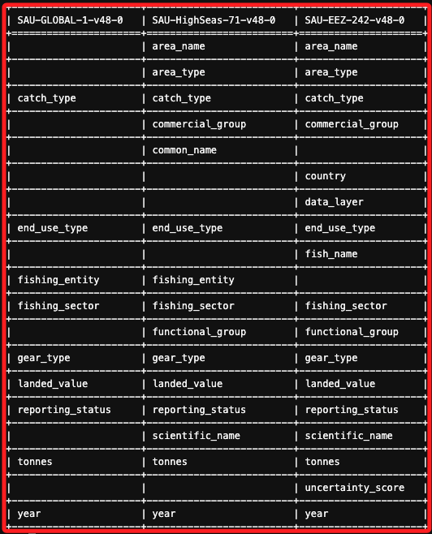

# Task 3：文件轉型與上傳


_接下來要使用文件 `SAU-EEZ-242-v48-0.csv`，因為該文件與已上傳的數據欄位不匹配，需要先修改然後再上傳。_

<br>

## 查看數據結構

_進入 Cloud9 檢查結構差異_

<br>

1. 啟動虛擬環境。

    ```bash
    source envCapstone/bin/activate
    ```

<br>

2. 安裝套件。

    ```bash
    python3 -m pip install tabulate
    ```

<br>

3. 啟動 Python 互動環境。

    ```bash
    python3
    ```

<br>

4. 運行以下腳本。 

    ```python
    import pandas as pd
    from tabulate import tabulate

    # 讀取每個 CSV 文件的前幾行，並獲取欄位名稱
    df_global = pd.read_csv('SAU-GLOBAL-1-v48-0.csv', nrows=0)
    df_highseas = pd.read_csv('SAU-HighSeas-71-v48-0.csv', nrows=0)
    df_eez = pd.read_csv('SAU-EEZ-242-v48-0.csv', nrows=0)

    # 提取欄位名稱
    columns_global = df_global.columns.tolist()
    columns_highseas = df_highseas.columns.tolist()
    columns_eez = df_eez.columns.tolist()

    # 建立一個欄位名稱的集合，以確保所有唯一的欄位名稱都會被比較
    all_columns = sorted(set(columns_global + columns_highseas + columns_eez))

    # 將每個欄位的名稱與對應的 CSV 文件進行匹配，沒有匹配的補空字串
    global_match = [col if col in columns_global else "" for col in all_columns]
    highseas_match = [col if col in columns_highseas else "" for col in all_columns]
    eez_match = [col if col in columns_eez else "" for col in all_columns]

    # 構建表格進行展示
    table = list(zip(global_match, highseas_match, eez_match))
    headers = ["SAU-GLOBAL-1-v48-0", "SAU-HighSeas-71-v48-0", "SAU-EEZ-242-v48-0"]

    # 使用 tabulate 進行表格化輸出
    print(tabulate(table, headers=headers, tablefmt="grid"))
    ```

<br>

5. 得到以下結果；特別說明，我這個部分是在完成教程後才回來做的，所以可能已經映射完成，所以並未查看到 `fish_name` 和 `country` 欄位。

    

<br>

6. 主要差異集中在 `SAU-EEZ-242-v48-0` 中，該數據集包含一些獨有的欄位，如 `data_layer` 和 `uncertainty_score`，這些欄位在其他數據集中不存在。此外，`SAU-EEZ-242-v48-0` 的 `fish_name` 和 `country` 欄位在數據結構上不存在於當前的輸出中。與此同時，`SAU-HighSeas-71-v48-0` 和 `SAU-EEZ-242-v48-0` 都比 `SAU-GLOBAL-1-v48-0` 提供了更多與區域和分類相關的信息，特別是像 `area_name` 和 `common_name` 等欄位。此外，這三個數據集中的共同欄位（如 `catch_type`、`fishing_entity`、`tonnes` 等）需要在合併時進行一致性的對齊或轉換。欄位名稱的差異顯示，在合併這些數據集時，可能需要對某些欄位進行名稱映射和轉換，尤其是在處理特定的區域名稱和分類名稱時。

<br>

## 轉換

_這裡先將映射部分筆記起來，我之後重做的時候，再來確認是不是原始資料的出圖可看到跟官方教程相同內容_

<br>

1. 根據官方指引的相關說明，需要將 `fish_name` 映射為 `common_name`、將 `country` 映射為 `fishing_entity`。

    

<br>

2. 加入了映射規則來對輸出表格進行欄位名稱的對齊。映射操作僅針對表格輸出，不會對原始 CSV 文件進行任何變更。具體的映射邏輯將 fish_name 映射為 common_name，並將 country 映射為 fishing_entity。

    ```python
    import pandas as pd
    from tabulate import tabulate

    # 讀取每個 CSV 文件的前幾行，並獲取欄位名稱
    df_global = pd.read_csv('SAU-GLOBAL-1-v48-0.csv', nrows=0)
    df_highseas = pd.read_csv('SAU-HighSeas-71-v48-0.csv', nrows=0)
    df_eez = pd.read_csv('SAU-EEZ-242-v48-0.csv', nrows=0)

    # 提取欄位名稱
    columns_global = df_global.columns.tolist()
    columns_highseas = df_highseas.columns.tolist()
    columns_eez = df_eez.columns.tolist()

    # 手動映射需要對齊的欄位名稱
    mapping_eez = {"fish_name": "common_name", "country": "fishing_entity"}

    # 將 SAU-EEZ-242-v48-0 的欄位名稱根據映射進行調整
    columns_eez_mapped = [mapping_eez.get(col, col) for col in columns_eez]

    # 建立一個欄位名稱的集合，以確保所有唯一的欄位名稱都會被比較
    all_columns = sorted(set(columns_global + columns_highseas + columns_eez_mapped))

    # 將每個欄位的名稱與對應的 CSV 文件進行匹配，沒有匹配的補空字串
    global_match = [col if col in columns_global else "" for col in all_columns]
    highseas_match = [col if col in columns_highseas else "" for col in all_columns]
    eez_match = [col if col in columns_eez_mapped else "" for col in all_columns]

    # 構建表格進行展示
    table = list(zip(global_match, highseas_match, eez_match))
    headers = ["SAU-GLOBAL-1-v48-0", "SAU-HighSeas-71-v48-0", "SAU-EEZ-242-v48-0 (Mapped)"]

    # 使用 tabulate 進行表格化輸出
    print(tabulate(table, headers=headers, tablefmt="grid"))
    ```

<br>

## 分析 `SAU-EEZ-242-v48-0.csv` 文件的數據結構

_細節之後補充_

<br>

1. 需要與之前數據集中的列進行比對，找出不匹配的欄位名。

<br>

2. 多數欄位名應該是一致的，但 `EEZ` 文件中的兩欄位名與其他文件不完全匹配，這需要進行修正。

<br>

## 修正欄位名並將文件轉換為 Parquet 格式

1. 建立文件備份。

    ```bash
    cp SAU-EEZ-242-v48-0.csv SAU-EEZ-242-v48-0-old.csv
    ```

<br>

2. 啟動虛擬環境。

    ```bash
    source envCapstone/bin/activate
    ```

<br>

3. 開啟 python 互動界面。

    ```bash
    python3
    ```

<br>

4. 執行以下腳本完成欄位名修正及文件轉換。

    ```python
    import pandas as pd

    # 加載備份文件
    data_location = 'SAU-EEZ-242-v48-0-old.csv'
    df = pd.read_csv(data_location)

    # 查看現有的欄位名
    print(df.head(1))

    # 修改欄位名，將 fish_name 和 country 欄位名修正為 common_name 和 fishing_entity
    df.rename(columns = {"fish_name": "common_name", "country": "fishing_entity"}, inplace = True)

    # 確認欄位名已經修正
    print(df.head(1))

    # 保存 CSV 及 Parquet 格式文件
    df.to_csv('SAU-EEZ-242-v48-0.csv', header=True, index=False)
    df.to_parquet('SAU-EEZ-242-v48-0.parquet')
    ```

<br>

5. 退出 Python 環境。

    ```bash
    exit()
    ```

<br>

6. 結束虛擬環境。

    ```bash
    deactivate
    ```

<br>

## 上傳轉換後的文件至 Amazon S3 Bucket

1. 將生成的 `SAU-EEZ-242-v48-0.parquet` 文件上傳至先前建立的 S3 Bucket。

    ```bash
    aws s3 cp SAU-EEZ-242-v48-0.parquet s3://data-source-99991
    ```

<br>

2. 假如要使用 Boto3。

    ```python
    import boto3

    # 初始化 S3 客戶端
    s3 = boto3.client('s3')

    # 設定桶名稱和文件路徑
    bucket_name = 'data-source-99991'
    file_path = 'SAU-EEZ-242-v48-0.parquet'
    # S3 中的路徑
    s3_key = 'data-folder/SAU-EEZ-242-v48-0.parquet'

    # 上傳文件到 S3
    s3.upload_file(file_path, bucket_name, s3_key)

    print(f"{file_path} 已成功上傳至 S3 桶: {bucket_name}/{s3_key}")
    ```

<br>

## 更新 AWS Glue 中的表元數據

1. 重新運行一次既有的 Crawler 就可以更新表的元數據。

    

<br>

2. 完成後進入 `Tables` 確認表格已更新並顯示新加入的數據列。

_後補_

<br>

## 在 Athena 中運行查詢以驗證數據

1. 使用以下查詢來驗證 `area_name` 列的值。

    ```sql
    SELECT DISTINCT area_name FROM fishdb.data_source_99991;
    ```

<br>

2. 此查詢應返回三個結果，包括來自 EEZ 文件的數據，此查詢之前只返回兩個結果。

    

<br>

3. 驗證 Fiji 自 2001 年以來在開放海域捕撈魚類的美元價值，按年份組織。

    ```sql
    SELECT year, fishing_entity AS Country, 
    CAST(CAST(SUM(landed_value) AS DOUBLE) AS DECIMAL(38,2)) AS ValueOpenSeasCatch
    FROM fishdb.data_source_99991
    WHERE area_name IS NULL AND fishing_entity='Fiji' AND year > 2000
    GROUP BY year, fishing_entity
    ORDER BY year;
    ```

<br>

4. 驗證 Fiji 自 2001 年以來在 Fiji 專屬經濟區（EEZ）捕撈魚類的美元價值，按年份組織。

    ```sql
    SELECT year, fishing_entity AS Country, 
    CAST(CAST(SUM(landed_value) AS DOUBLE) AS DECIMAL(38,2)) AS ValueEEZCatch
    FROM fishdb.data_source_99991
    WHERE area_name LIKE '%Fiji%' AND fishing_entity='Fiji' AND year > 2000
    GROUP BY year, fishing_entity
    ORDER BY year;
    ```

<br>

5. 驗證 Fiji 自 2001 年以來在 EEZ 和高海域捕撈魚類的總價值，按年份組織。

    ```sql
    SELECT year, fishing_entity AS Country, 
    CAST(CAST(SUM(landed_value) AS DOUBLE) AS DECIMAL(38,2)) AS ValueEEZAndOpenSeasCatch
    FROM fishdb.data_source_99991
    WHERE (area_name LIKE '%Fiji%' OR area_name IS NULL) AND fishing_entity='Fiji' AND year > 2000
    GROUP BY year, fishing_entity
    ORDER BY year;
    ```

<br>

## 分析結果

1. 如果數據格式正確，且 AWS Glue 的 Crawler 已正確更新元數據表，則前三個查詢的結果應該加總一致。例如， `2001` 年的 `ValueOpenSeasCatch` 和 `ValueEEZCatch` 的總和應等於 `2001` 年的 `ValueEEZAndOpenSeasCatch`。

<br>

## 在 Athena 中建立視圖

1. 運行下列查詢，將視圖命名為 `MackerelsCatch`，並用來檢視數據。

    ```sql
    CREATE OR REPLACE VIEW MackerelsCatch AS
    SELECT year, area_name AS WhereCaught, fishing_entity as Country, SUM(tonnes) AS TotalWeight
    FROM fishdb.data_source_99991
    WHERE common_name LIKE '%Mackerels%' AND year > 2014
    GROUP BY year, area_name, fishing_entity, tonnes
    ORDER BY tonnes DESC;
    ```

<br>

2. 添加視圖。

    

<br>

## 查詢視圖數據

1. 驗證視圖是否正確地返回數據，並使用視圖進行後續分析。例如，可以查詢每年 mackerel 捕撈數量最多的國家。

    ```sql
    SELECT year, Country, MAX(TotalWeight) AS Weight
    FROM fishdb.mackerelscatch
    GROUP BY year, Country
    ORDER BY year, Weight DESC;
    ```

    

<br>

## 完成


<br>

___

_END_