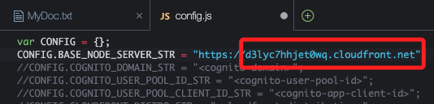
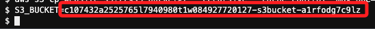
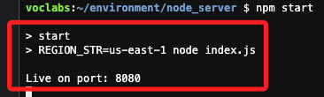
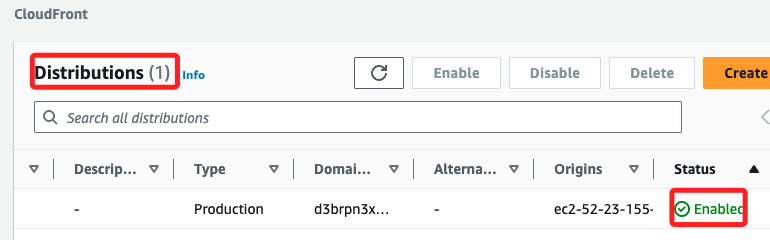

# Task 1：準備 Lab 環境

_在一開始 Lab 時，先在預先準備的 AWS Cloud9 IDE 中導入一些檔案並執行預設腳本。_

<br>

## 連接到 Cloud9 IDE

1. 搜尋並進入 `Cloud9`。

<br>

2. 在 Lab 預先建立好的實例 `Cloud9 Instance` 右側點擊 `Open` 開啟 IDE。

<br>

## 記錄所需資訊

_準備一個文件用來記錄各項資訊_

<br>

1. 開啟新文件，並儲存為 `MyDoc.txt`。

<br>

2. 貼上以下內容，在接下來步驟中將紀錄各項資訊。

    ```bash
    S3 bucket:
    CloudFront distribution domain:
    User pool ID:
    App client ID:
    Amazon Cognito domain prefix:
    Identity pool ID:
    ```

<br>

## 下載並執行應用程式代碼

1. 在 Cloud9 終端中運行以下指令；下載並解壓縮 `code.zip` 文件，接著進入解壓縮的 `resources` 目錄，並執行 `setup.sh` 腳本進行設置。

    ```bash
    wget https://aws-tc-largeobjects.s3.us-west-2.amazonaws.com/CUR-TF-100-EDBLDR-1-107430/01-lab-cognito/code.zip
    unzip code.zip
    cd resources
    . ./setup.sh
    ```

<br>

2. 當 `setup.sh` 腳本執行完成後，最後四行會輸出如下內容。

    

<br>

3. 在 `MyDoc.txt` 中記錄其中的 S3 及 CloudFront 輸出資訊；切記要存檔。

    ```bash
    S3 bucket:c1234567890abcdefghi-s3bucket-123456abcd3
    CloudFront distribution domain:d123456acbdef.cloudfront.net
    ```

<br>

## 這個 Bash 腳本執行了以下工作

_僅補充說明，無操作_

<br>

1. 刪除舊版的 AWS CLI，並且從官方下載 AWS CLI v2 安裝檔，解壓縮後進行安裝。

<br>

2. 安裝 Python 的 Boto3 庫，這是 AWS SDK for Python，用來與 AWS 服務互動。

<br>

3. 執行 `npm install` 來安裝 Node.js 相關的依賴模組。

<br>

4. 並運行 `setup.py` 腳本，用於配置 EC2 安全群組和部署 CloudFront。

<br>

5. 使用 AWS CLI 列出第一個 S3 bucket 的名稱，以及列出 CloudFront 發行的第一個分佈的域名。

<br>

## 更新 Web 代碼

_用以指向 Node 伺服器的 API 端點；以下繼續在終端機中操作_

<br>

1. 在左側欄中展開 `website/scripts` 資料夾，並點擊開啟 `config.js` 文件。

<br>

2. 將 `<cloudfront-domain>` 佔位符替換為記錄在 `MyDoc.txt` 中的 `CloudFront distribution domain`；特別注意，要保留前綴 `https://` 以及前後雙引號。

    

<br>

3. 修改後如下，切記保存更改。

    

<br>

## 上傳更新後的網站代碼

_對官方指引稍作修改_

<br>

1. 先在終端機中將前面紀錄的 `S3 bucket` 存入變數中，也就是替換以下 `<s3-bucket>` 佔位符；特別注意，變數名稱不要使用 `-`，但可以使用底線 `_`。

    ```bash
    S3_BUCKET=<s3-bucket>
    ```

    _如下_

    

<br>

2. 使用指令上傳更新的網站代碼，這裡會自動帶入變數值。

    ```bash
    cd /home/ec2-user/environment
    aws s3 cp website s3://$S3_BUCKET/ --recursive --cache-control "max-age=0"
    ```

<br>

3. 運行更新後的指令來完成代碼上傳。

<br>

## 啟動 Node 伺服器

1. 運行指令啟動 Node 伺服器；切記在 Lab 運行過程中不要關閉這個終端機。

    ```bash
    cd /home/ec2-user/environment/node_server
    npm start
    ```

<br>

2. 伺服器啟動後，終端中會顯示如下輸出。

    

<br>

## 監控 CloudFront 發行的部署狀態

1. 搜尋並進入 `CloudFront`。

<br>

2. 查看 `Distributions` 的 `Status`，如果狀態為 `Deploying`，等待狀態變為 `Enabled`，然後再進行下一個 Task。

    

<br>

___

_END_