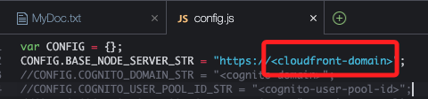

# Task 1：準備 Lab 環境

_在開始此 Lab 之前，必須先在為您準備的 AWS Cloud9 統合開發環境（IDE）中導入一些檔案並執行腳本。_

<br>

## 連接到 Cloud9 IDE

1. 搜尋並進入 `Cloud9`。

<br>

2. 點擊 `Cloud9 Instance` 右側的 `Open`；這會開啟新的頁面。

<br>

## 記錄所需資訊

1. 開啟新文件，並儲存為 `MyDoc.txt`。

<br>

2. 貼上以下內容，在接下來步驟中將紀錄各項資訊。

    ```bash
    S3 bucket:
    CloudFront distribution domain:
    User pool ID:
    App client ID:
    Amazon Cognito domain prefix:
    Identity pool ID:
    ```

<br>

## 下載並執行應用程式代碼

1. 在 Cloud9 終端中運行以下指令；下載並解壓縮 `code.zip` 文件，接著進入解壓縮的 `resources` 目錄，並執行 `setup.sh` 腳本進行設置。

    ```bash
    wget https://aws-tc-largeobjects.s3.us-west-2.amazonaws.com/CUR-TF-100-EDBLDR-1-107430/01-lab-cognito/code.zip
    unzip code.zip
    cd resources
    . ./setup.sh
    ```

<br>

2. 當 `setup.sh` 腳本執行完成後，最後四行會輸出如下內容。

    

<br>

3. 在 `MyDoc.txt` 中記錄其中的 S3 及 CloudFront 輸出資訊。

    ```bash
    S3 bucket:c1234567890abcdefghi-s3bucket-123456abcd3
    CloudFront distribution domain:d123456acbdef.cloudfront.net
    ```

<br>

## 更新 Web 代碼

_用以指向 Node 伺服器的 API 端點；以下繼續在終端機中操作_

<br>

1. 在左側欄中展開 `website/scripts` 資料夾，並點擊開啟 `config.js` 文件。

<br>

2. 將 `<cloudfront-domain>` 佔位符替換為記錄在 `MyDoc.txt` 中的 `CloudFront distribution domain`。

    

<br>

3. 切記保存更改。

<br>

## 上傳更新後的網站代碼

1. 使用指令上傳更新的網站代碼，並將 `<s3-bucket>` 佔位符替換為前面紀錄的 `S3 bucket`。

    ```bash
    cd /home/ec2-user/environment
    aws s3 cp website s3://<s3-bucket>/ --recursive --cache-control "max-age=0"
    ```

<br>

2. 帶入後實際的指令如下。

    ```bash
    cd /home/ec2-user/environment
    aws s3 cp website s3://c1234567890abcdefghi-s3bucket-123456abcd3/ --recursive --cache-control "max-age=0"
    ```

<br>

3. 運行更新後的指令來完成代碼上傳。

<br>

## 啟動 Node 伺服器

1. 運行指令啟動 Node 伺服器。

    ```bash
    cd /home/ec2-user/environment/node_server
    npm start
    ```

<br>

2. 伺服器啟動後，終端中會顯示如下輸出。

    ```bash
    > start
    > REGION_STR=us-east-1 node index.js
    Live on port: 8080
    ```

<br>

## 監控 CloudFront 發行的部署狀態

1. 搜尋並進入 `CloudFront`。

<br>

2. 查看發行的 `狀態`，如果狀態為 `Deploying`，等待狀態變為 `Enabled`，然後再進行下一個 Task。

<br>

___

_END_