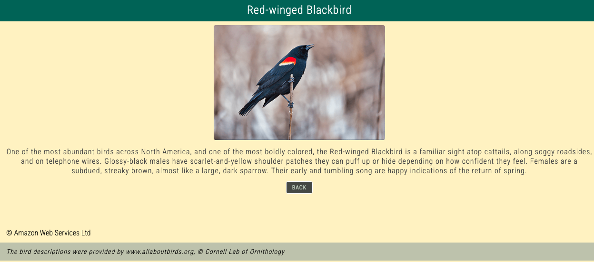
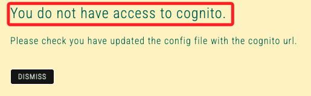

# Task 2: 訂閱 SNS 主題

_在這個任務中，將訂閱一個 SNS 主題，當應用程式用戶請求的報告可用時，系統會發送通知。_

 

## 訂閱 SNS 主題

1. 搜尋並進入 `Simple Notification Service`。

 

2. 在左側欄中選擇 `Topics`。

 

3. 在 `Name` 下找到並點擊 `EmailReport`。

 

## 建立電子郵件訂閱

1. 在 `Subscription` 選擇 `Create subscription`。

    

 

2. 進行配置，在 `Topic ARN` 部分已 _自動填入_ 前面步驟建立主題的 `ARN`。

    

 

3. `Protocol` 選擇 `Email`。

 

4. `Endpoint` 輸入自己的電子郵件的地址，這在本 Lab 後續步驟中用來接收信件通知。

    

 

5. 點擊右下角 `Create subscription`。

 

## 確認電子郵件訂閱

1. 檢查電子郵件收件箱，會收到來自 `AWS Notifications` 的郵件，並在郵件正文中點擊 `Confirm subscription`。

    

 

2. 打開的網頁會顯示 `ubscription confirmed!`；可關閉這個網頁。

    

 

## 發佈測試消息以驗證 SNS 訂閱

1. 返回 `Amazon SNS` 控制台中，點擊 `EmailReport` 進入主題頁面。

    

 

2. 點擊 `Publish message` 後進行配置。

    

 

3. 在 `Subject` 輸入 `Test`。

 

4. 在 `Message body` 輸入 `這是 Lab Task 2 的測試信件。`。

    

 

5. 在頁面底部點擊 `Publish message`。

 

6. 檢查電子郵件，確認已收到來自 SNS 的測試消息；以上已成功訂閱 SNS 主題，並驗證 SNS 通知功能能夠正常運作。

    

 

___

_END_