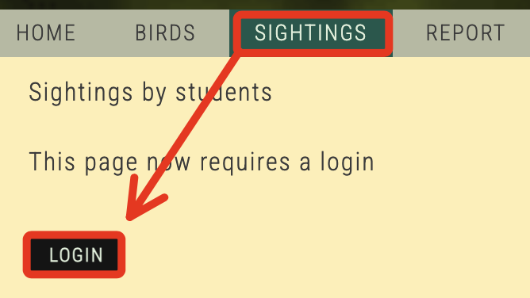

# Task 2：檢查 Birds 網站

_此任務的目的是檢查 `Birds Web` 應用程式在 `啟用使用者身份驗證之前` 的行為。_

 

## 開啟 Birds Web 應用程式

_訪問失敗有時候可能是需要稍等一下_

 

1. 開啟新的瀏覽器分頁，輸入 CloudFront 發佈的網域名，就是紀錄在 `MyDoc.txt` 中的 `CloudFront distribution domain`。

    

 

2. 切換到頁面中的 `BIRDS` 頁籤。

    

 

3. 點擊任意鳥類照片以查看更多資訊；特別說明，這時含有鳥類描述的頁面並未受到保護，任何訪問者都能看到這些內容，也就是說這表示應用程式尚未實施身份驗證；點擊 `BACK` 可返回上一頁。

    

 

## 瀏覽需要身份驗證的頁面

1. 切換到 `SIGHTINGS` 頁籤，點擊 `LOGIN` 按鈕進行登入。

    

 

2. 系統會顯示無法訪問，原因是應用程式的 `Amazon Cognito user pool` 尚未完成設定。

    

 

3. 可關閉訪問中的瀏覽器分頁，但要保留 Cloud9 IDE 中運行的 Node 伺服器運行；接下來會建立並配置 `Amazon Cognito user pool` 以管理應用程式的使用者及其密碼。

 

___

_END_