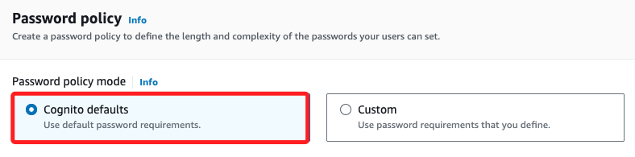

# Task 3: 建立 StateMachine 發送電子郵件

_在此任務中，將建立一個 Step Functions 狀態機器，透過 SNS 主題發送電子郵件通知。該狀態機器需要具備訪問 Lambda 服務的權限，因此首先需要查看一個已經為此目的建立的 IAM 角色。_

<br>

## 審查 IAM Role

_Step Functions 的 Role_

<br>

1. 搜尋並進入 `IAM`。

<br>

2. 在左側欄點擊 `Roles`。

<br>

3. 搜尋並點擊進入 `RoleForStepToCreateAReport`。

    

<br>

## 檢視角色的權限

1. 預設會進入 `Permissions` 頁籤，展開 `stepPolicyForCreateReport` 策略。

    

<br>

2. 這個角色允許對多個 Lambda 函數執行多個 Lambda 操作，並對所有資源執行記錄操作。

    ```json
    {
        "Version": "2012-10-17",
        "Statement": [
            {
                "Action": [
                    "lambda:Get*",
                    "lambda:Invoke*",
                    "lambda:List*"
                ],
                "Resource": [
                    "arn:aws:lambda:us-east-1:084927720127:function:GeneratePresignedURL",
                    "arn:aws:lambda:us-east-1:084927720127:function:generateHTML",
                    "arn:aws:lambda:us-east-1:084927720127:function:getRealData"
                ],
                "Effect": "Allow"
            },
            {
                "Action": [
                    "logs:*"
                ],
                "Resource": "*",
                "Effect": "Allow"
            }
        ]
    }
    ```

<br>

3. 接著展開 `AWSLambdaRole` 策略，這是一個 `AWS managed` 管理策略；該策略允許對所有資源執行 `lambda:InvokeFunction` 操作，所以將允許在 Lambda 控制台測試函數。

    

<br>

## 檢視信任關係

1. 切換到 `Trust relationships` 頁籤。

<br>

2. 該信任關係 _允許 `Step Functions` 服務（`states.amazonaws.com`）來假設此角色_；再次強調這句描述：_允許 `Step Functions` 服務來假設此角色，這個服務就是 `states.amazonaws.com`_。

<br>

3. 官方在此特別提示了在這個 Lab 中是無法建立 IAM 角色。

<br>

## 建立 State Machine

_發送電子郵件_

<br>

1. 進入 `Step Functions`，在左側欄中選擇 `State machines`。

<br>

2. 點擊 `Create state machine`。

<br>

3. 在彈窗 `Choose a template` 頁面中，使用預設選擇的 `Blank`，然後點擊 `Select`。

<br>

## 設計工作流程

1. 在左側搜尋框中輸入 `SNS`。

<br>

2. 將 `Publish` 拖曳到畫布上的 `Drag first state here` 框中。

<br>

## 配置 SNS 發布狀態

1. 使用滑鼠選取 `SNS Publish`，並在右側的面版中進行配置。

<br>

2. 在 `Topic` 選擇先前建立的 `EmailReport` 主題的 `ARN`。

    

<br>

3. 在 `Message` 使用預設的 `Use state input as message` 即可。

<br>

## 修改狀態機器的 ASL

_Amazon States Language_

<br>

1. 切換上方頁籤為 `Code` 進入 _代碼模式_。

<br>

2. 在生成的 `ASL` 代碼中找到 `"Message.$": "$"`。

    

<br>

3. 修改為 `"Message.$": "$.presigned_url_str"`。

    

<br>

4. 此操作確保應用程序會將一個包含 `presigned_url_str` 的 JSON payload 作為郵件內容發送。

<br>

## 配置狀態機器

_這個日誌組將捕獲每次運行狀態機器時的資訊，用於檢查和調試狀態機器。_

<br>

1. 切換當 `Config` 頁籤進入 _配置模式_。

<br>

1. 設置 `State machine name` 為 `MyStateMachine`。

<br>

3. 在 `Execution role` 部分，滑到 `Choose a recently used role` 區塊並選取下方的 `RoleForStepToCreateAReport`。

    

<br>

4. 將 `Log level` 設置為 `ALL`。

<br>

5. 保留其他設置的預設值，點擊右上角 `Create`。

<br>

## 測試 State Machine

1. 點擊右上角 `Execute` 進行配置。

<br>

2. 在代碼編輯器中，替換現有的 JSON 代碼如下。

    ```json
    {
        "presigned_url_str": "Testing that my email message works"
    }
    ```

<br>

3. 點擊 `Start execution`。

<br>

## 查看執行結果

1. 開啟 `Execution Details` 頁面，檢視執行細節。

<br>

2. 幾分鐘內應收到一封通知，該通知包含訊息內容 `Testing that my email message works`；以上成功建立一個基本的狀態機器，該狀態機器調用了 SNS 主題並發送了一封電子郵件。

<br>

___

_END_