# Task 3：建立user pool

 

## 說明

1. 這個任務會建立 `Amazon Cognito user pool` 作為身份提供者，用於建立使用者及管理其密碼。

 

2. `user pool` 還會產生 `憑證 (tokens)`，網頁應用程式將使用這些憑證來確保使用者在訪問受保護頁面或執行受保護操作之前，已經通過身份驗證並擁有有效的工作階段。

 

## 建立 Cognito user pool

1. 進入 `Cognito`。

    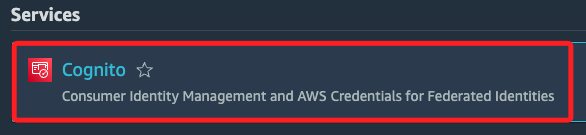

 

2. 點擊 `User Pools`。

    

 

3. 點擊 `Create user pool` 建立新的 `user pool`。

    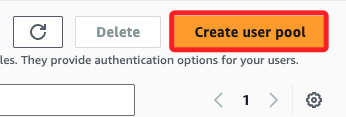

 

## 配置登入體驗

_在 `Configure sign-in experience` 頁面中進行配置_

 

1. `Authentication providers` 預設已經反白選取 `Cognito user pool`。

    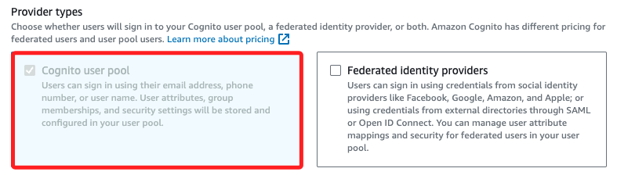

 

2. 在 `Cognito user pool sign-in options` 選擇 `User name`、在 `User name requirements` 勾選 `Make user name case sensitive`；然後點擊 `Next`。

    

 

## 配置安全性要求

_在 `Configure security requirements` 頁面中進行配置_

 

1. `Password policy mode` 使用預設選取的 `Cognito defaults`。

    

 

2. `Multi-factor authentication` 選擇 `No MFA`。

    

 

3. `User account recovery` 取消選擇 `Enable self-service account recovery - Recommended`；然後點擊 `Next`。

    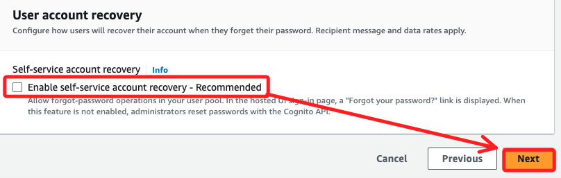

 

## 配置註冊體驗

_在 `Configure sign-up experience` 頁面中進行配置_

 

1. 取消選擇 `Enable self-registration`。

    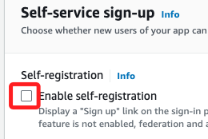

 

2. 在 `Cognito-assisted verification and confirmation`，選擇 `Don’t automatically send messages`。

    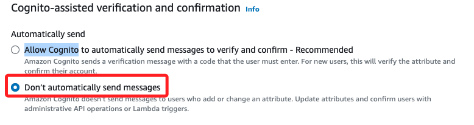

 

3. 點擊 `Next`。

    

 

## 配置訊息傳遞

_在 `Configure message delivery` 頁面中進行配置_

 

1. 在 `Email` 切換選擇為 `Send email with Cognito`。

    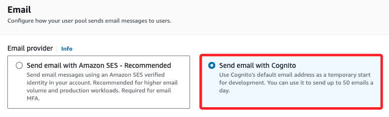

 

2. 點擊 `Next`。

    

 

## 應用程式整合

_在 `Integrate your app` 頁面中進行配置_

 

1. `User pool name` 輸入 `bird_app`。

    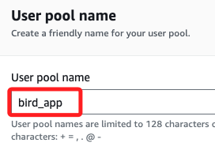

 

2. 勾選 `Use the Cognito Hosted UI`。

    

 

3. 在 `Domain` 區域中，選擇 `Use a Cognito domain`；

    

 

4. 在下方 `Cognito domain` 欄位中輸入唯一的域名如 `mydomain2024`；完成後將此名稱紀錄在 `MyDoc.txt`。

    

 

## 配置應用程式客戶端

1. 在 `Initial app client` 區域中，保留預設選擇的 `Public client`。

    

 

2. 在 `App client name` 欄位中輸入命名 `bird_app_client`。

    

 

3. 在 `Allowed callback URLs` 欄位中，輸入 `https://<cloudfront-domain>/callback.html`，將其中 `<cloudfront-domain>` 替換為記錄在 `MyDoc.txt` 中的 CloudFront 網域名。

    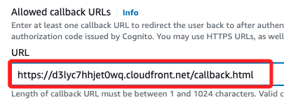

 

4. 展開 `Advanced app client settings` 區域，在下拉選單 `Authentication flows` 中，使用預設選取的 `ALLOW_USER_PASSWORD_AUTH`、`ALLOW_REFRESH_TOKEN_AUTH`。

    

 

5. 在 `OAuth 2.0 Grant Types` 區域中，取消選取 `Authorization code grant`，然後選取 `Implicit grant`。

    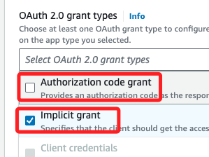

 

6. 點擊 `Next`。

    

 

## 檢查設定並建立 user pool

1. 檢查所有設定是否正確，然後滾動到最下方點擊 `Create user pool`。

    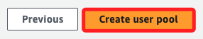

 

2. 在 `MyDoc.txt` 記錄 `User Pool ID`。

    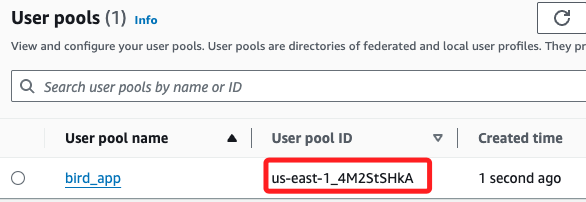

 

## 配置應用整合

1. 在 `user pool` 建立後，點擊進入 `bird-app`。

    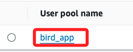

 

2. 進入 `App integration` 頁籤。

    

 

3. 滾動至頁面底部找到 `App clients and analytics` 區域，找到 `bird_app_client`，將 `Client ID` 紀錄到 `MyDoc.txt`；至此成功設置 `Cognito user pool` 與應用程式客戶端，接下來將會建立測試用戶。

    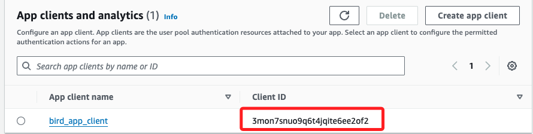

 

___

_END_