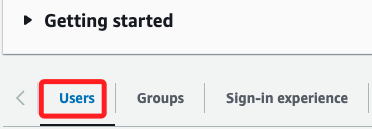
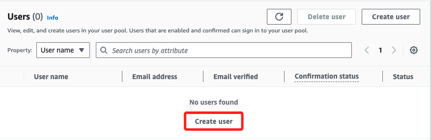
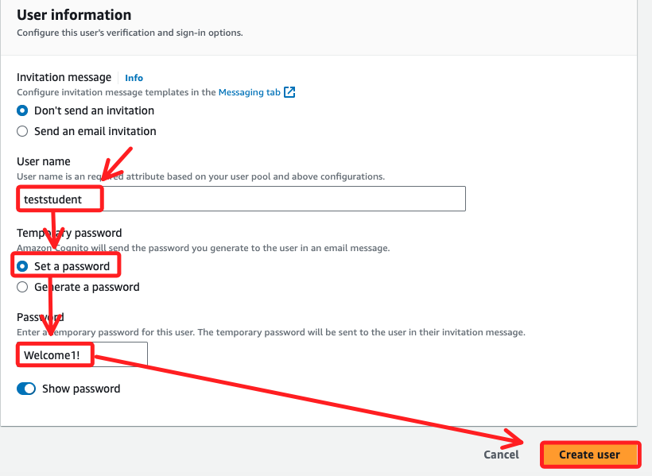

# Task 4：新增測試使用者

 

## 說明

1. 在使用 `Amazon Cognito user pool` 訪問應用程式之前，必須先在 `user pool` 中建立使用者帳戶。

 

2. 此任務會建立一個使用者 `teststudent`，並使用該帳戶來測試應用程式與 `Amazon Cognito user pool` 的整合。

 

## 建立測試使用者

_繼續在 `User pools` 的 `bird_app` 詳細頁面中操作_

 

1. 切換到 `Users` 頁籤。

    

 

2. 在 `Users` 面板中選擇 `Create user`。

    

 

3. 在 `Username` 輸入 `teststudent`、`Temporary password` 選擇 `Set a password`，然後在 `Password` 框中輸入 `Welcome1!`；點擊 `Create user` 完成建立。

    

 

## 測試 `teststudent` 使用者登入

1. 切換回 `App integration` 頁籤。

    

 

2. 滾動至底部 `App clients and analytics` 區域，點擊 `bird_app_client`。

    

 

3. 在 `Hosted UI` 區域中，選擇 `View Hosted UI`。

    

 

4. 在新打開的瀏覽器分頁中，輸入剛剛建立的使用者名稱 `teststudent` 及密碼 `Welcome1!`，點擊 `Sign In`。

    

 

5. 第一次登入系統會要求更改密碼，在 `New Password` 統一輸入 `Welcome123!`，然後點擊 `Send`；特別注意，這是在 Lab 環境中，僅基於便於操作紀錄所以統一密碼。

    

 

6. 完成以上操作會重回網站應用首頁。

    

 

## 獲取 Cognito 發送的憑證 (Token)

1. 在網頁應用程式頁面中，打開瀏覽器的開發者工具，並選擇模擬在行動裝置上的顯示效果。

    

 

2. 切換到 `Application` 頁籤，在左側欄中的 `Storage` 會看到 `Local Storage`。

    

 

3. 展開 `Local Storage`，找到 `CloudFront` 網域，點擊該網域。

    

 

4. 在右側區域中可看到名為 `bearer_str` 的 `Key`，這個 `bearer_str` 的 `Value` 即是 `Amazon Cognito user pool` 產生的 `Token`。

    

 

___

_END_