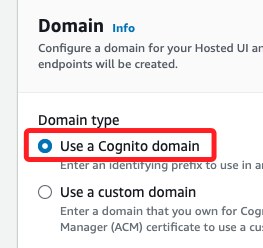
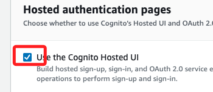
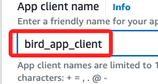
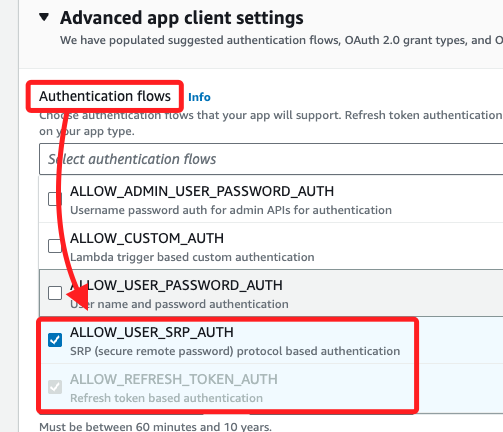

# Task 4: 在狀態機器中新增 `GeneratePresignedURL` Lambda 函數

<br>

## 說明

1. 在此任務中，將建立一個簡單的 `report.html` 文件並上傳至 S3，然後透過 AWS CLI 生成並測試一個 `預簽名 URL`。

<br>

2. 接著，將檢查 S3 Bucket 的策略，確認該文件只能透過 `預簽名 URL` 訪問。

<br>

3. 之後，會測試一個已建立的 `Lambda 函數` 來生成 `預簽名 URL` 並傳遞該報告文本。

<br>

4. 最終會將此 Lambda 函數新增至先前建立的 `Step Functions` 狀態機器中。

<br>

## 建立範例文本文件

_返回 Cloud9 IDE；以下將建立範例文本，將其上傳至 S3 並測試訪問_

<br>

1. 在上方功能列展開 `File` 並點擊 `New File`。

<br>

2. 在新增的文件中貼上以下內容。

    ```html
    <!DOCTYPE html>
    <html lang="zh-Hant">
    <head>
        <meta charset="UTF-8">
        <title>範例 HTML</title>
    </head>
    <body>
        <output>你好！這是一個範例 HTML.</output>
    </body>
    </html>
    ```

<br>

3. 使用組合鍵進行儲存，並命名為 `report.html`；務必確保文本位置在環境的根目錄中。

    

<br>

## 上傳文件至 S3 並檢查 S3 Bucket 策略

_在 Cloud9 終端機中_

<br>

1. 執行以下指令上傳 `report.html` 文件至 S3，並將 `cache-control` 設置為 `max-age=0`，防止文件被緩存；`0` 就是將文件的最大緩存時間設為 `0` 秒，確保每次訪問都能看到文件的最新版本，避免舊版本被緩存導致資料過時。

    ```bash
    cd /home/ec2-user/environment
    bucket=`aws s3api list-buckets --query "Buckets[].Name" | grep s3bucket | tr -d ',' | sed -e 's/"//g' | xargs`
    aws s3 cp report.html s3://$bucket/ --cache-control "max-age=0"
    ```

<br>

2. 進入 `S3`，在 `Buckets` 並點擊預設的 Bucket。

    

<br>

3. 查看文件 `report.html` 文件已存在於 Bucket 中。

<br>

4. 切換到 `Permissions` 標籤。

<br>

3. 在 `Bucket policy` 部分檢查策略，確認以下策略存在。

    ```json
    {
        "Sid": "DenyOneObjectIfRequestNotSigned",
        "Effect": "Deny",
        "Principal": "*",
        "Action": "s3:GetObject",
        "Resource": "arn:aws:s3:::your-bucket-name/report.html",
        "Condition": {
            "StringNotEquals": {
                "s3:authtype": "REST-QUERY-STRING"
            }
        }
    }
    ```

<br>

4. 會出現在最下方。

    

<br>

## 測試直接訪問

1. 切換到 `Objects` 頁籤，然後點擊 `report.html`。

<br>

2. 複製 `Object URL` 並在瀏覽器中打開。

    

<br>

3. 會收到 `AccessDenied` 錯誤，這是由於 `Bucket` 策略阻止了直接訪問。

    

<br>

## 建立並測試預簽名 URL

_返回 AWS Cloud9 終端機_

<br>

1. 運行指令生成一個有效期 `30` 秒的預簽名 URL。

    ```bash
    aws s3 presign s3://$bucket/report.html --expires-in 30
    ```

<br>

2. 複製返回的 `預簽名 URL`，並在瀏覽器中打開，將會成功加載報告。

    

<br>

3. 等待 `30` 秒後刷新頁面，會再次看到 `AccessDenied` 錯誤，這是預期的行為。

<br>

4. 以上成功測試 `預簽名 URL`，並確認該文件只能通過 `預簽名 URL` 訪問。

<br>

## 查看 Lambda 函數的 IAM 角色

1. 進入 IAM 選擇 Roles，搜尋並點擊進入 `RoleForAllLambdas`。

    

<br>

2. 在 `Permissions` 標籤下展開 `lambdaPolicyForAllLambdaSteps` 策略，該角色允許對 S3、SNS、DynamoDB 的操作。

    ```json
    {
        "Version": "2012-10-17",
        "Statement": [
            {
                "Action": [
                    "s3:Get*",
                    "s3:List*",
                    "s3:PutObject*"
                ],
                "Resource": "arn:aws:s3:::c107432a2525765l7940980t1w084927720127-s3bucket-a1rfodg7c9lz/*",
                "Effect": "Allow"
            },
            {
                "Action": [
                    "dynamodb:Scan"
                ],
                "Resource": [
                    "arn:aws:dynamodb:us-east-1:084927720127:table/BirdSightings"
                ],
                "Effect": "Allow"
            },
            {
                "Action": [
                    "logs:*"
                ],
                "Resource": "*",
                "Effect": "Allow"
            },
            {
                "Action": [
                    "sns:Publish"
                ],
                "Resource": "arn:aws:sns:us-east-1:084927720127:EmailReport",
                "Effect": "Allow"
            }
        ]
    }
    ```

<br>

3. 切換到 `Trust relationships` 頁籤，確認 Lambda 服務 (`lambda.amazonaws.com`) 被授權假設此角色。

    ```json
    {
        "Version": "2012-10-17",
        "Statement": [
            {
                "Effect": "Allow",
                "Principal": {
                    "Service": "lambda.amazonaws.com"
                },
                "Action": "sts:AssumeRole"
            }
        ]
    }
    ```

<br>

## 測試 Lambda 函數

_`GeneratePresignedURL`_

<br>

1. 進入 `Lambda`，點擊進入 Lambda 函數 `GeneratePresignedURL`。

<br>

2. 點擊 `Test`，輸入 `Event name` 為 `test1`，其餘不變，然後點擊右下角 `Save`。

<br>

3. 再次點擊 `Test` 會測試，結果將返回一個 `預簽名 URL`。

    

<br>

4. 複製該 `URL` 並在瀏覽器中打開，確認可以加載 `report.html` 文件。

<br>

## 在狀態機器中新增 Lambda 函數

_`GeneratePresignedURL`_

<br>

1. 進入 `Step Functions` 並點擊 `State machines`，然後選擇 `MyStateMachine`，接著點擊右上方 `Edit`。

<br>

2. 在搜尋框中輸入 `Lambda`，將 `Invoke` 對象拖曳到 `SNS Publish` 對象上方的箭頭處。

    

<br>

## 配置以下選項

_選取 `Lambda Invoke`，並在右側欄位中進行設置_

<br>

1. 在 `State name` 輸入 `GeneratePresignedURL`；輸入後按下 `ENTER` 會看到左側圖框中的物件立即變更名稱。

<br>

2. 在 `Function name` 選擇 `GeneratePresignedURL:$LATEST`。

<br>

3. 在 `Payload` 選擇 `No payload`。

<br>

4. 在 `Next state` 使用預設的 `SNS Publish`。

<br>

5. 點擊右上角 `Save`。

<br>

6. 點擊 `Execute` 以測試狀態機器。

<br>

7. 名稱使用預設即可，在代碼編輯器中刪除內容，只保留一個大括號。

    ```json
    {}
    ```

<br>

8. 點擊右下角 `Start execution`。

<br>

9. 然後檢查收到的電子郵件中的預簽名 URL，確認可以加載生成的報告。

<br>

___

_END_