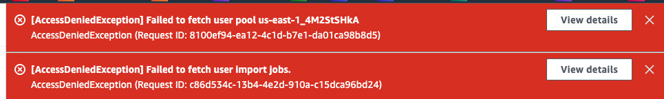

# Task 5: 將 `generateHTML` Lambda 函數加入狀態機器

<br>

## 說明

1. 在此任務中，將測試一個生成 HTML 文本的 Lambda 函數。此文本包含一個類似於 JSON 文檔的 JavaScript 對象數據。

<br>

2. 該函數會將結果文件寫入 S3 並覆蓋現有的 `report.html` 文件。

<br>

3. 完成測試後，將此 Lambda 函數新增至 Step Functions 狀態機器中，並與之前的 `GeneratePresignedURL` Lambda 函數並行運行，以提高狀態機器的執行效率。

<br>

## 查看並檢查 Lambda 函數的 IAM 角色

1. 進入 `Lambda`，點擊名為 `generateHTML` 的 Lambda 函數。

<br>

2. 在函數界面切換到 `Configuration` 頁面。

<br>

3. 切換左側頁籤到 `Permissions`，在 `Execution Role` 下確認該函數使用的是 `RoleForAllLambdas` 角色。

    

<br>

4. 此角色允許 Lambda 函數與 Amazon S3、SNS 和 DynamoDB 進行交互，這與 `GeneratePresignedURL` 函數使用的角色相同。

<br>

## 測試 `generateHTML` Lambda 函數

1. 進入 `Code`，然後點擊 `Test`。

<br>

2. 在 `Event name` 欄位中輸入 `test2`。

<br>

3. 複製以下 JSON 代碼作為測試事件的輸入，並替換現有內容。

    ```json
    {
        "bird_obj_arr": [
            {
            "class_level_str": "3rd Grade",
            "location_str": "Home",
            "bird_name_str": "Northern Cardinal",
            "student_name_str": "Maria Garcia",
            "date_str": "2-21-2022",
            "id_str": "373453bd-722d-454f-8b4b-1ec53e2df9b0",
            "count_int": 2
            },
            {
            "class_level_str": "3rd Grade",
            "location_str": "Home",
            "bird_name_str": "Baltimore Oriole",
            "student_name_str": "Li Juan",
            "date_str": "12-20-2021",
            "id_str": "bd6560ac-ee19-4ef4-ac73-8deb61520601",
            "count_int": 1
            },
            {
            "class_level_str": "3rd Grade",
            "location_str": "Lake",
            "bird_name_str": "American Kestrel",
            "student_name_str": "Jorge Souza",
            "date_str": "01-30-2022",
            "id_str": "591d0b66-87ba-4e15-aadf-b0db6e63f089",
            "count_int": 5
            }
        ]
    }
    ```

<br>

4. 點擊右下角 `Save`；返回後再次點擊 `Test` 以運行函數。

<br>

5. 執行結果應返回如下 JSON 響應。

    ```json
    {
    "msg_str": "Report published to S3"
    }
    ```

    

<br>

6. 注意，若 Lambda 函數運行成功，會覆蓋 S3 中的 `report.html` 文件，雖無法直接從 S3 控制台打開文件，但可選擇下載 `report.html` 文件，並在本地檢視文件內容。

<br>

## 新增並行狀態至狀態機器

1. 進入 `Step Functions`。

<br>

2. 選擇 `MyStateMachine`，然後點擊 `Edit`。

<br>

3. 在左側欄切換到 `Flow` 頁籤。

<br>

4. 將 `Parallel` 拖曳至 `Lambda: Invoke GeneratePresignedURL` 上方。

    

<br>

5. 將 `Lambda: Invoke GeneratePresignedURL` 拖曳至 `Parallel` 狀態的右側 `Drop state here` 區域。

    

<br>

## 新增 `generateHTML` Lambda 函數至狀態機器

1. 切換到 `Actions`，搜尋 `Lambda`。

<br>

2. 新增一個 `Invoke` 並拖曳至 `Parallel` 狀態的左側 `Drop state here` 區域。

    

<br>

## 配置 Lambda Invoke 對象的參數

_配置新加入的 Invoke_

<br>

1. `State name` 輸入 `generateHTML`。

<br>

2. `Function name` 選擇 `generateHTML:$LATEST`。

<br>

3. `Payload` 使用預設的 `Use state input as payload`。

<br>

4. `Next state` 使用預設的 `Go to end`。

<br>

5. 選取 `Parallel`， 將預設的 `State name` 改為 `Process Report`。

<br>

6. 點擊右上角 `Save` 保存更改。

<br>

## 更新 SNS Publish 對象的消息格式

1. 進入 `Code` 模式，找到靠近代碼底部的 `"Message.$": "$.presigned_url_str"` 行。

<br>

2. 將該行的值 `$"presigned_url_str"` 替換為 `$`，以允許將 `generateHTML` 和 `GeneratePresignedURL` 狀態的數據一併傳遞至 SNS Publish 狀態。

<br>

3. 更新後的代碼應如下。

    

<br>

4. 點擊 `Save` 保存變更。

<br>

## 測試更新後的狀態機器

1. 點擊 `Execution` 並配置以下選項。

<br>

2. 在代碼編輯器中，將現有 JSON 代碼替換為以下內容。

    ```json
    {
        "bird_obj_arr": [
            {
            "class_level_str": "3rd Grade",
            "location_str": "Home",
            "bird_name_str": "Northern Cardinal",
            "student_name_str": "Maria Garcia",
            "date_str": "2-21-2022",
            "id_str": "373453bd-722d-454f-8b4b-1ec53e2df9b0",
            "count_int": 2
            },
            {
            "class_level_str": "3rd Grade",
            "location_str": "Home",
            "bird_name_str": "Baltimore Oriole",
            "student_name_str": "Li Juan",
            "date_str": "12-20-2021",
            "id_str": "bd6560ac-ee19-4ef4-ac73-8deb61520601",
            "count_int": 1
            },
            {
            "class_level_str": "3rd Grade",
            "location_str": "Lake",
            "bird_name_str": "American Kestrel",
            "student_name_str": "Jorge Souza",
            "date_str": "01-30-2022",
            "id_str": "591d0b66-87ba-4e15-aadf-b0db6e63f089",
            "count_int": 5
            }
        ]
    }
    ```

<br>

4. 點擊 `Start execution`，並檢查電子郵件中的通知；在電子郵件內容應包含兩個鍵值對：`msg_str` 和 `presigned_url`；其中 `msg_str` 是來自 `generateHTML` 狀態的數據，而 `presigned_url` 則是來自 `GeneratePresignedURL` 狀態。

    

<br>

5. 點擊會看到以下內容。

    

<br>

___

_END_