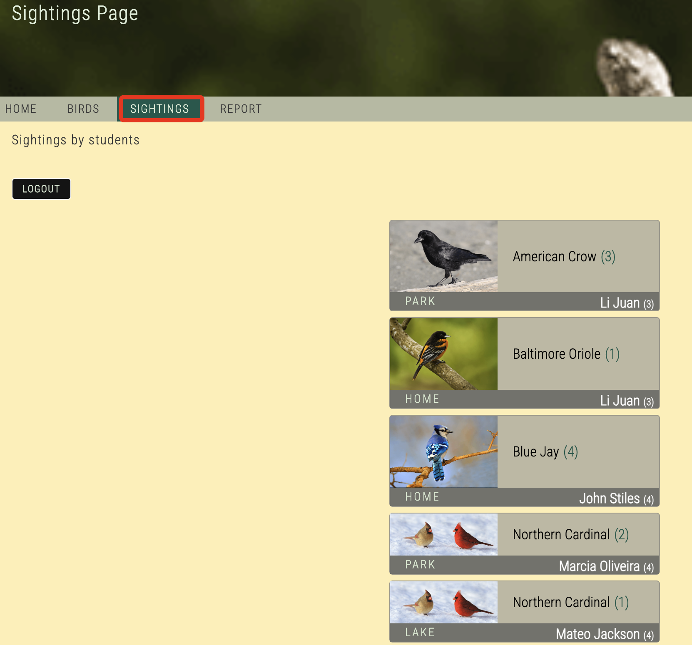
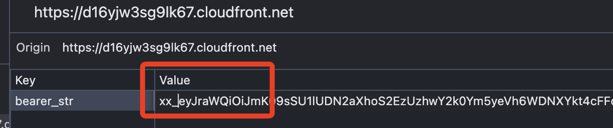
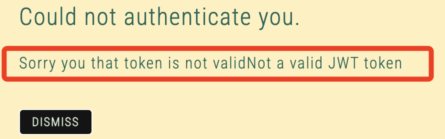
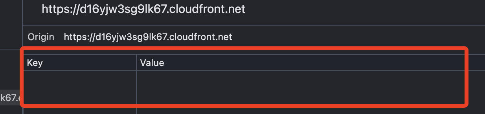
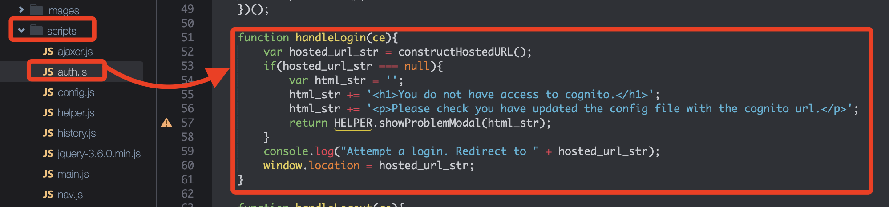
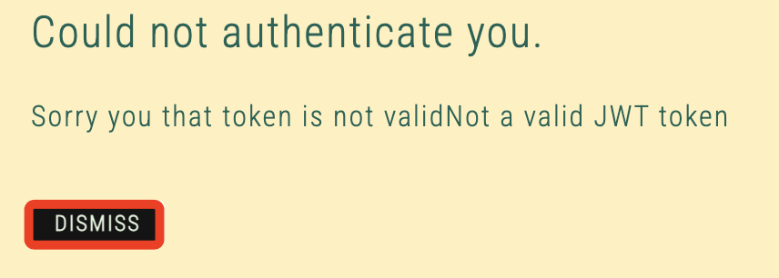

# Task 6：測試應用程式與user pool的整合

_在此任務中，將測試更新後的應用程式，確保其能正確使用 Amazon Cognito user pool進行身份驗證。首先，必須重新啟動 Node 伺服器，使其使用更新後的配置。_

<br>

## 重新啟動 Node 伺服器

1. 運行指令啟動 Node 伺服器；官方教程未提及切換路徑，假如路徑並非在腳本所在資料夾，要先進行路徑切換。

    ```bash
    cd /home/ec2-user/environment/node_server
    npm start
    ```

<br>

2. 返回已開啟網頁應用程式的分頁，並刷新頁面。

<br>

## 測試應用程式的行為

1. 選擇 `SIGHTINGS` 頁籤，這將顯示學生提交的鳥類目擊記錄。

    

<br>

## 測試應用程式的 Token 驗證功能

_回到網頁應用瀏覽中，在瀏覽器的 `開發者工具` 中嘗試使用 `偽造的 Token`_

<br>

1. 在開發者工具中，找到 CloudFront 分發對應的 `Local Storage`，找到 `bearer_str`，雙擊該值，並隨意修改字串內容，這裡是飯加入前綴 `xx_`。

    

<br>

2. 再次點擊 `SIGHTINGS` 頁籤，此時應用程式會顯示一條訊息指出 Token 無效，如此便驗證了應用程式目前是可以能評估並確保 Token 的合法性。

    

<br>

3. 注意，此時在開發者工具的 `Local Storage` 中會發現 `bearer_str` 已被強製移除。

    

<br>

4. 延續上一點，關於這個移除的機制，官方說明提到 _這是應用程式中的一段代碼所實現的_，經查詢確實在 `auth.js` 中可看到處理這個行為的函數 `handleLogout()`。

    

<br>

5. 選擇 `DISMISS` 關閉訊息，會自動回到應用的首頁。

    

<br>

## 測試沒有 Token 的情況

1. 再次選擇 `SIGHTINGS` 頁籤，應用程式會顯示訊息，要求使用者進行登入；這證明若使用者沒有經過身份驗證（沒有 Token），將無法訪問受保護的頁面。

<br>

2. 此次測試表明，只有經過 Amazon Cognito user pool驗證的使用者才能訪問應用程式的受保護頁面。Cognito user pool集中管理應用程式的使用者名稱和密碼，確保使用者的身份驗證資訊更安全且易於管理。

<br>

3. 為了讓學生報告鳥類目擊情況，必須授予他們臨時訪問資料庫的權限。除了身份驗證外，這些使用者還需要授權。這將使用 Amazon Cognito 身份池來完成。在接下來的任務中，將更新並整合身份池與 `user pool`。

<br>

___

_END_