# Task 7：配置 Amazon Cognito Identity Pool

_此任務中，將會配置已經在 Lab 環境中預先建立的 `Amazon Cognito Identity Pool`，並使其與 `Birds 應用程式` 整合。_

 

## 進入 `Identity Pool` 配置頁面

_返回 `Cognito` 主控台_

 

1. 從左側選單中選擇 `Identity pools`；補充說明，這個選項的名稱本來是 `Federated identities`，現在已經更名。

    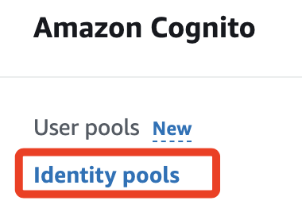

 

2. 點擊進入 `bird_app_id_pool`，這是預先建立的 `Identity Pool`。

 

3. 在 `MyDoc.txt` 中記錄 `Identity Pool ID`。

    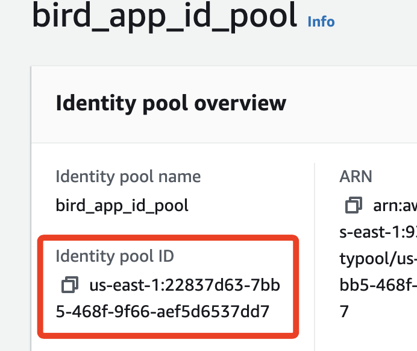

 

4. 至此 `MyDoc.txt` 所需記錄的資訊都已完成。

    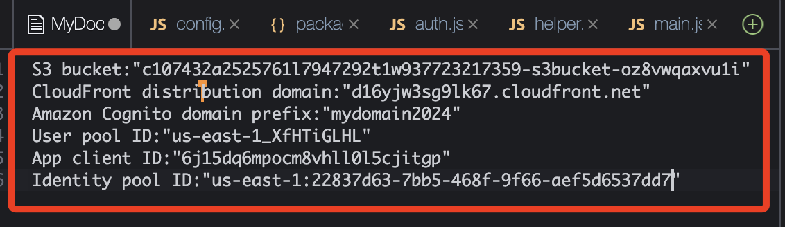

 

## 查看 Identity Pool 角色

1. 切換到 `User access` 頁籤。

    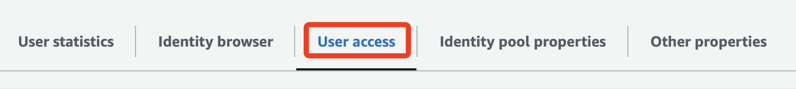

 

2. 在開始設定之前，先確認一下跟這張完成圖是否不同，這張完成圖是完成後截圖的，若下一次練習有所不同再進行更換。

    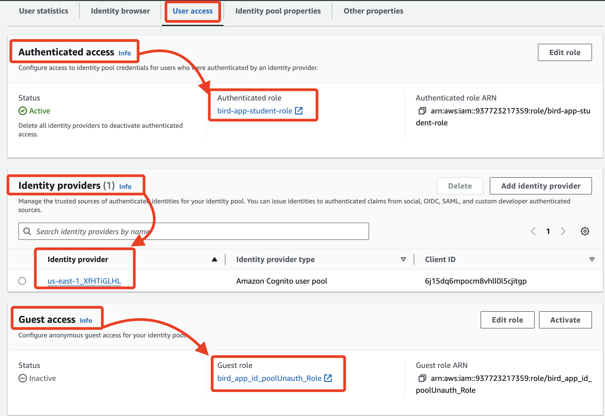

 

3. 在 `Authenticated role` 項目會顯示 `bird-app-student-role`，這是當使用者通過身份驗證後，會自動被分配的角色；對於 `Birds 應用程式`，該角色已配置為允許學生添加和選擇 DynamoDB 表中的記錄。

    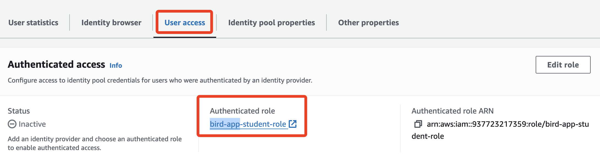

 

4. 向下滑動到 `Guest` 區塊，在 `Guest role` 項目下顯示 `bird_app_id_poolUnauth_Role`，此角色會分配給尚未通過身份驗證的使用者，並規範了這些使用者在 `Birds 應用程式` 中的訪問權限。

    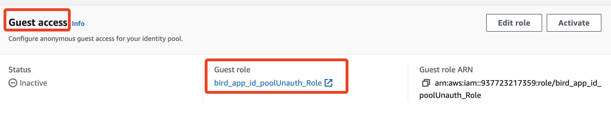

 

## 更新 Identity Pool 配置

1. 在 `User access` 頁籤，進入 `Identity providers` 區域，點擊 `Add identity provider`。

    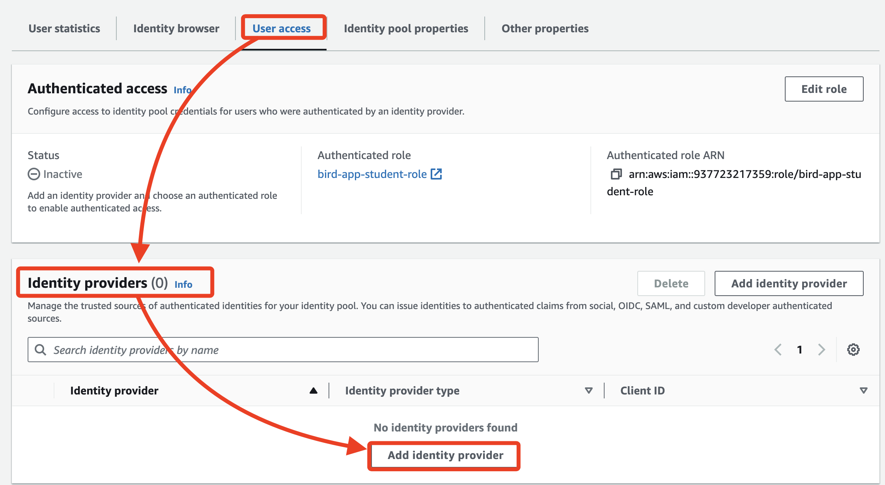

 

2. 選取 `Amazon Cognito user pool`。

    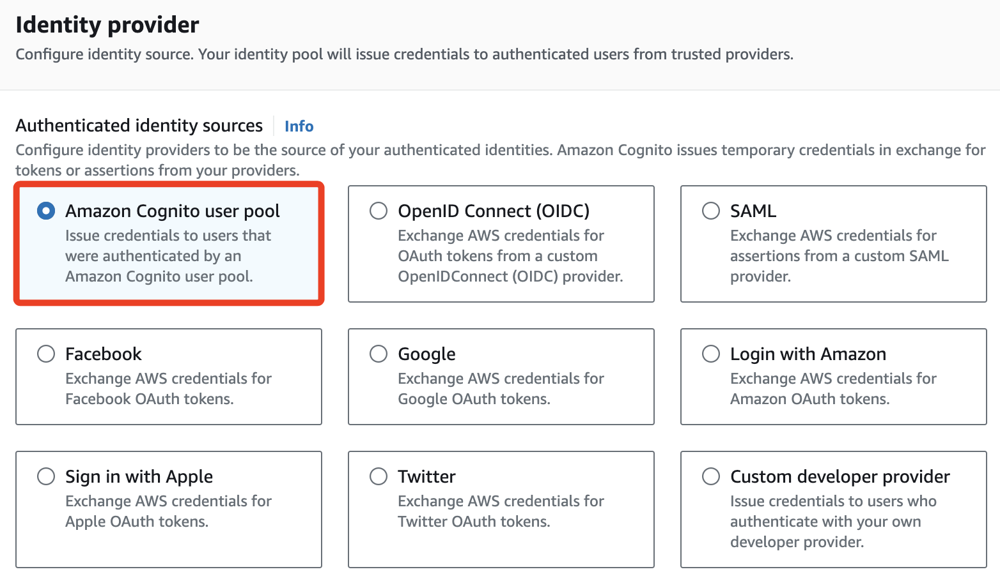

 

3. 在 `User pool details` 區塊中進行配置，下拉 `User Pool ID` 選單，點擊 `bird_app` 的 `user pool ID`。

    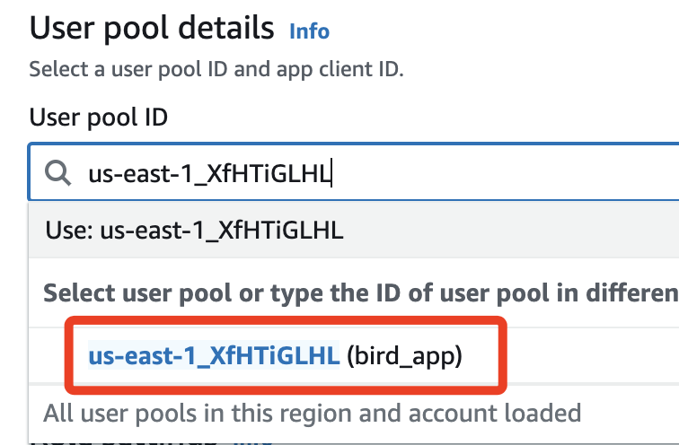

 

4. 同樣地，下拉 `App client ID` 選單並選擇 `bird_app_client` 的 ID。

    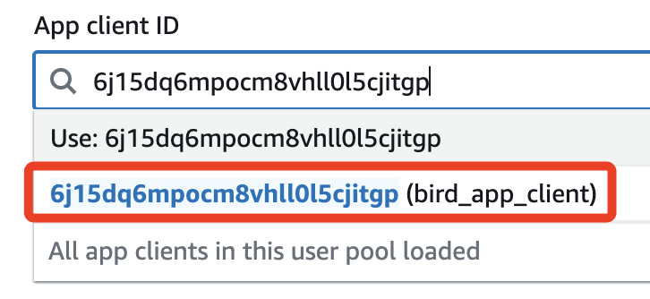

 

5. 點擊 `Save Changes` 保存配置。

    

 

## 結論

1. 至此 `Identity Pool` 已成功配置，`Birds 應用程式` 可以使用 `Cognito` 的身份驗證和授權功能來管理不同使用者的訪問權限。

 

___

_END_