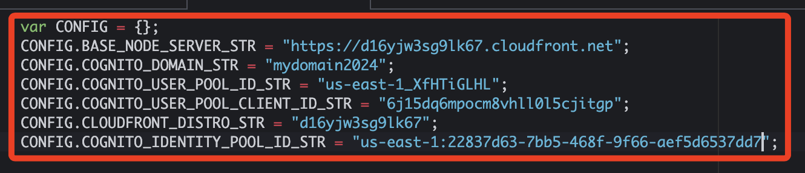
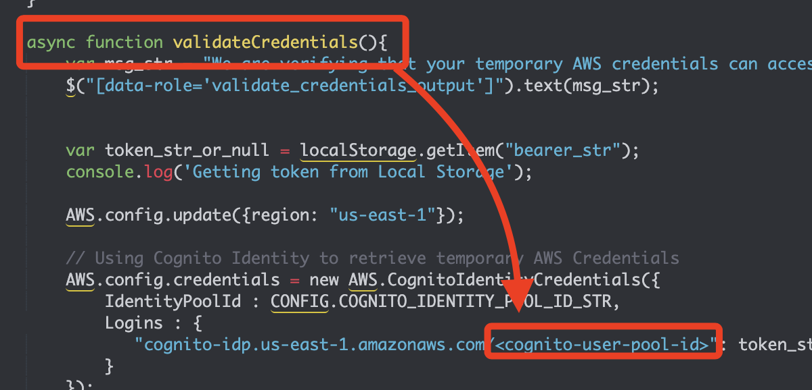
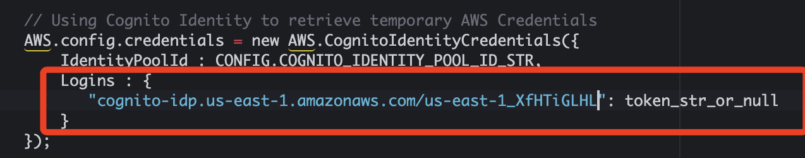

# Task 8：更新應用程式以使用Identity Pool進行授權

_為了使 Birds 應用程式能夠與 Amazon Cognito Identity Pool進行互動，必須進行一些必要的更新。這些更新將使應用程式能夠正確處理授權並確保使用者擁有適當的 AWS 憑證來訪問受保護的資源。_

<br>

## 更新 Birds Web 應用程式

_返回 AWS Cloud9 IDE_

<br>

1. 展開 `website/scripts` 資料夾，點擊打開 `config.js` 文件。

<br>

2. 修正最後一行代碼，並將 `<cognito-identity-pool-id>` 佔位符替換為記錄在 `MyDoc.txt` 中的 `Identity Pool ID`；保存變更。

    

<br>

3. 在 `website/scripts` 資料夾中打開 `auth.js` 文件。

    ```javascript
    var AUTH = (function(){

        // 以上省略 ...

        async function validateCredentials(){
            var msg_str = "We are verifying that your temporary AWS credentials can access dynamoDB. One moment...";
            $("[data-role='validate_credentials_output']").text(msg_str);
            var token_str_or_null = localStorage.getItem("bearer_str");
            console.log('Getting token from Local Storage');
            AWS.config.update({region: "us-east-1"});
            AWS.config.credentials = new AWS.CognitoIdentityCredentials({
                IdentityPoolId : CONFIG.COGNITO_IDENTITY_POOL_ID_STR,
                Logins : {
                "cognito-idp.us-east-1.amazonaws.com/<cognito-user-pool-id>": token_str_or_null
                }
            });
            
            var docClient = new AWS.DynamoDB.DocumentClient({region: "us-east-1"});
            
            var params = {
                TableName: "BirdSightings"
            };
            
            // 以下省略 ...
    })();
    ```

<br>

4. 找到 `<cognito-user-pool-id>`。

    

<br>

5. 將 `<cognito-user-pool-id>` 佔位符替換為 `user pool ID`；特別注意，這裡要使用 `user pool ID`，而不是 `Identity Pool ID`。

    

<br>

5. 更新後務必確認儲存修正；此代碼片段使用 `COGNITO_IDENTITY_POOL_ID_STR` 變數來請求 `Identity Pool` 中的 `AWS 憑證`，該代碼還傳遞了 `user pool ID` 和 `token_str_or_null`，`Identity Pool` 會使用這些資訊來驗證使用者，如果驗證通過，`Identity Pool` 會向應用程式返回 `AWS 憑證`。

<br>

## 推送更新至 S3 Bucket

1. 在之前的步驟中已經輸入變數 `S3_BUCKET`，若使用相同終端機，可以不用再次輸入。

    ```bash
    S3_BUCKET=<s3-bucket>
    ```

<br>

2. 切換路徑並運行以下指令完成上傳。

    ```bash
    cd /home/ec2-user/environment
    aws s3 cp website s3://$S3_BUCKET/ --recursive --cache-control "max-age=0"
    ```

<br>

## 確認 Node 伺服器是否正在運行

1. 如果伺服器未在運行，運行以下指令重新啟動伺服器：

    ```bash
    cd /home/ec2-user/environment/node_server
    npm start
    ```

<br>

2. 經過這些更新，Birds 應用程式現在可以正確與 Cognito Identity Pool進行整合，確保使用者在身份驗證後能夠獲得 AWS 憑證並進行授權。

<br>

___

_END_