# Task 1：Preparing the lab

<br>

## 連接到 AWS Cloud9 IDE

1. 搜尋並進入 `Cloud9`。

    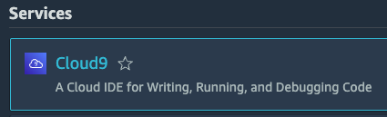

<br>

2. 點擊現有 `Cloud9 Instance` 右側 `Open` 進入 IDE；保持這個頁面在開啟中。

    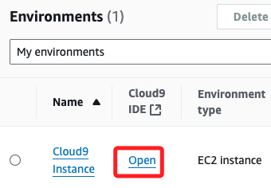

<br>

3. 上方會出現紅色警告，可不予理會；這個警告是說明系統無法更新設置，這是因為當前使用者缺乏正確的 IAM 權限；具體來說，Cloud9 需要某些 IAM 權限來執行設置變更，但在 Lab 中的使用者 IAM 角色沒有被授予這些必要的權限；在下方終端機中可輸入指令。

    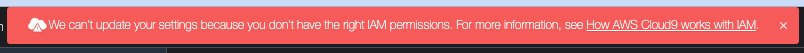

<br>

## 記錄 Lab 環境的重要信息

1. 使用任何可建立文檔的方式建立一個文檔，這裡使用 Cloud9 的功能選單添加新文件。

    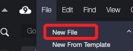

<br>

2. 編輯內容，將以下文字貼在新開啟的文件中，這是要用來記錄後續步驟中的各種重要資訊備用。

    ```bash
    CloudFront distribution domain:
    Table name:
    Table partition key:
    Table sort key:
    Password:
    Index name:
    Index partition key:
    Index sort key:
    ```

<br>

3. 可使用快速鍵儲存為 `MyDoc.txt`，組合鍵與一般文書軟體相同，在 `MacOS` 是 `command + S`。

    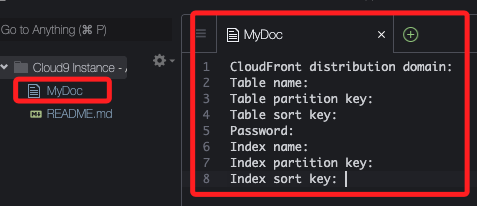

<br>

## 下載並設置應用程式代碼

1. 在 Cloud9 終端機中執行以下命令，這是下載並設置 Lab 所需的應用程式代碼。

    ```bash
    wget https://aws-tc-largeobjects.s3.us-west-2.amazonaws.com/CUR-TF-100-EDBLDR-1-107430/02-lab-ddb/code.zip
    unzip code.zip
    cd resources
    . ./setup.sh
    ```

<br>

2. 特別注意，在終端機中執行多行指令若未使用 `&&` 串接，最後一行指令需要再按一次 `ENTER`，特別注意避免盲等；下圖提示的就是上一點的指令運行到最後一行時，會停在最後一行指令等待使用者操作，按下 `ENTER` 繼續運行。

    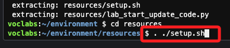

<br>

3. 最後一行只另是運行 `setup.sh` 腳本，執行後會輸出相關信息，其中最後幾行如下。

    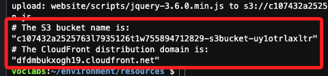

<br>

4. 將輸出中的 `CloudFront distribution domain` 紀錄在前面步驟建立的文件中。

    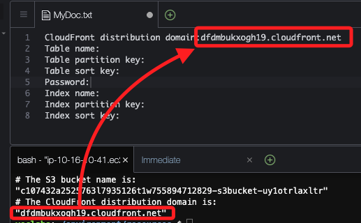

<br>

## 啟動 Node.js 伺服器

1. 運行以下命令啟動 Node.js 伺服器。

    ```bash
    cd /home/ec2-user/environment/node_server
    npm start
    ```

<br>

2. 結果如下，將這個終端保持在運行中。

    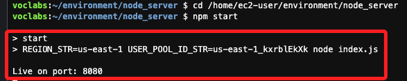

<br>

## 監控 CloudFront 分發部署

1. 搜尋並進入 `CloudFront`。

    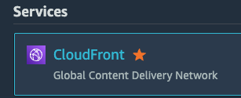

<br>

2. 確認 `Distributions` 的狀態為 `Enabled`，至此確保 Lab 環境正確。

    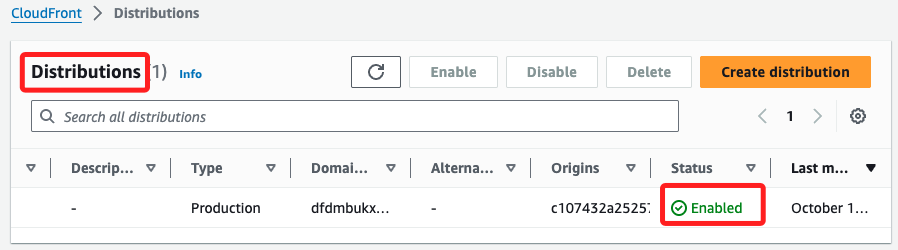

<br>

___

_END_