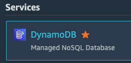
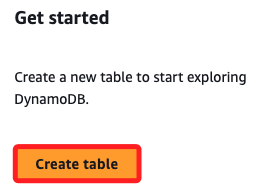
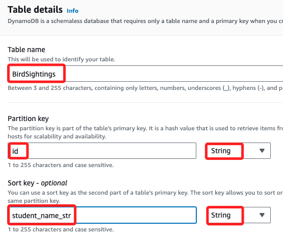
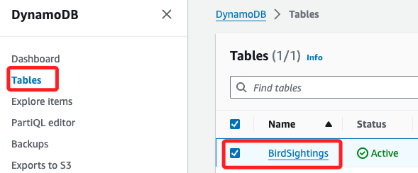
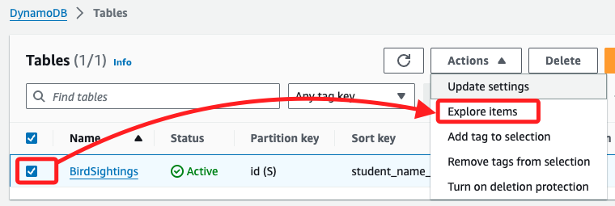
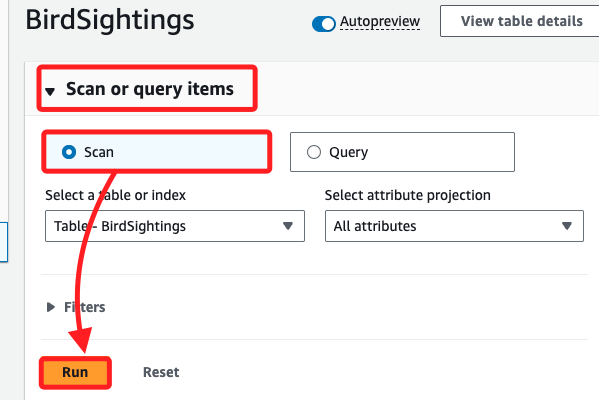
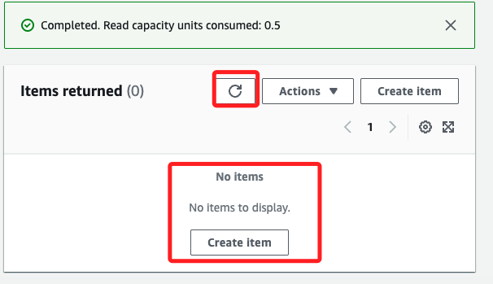

# Task 2：建立 DynamoDB 資料表

_在這個 Lab 情境中，為了儲存和動態管理學生的鳥類觀察數據，將會建立一個全新的 `DynamoDB` 資料表，此資料表將使用 `複合主鍵`，包含 `分區鍵 (Partition Key)` 和 `排序鍵 (Sort Key)`。_

<br>

## Lab 任務的補充說明

1. 每個 `DynamoDB` 資料表都需要一個 `主鍵`，在這個表中，將配置 `複合主鍵`，就是同時具備 `分區鍵` 與 `排序鍵`；另外配置兩個 `屬性`，第一個屬性為 `id`，作為資料表的 `分區鍵`，第二個屬性為 `student_name_str`，作為資料表的 `排序鍵`。

<br>

2. 特別注意，在選擇 `主鍵` 時，一旦資料表建立完成就無法再更改主鍵的 `屬性`；如果需要更改主鍵，則須重新建立一個資料表並將資料遷移過去。

<br>

3. 相關資訊可參閱 [Amazon DynamoDB 開發者指南](https://docs.aws.amazon.com/amazondynamodb/latest/developerguide/Introduction.html)。

<br>

## 建立 DynamoDB 資料表

1. 搜尋並進入 `DynamoDB`。

    

<br>

2. 點擊 `Create table`。

    

<br>

3. 相關設定如下說明，在 `Table name` 輸入 `BirdSightings`；`Partition key` 輸入 `id`，在尾端的型態選擇使用預設的 `String`；`Sort key` 輸入 `student_name_str`，並確保選擇 `String`。

    

<br>

4. 滾動至頁面底部點擊 `Create table`，等待資料表狀態顯示為 `Active`；這過程可能需要幾秒鐘。

    

<br>

## 紀錄設定訊息

1. 在之前準備的文字檔案中，記錄下資料表名稱、分區鍵及排序鍵，後續任務中將需要這些資訊，資料表名稱為 `BirdSightings`、分區鍵為 `id`、排序鍵 `student_name_str`。

    ```bash
    CloudFront distribution domain:dfdmbukxogh19.cloudfront.net
    Table name:BirdSightings
    Table partition key:id
    Table sort key:student_name_str
    Password:
    Index name:
    Index partition key:
    Index sort key:
    ```

<br>

## 檢查資料表狀態並進行掃描

1. 點擊左側 `Tables`，選擇前面步驟建立的 `BirdSightings` 資料表。

    

<br>

2. 展開上方 `Actions`，然後點擊 `Explore items`。

    

<br>

3. 展開 `Scan or query items` ，使用預設選取的 `Scan`，然後點擊 `Run` 執行掃描操作。

    

<br>

4. 因為該資料表是新的，沒有返回任何記錄；可點擊 `刷新` 以確認這個結果。

    

<br>

___

_END_