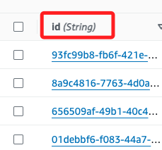

# Task 3：使用批次腳本將多筆記錄新增至資料表

_雖然可用手動方式在 `DynamoDB` 主控台中逐一新增記錄，但對於大規模資料集來說並不符合效益且容易出錯；可使用批次處理腳本模式，透過腳本從檔案讀取多筆記錄並將其新增至資料表中。_

<br>

## 檢視要載入的數據

_返回 Cloud9 IDE_

<br>

1. 在終端機左側的 Environment 視窗中，展開 `node_server` 資料夾，找到並打開 `past_sightings.json` 檔案。

    

<br>

2. 點擊兩下可開啟文件，這是後續要載入到 `BirdSightings` 資料表的數據，內容包含 `25` 筆記錄，每筆記錄包含多個屬性；特別注意，假如重複運行，資料會重複寫入其中。

    ```json
    [
        {
            "student_name_str": "Li Juan",
            "bird_name_str": "American Crow",
            "count_int": 3,
            "location_str": "park",
            "date_str": "2021-12-10",
            "class_level_str": "3rd Grade"
        },
        {
            "student_name_str": "Li Juan",
            "bird_name_str": "Baltimore Oriole",
            "count_int": 1,
            "location_str": "Home",
            "date_str": "2021-12-13",
            "class_level_str": "3rd Grade"
        }
    ]
    ```

<br>

3. 點擊文件右側 `x` 關閉檔案。

    

<br>

## 載入資料的腳本

_此部分主要對腳本內容做說明，另外將替換為實際資料表名稱；其餘不變。_

<br>

1. 在 `node_server` 資料夾中找到並打開 `load_past_sightings.js` 檔案。

    

<br>

2. 特別注意，先滾動到下方，將代碼中 `<Table-名稱>` 替換為實際資料表名稱；修改後記得儲存變更。

    ```javascript
    var params = {
        RequestItems: { 
            '<Table-名稱>': items_array
        }
    };
    ```

    _也就是替換為 `BirdSightings`_

    

<br>

3. 完整代碼如下，已加入逐行繁體中文註解，不再贅述。

    ```javascript
    function load_past_sightings(){
        // 載入檔案系統模組，用於讀取 JSON 檔案
        var	FS = require("fs");
        // 載入 uuid 模組，用於生成唯一的 id
        const { v4: uuidv4 } = require('uuid');
        // 載入 AWS SDK 並設置 DynamoDB 文件客戶端，區域設定為 us-east-1
        var AWS = require("aws-sdk");
        var docClient = new AWS.DynamoDB.DocumentClient(
            {region: 'us-east-1'}
        );

        // 輸出訊息：開始取得過去的鳥類觀察記錄
        console.log("getting past bird sightings");

        // 讀取本地的 past_sightings.json 檔案
        let rawdata = FS.readFileSync('past_sightings.json');
        // 將讀取的 JSON 原始數據解析為 JavaScript 物件
        let past_sightings = JSON.parse(rawdata);
        // 初始化一個陣列，準備存放要寫入 DynamoDB 的項目
        var items_array = [];
        
        // 遍歷每一筆觀察記錄
        for ( var i = 0; i < past_sightings.length; i++ ) {
            // 為每一筆記錄生成一個唯一的 id
            past_sightings[i].id = uuidv4();

            // 將 date_str（ISO 日期格式）轉換為 date_int（Unix 時間戳）
            var sighting_date = new Date(past_sightings[i].date_str);
            past_sightings[i].date_int = sighting_date.getTime()/1000; // 轉換為秒數
            // 刪除原始的 date_str 屬性
            delete past_sightings[i].date_str;

            // 輸出轉換後的記錄以供檢查
            console.log(past_sightings[i]);

            // 構建要插入 DynamoDB 的項目
            var item = {
                    PutRequest: {
                        Item: past_sightings[i]
                    }
                };

            // 如果 item 有值，則將其加入 items_array
            if (item) {
                items_array.push(item);
            }
        }

        // 輸出準備寫入 DynamoDB 的所有項目
        console.log(items_array);

        // 設置批次寫入的參數，指定要寫入的資料表名稱
        var params = {
            RequestItems: { 
                // 替換為實際資料表名稱
                '<Table-名稱>': items_array
            }
        };

        // 使用 AWS SDK 的 batchWrite 方法批次寫入資料至 DynamoDB
        docClient.batchWrite(params, function(err, data) {
            // 如果出現錯誤，則輸出錯誤訊息
            if (err) {
                console.log(err); 
            } else  {
                // 如果成功，則輸出成功訊息，並顯示新增的項目數量
                console.log(
                    'Added ' + items_array.length + ' items to DynamoDB'
                );
            }   
        });

    }

    // 執行 load_past_sightings 函數來載入數據
    load_past_sightings();
    ```

<br>

## 執行批次腳本

1. 在下方終端機視窗中，點擊 `+` 可打開新的終端機窗口；特別注意，不要停止當前正在運行的 `Node.js` 伺服器，需使用新的終端窗口進行以下步驟。

    

<br>

2. 在新開啟的終端機中，執行以下命令運行批次腳本。

    ```bash
    cd /home/ec2-user/environment/node_server
    node load_past_sightings.js
    ```

<br>

3. 正確運行可看到如下的輸出結果。

    

<br>

4. 假如出現 `false` 相關訊息，可確認是否修改了資料庫名稱，並且完成更改的儲存。

    

<br>

## 檢視新增的記錄

1. 回到 DynamoDB 主控台的標籤頁；在 `Scan or query items` 區域中，依舊保持預設的 `Scan`，然後點擊 `Run` 進行掃描操作。

    

<br>

2. 在 `Items returned` 中會顯示來自 `past_sightings.json` 檔案的 25 筆記錄。

    

<br>

## 資料說明

_僅說明，無任何操作_

<br>

1. 首先，代碼中自動化為每筆記錄生成了唯一的 `id` 值。

    

<br>

2. 另外，在日期的欄位部分被轉換為整數值，這是因為 `JavaScript` 代碼進行了該操作。

    

<br>

3. 特別注意，前面步驟在建立時只設定了 `2` 個屬性，但是導入資料後的有 `7` 個屬性，這是因為 `DynamoDB` 是一個 `非關聯式資料庫 (NoSQL)`，當資料表中沒有新載入資料的屬性時，這些屬性將被自動新增。

    

<br>

___

_END_