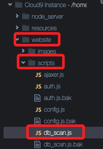
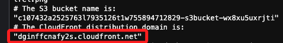
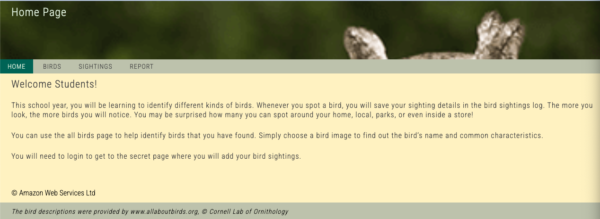
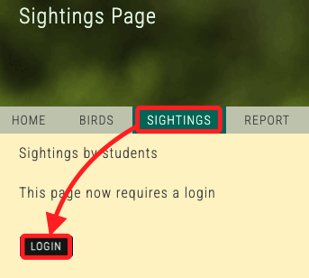
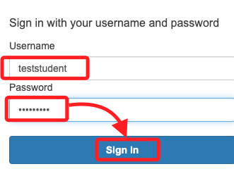
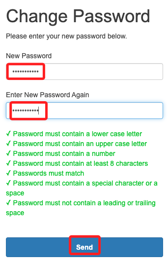
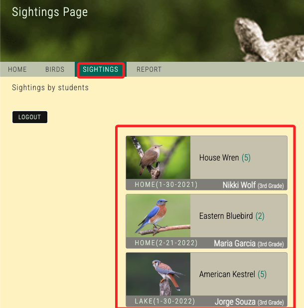
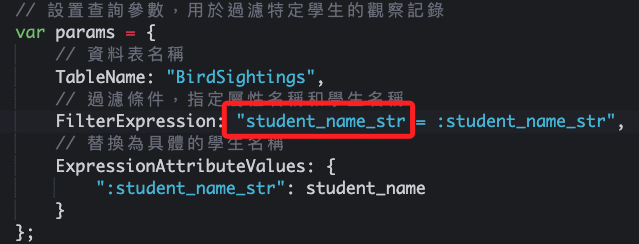

# Task 4：使用 Scan 方法以程式化方式檢索資料

_在此任務中，將更新網站程式碼，使其從 `BirdSightings` 資料表中動態顯示鳥類觀察數據。這樣，當學生將來新增記錄時，這些新記錄將自動顯示在應用程式的 `Sightings` 頁面上。_

<br>

## 檢視程式碼

_返回 Cloud9 IDE_

<br>

1. 在左側的視窗中，依序展開 `website` 資料夾、`scripts` 資料夾，然後找到並點擊開啟 `db_scan.js` 檔案。

    

<br>

2. 將代碼中 `<Table-名稱>` 替換為實際的資料表名稱，也就是 `BirdSightings`，修改如下，記得儲存變更；同樣的，在教程中顯示的會是 `<table-name>`，這裡使用 `<Table-名稱>` 是便於在完整代碼中進行辨識。

    ```javascript
    var params = {
        TableName: "BirdSightings"
    };
    ```

<br>

3. 以下是尚未替換資料表名稱的完整代碼，並已加入逐行繁體中文註解，不再贅述。

    ```javascript
    var DB = (function(){
        // 定義兩個對象，`expose` 代表公開方法，`hide` 代表私有方法
        var 
            expose = {
                // 將 `getSightings` 方法暴露出來供外部調用
                getSightings: getSightings
            },hide = {
                // 私有方法，只在模組內部使用
                setUpHandlers: setUpHandlers
            };
        // 自動執行初始化函數
        (function init(){
            // 設定事件處理器
            setUpHandlers();
        })();
        // 設置事件處理器的函數
        function setUpHandlers(){
            // 綁定 DOM 事件處理，當網頁載入時，觸發 `get-sightings` 操作
            $(document).on("load", "[data-action='get-sightings']", getSightings);
        }
        // 非同步函數，從 DynamoDB 獲取觀察記錄
        async function getSightings(req, res, next){
            // 顯示訊息，通知使用者正在驗證 AWS 憑證
            var msg_str = "We are verifying that your temporary AWS credentials can access dynamoDB. One moment...";
            // 更新前端顯示的訊息
            $("[data-role='get-sightings-from-ddb']").text(msg_str);
            // 從 localStorage 中獲取 Bearer Token，用於身份驗證
            var token_str_or_null = localStorage.getItem("bearer_str");
            // 更新 AWS 配置，設置區域為 "us-east-1"
            AWS.config.update({region: "us-east-1"});
            // 使用 Cognito Identity 憑證來取得臨時 AWS 憑證
            AWS.config.credentials = new AWS.CognitoIdentityCredentials({
                // 使用者池 ID
                IdentityPoolId : CONFIG.COGNITO_IDENTITY_POOL_ID_STR,
                Logins : {
                    // 用於身份驗證的 Bearer Token
                "cognito-idp.us-east-1.amazonaws.com/us-east-1_hZtfxiiPX": token_str_or_null 
                }
            });
            // 創建 DynamoDB 文件客戶端，用於操作資料表
            var docClient = new AWS.DynamoDB.DocumentClient({region: "us-east-1"});
            // 定義查詢參數，指定資料表名稱
            var params = {
                // 替換為實際資料表名稱
                TableName: "BirdSightings"
            };
            // 非同步函數，用於測試與 DynamoDB 的通訊
            async function getDdbData(){
                try {
                    // 使用 `scan` 方法從 DynamoDB 中讀取所有記錄
                    const data = await docClient.scan(params).promise();
                    // 更新訊息
                    msg_str = "Got DB data.";
                    // 將獲取到的資料存入 sightings_list
                    sightings_list = data['Items'];
                    // 遍歷每一筆觀察記錄，並將日期從 UNIX 時間戳轉換為可讀格式
                    for ( var i = 0; i < sightings_list.length; i++ ) {
                        // 轉換為日期物件
                        sighting_date = new Date(sightings_list[i].date_int * 1000);
                        // 將日期轉換為 ISO 格式
                        sighting_date.toISOString().substring(0, 10);
                        // 提取年份
                        year = sighting_date.getFullYear();
                        // 提取月份
                        month = sighting_date.getMonth()+1;
                        // 提取日期
                        day = sighting_date.getDate();
                        // 組合成新的日期格式
                        sightings_list[i].date_str = month+'-' + day + '-'+year;
                        // 刪除原來的 UNIX 時間戳屬性
                        delete sightings_list[i].date_int;
                    }
                    // 返回訊息和更新後的觀察記錄
                    return {
                        msg_str: msg_str,
                        sightings_list: sightings_list,
                    };
                } catch (err) {
                    // 如果出錯，返回錯誤訊息
                    msg_str = "There was a problem with your credentials.";
                    return msg_str;
                }
            }
            // 等待並取得從 DynamoDB 返回的數據
            var sightingsDdbData = await getDdbData();
            // 更新前端顯示的訊息
            $("[data-role='get-sightings-from-ddb']").text(msg_str);
            // 返回取得的觀察記錄列表
            return sightingsDdbData['sightings_list'];
        }
        // 返回公開的方法，允許外部調用 `getSightings`
        return expose;
    })();
    ```

<br>

## 更新網站程式碼並上傳到 S3

_完成以上更新後，在終端機中運行以下指令_

<br>

1. 更新網站程式碼；特別注意，這三行指令在運行後並無任何輸出。

    ```bash
    cd /home/ec2-user/environment/website
    cp index_db_scan.html index.html
    cp scripts/templates_sightings_from_db.js scripts/templates.js
    ```

<br>

2. 將更新的網站程式碼上傳至 S3。

    ```bash
    cd /home/ec2-user/environment/resources
    python upload_website_code.py
    ```

<br>

## 測試網站更新

1. 開啟新的瀏覽器頁籤，輸入之前紀錄在 `MyDoc.txt` 文件中的 `CloudFront distribution domain`；前情回顧一下，這是 `CloudFront` 分發的網域，透過運行指令後所取得。

    

<br>

2. 進行訪問會看到以下畫面，這就是 Lab 提供的 Birds 應用程式；接著開啟瀏覽器的的 `開發者工具`，這裡預設使用了 Chrome，對於瀏覽器開發者工具的使用，這裡不做贅述。

    

<br>

3. 在瀏覽畫面中切換到 `SIGHTINGS 頁籤` 並點擊 `LOGIN`。

    

<br>

4. 分別在 `Username` 輸入 `teststudent`、`Password` 輸入 `Welcome1!`；然後點擊 `Sign In`。

    

<br>

5. 當系統提示選擇新密碼時，輸入自訂密碼如 `Welcome123!`，在這請使用這個密碼避免忘記，輸入完畢點擊 `Send`；特別說明，Lab 並未指定要輸入這個密碼。

    

<br>

6. 返回 SIGHTINGS 頁面，應顯示所有 25 筆鳥類觀察記錄；特別注意，在前面步驟假如有重複輸入，這裡的資料筆數也會不同，另外，每次進行訪問的時候，排序也未必相同。

    

<br>

## 更新程式碼以只顯示已登入學生的數據

_進入 Cloud9 IDE 中_

<br>

1. 在左側 `website` 資料夾中，找到並進入子資料夾 `scripts`，接著找到並點擊開啟檔案 `db_scan_filter.js`；完整原始代碼如下，並已加入逐行繁體中文註解，不再贅述。

    ```javascript
    var DB = (function(){
        // 定義兩個對象，`expose` 代表公開方法，`hide` 代表私有方法
        var 
            expose = {
                // 將 `getSightings` 方法暴露出來供外部調用
                getSightings: getSightings
            },hide = {
                // 私有方法，只在模組內部使用，用來設置事件處理器
                setUpHandlers: setUpHandlers
            };
        // 自動執行初始化函數
        (function init(){
            // 設定事件處理器
            setUpHandlers();
        })();
        // 設置事件處理器的函數
        function setUpHandlers(){
            // 綁定 DOM 事件處理，當網頁載入時，觸發 `get-sightings` 操作
            $(document).on(
                "load",
                "[data-action='get-sightings']",
                getSightings
            );
        }
        // 非同步函數，從 DynamoDB 獲取觀察記錄
        async function getSightings(req, res, next){
            // 顯示訊息，通知使用者正在驗證 AWS 憑證
            // 輸出紀錄，用於調試
            console.log('getSightings');
            var msg_str = "We are verifying that your temporary AWS credentials can access dynamoDB. One moment...";
            // 更新前端顯示的訊息
            $("[data-role='get-sightings-from-ddb']").text(msg_str);
            // 從 localStorage 中獲取 Bearer Token，用於身份驗證
            var token_str_or_null = localStorage.getItem("bearer_str");
            // 更新 AWS 配置，設置區域為 "us-east-1"
            AWS.config.update({region: "us-east-1"});
            // 使用 Cognito Identity 憑證來取得臨時 AWS 憑證
            AWS.config.credentials = new AWS.CognitoIdentityCredentials({
                // 使用者池 ID
                IdentityPoolId : CONFIG.COGNITO_IDENTITY_POOL_ID_STR,
                Logins : {
                    // 用於身份驗證的 Bearer Token
                    "cognito-idp.us-east-1.amazonaws.com/us-east-1_hZtfxiiPX": token_str_or_null
                }
            });
            // 創建 DynamoDB 文件客戶端，用於操作資料表
            var docClient = new AWS.DynamoDB.DocumentClient(
                {region: "us-east-1"}
            );
            // 接收來自請求的學生姓名
            var student_name = req;
            // 用於調試，確認學生姓名是否傳入
            console.log('Checking student name.');
            // 輸出學生姓名
            console.log(student_name);
            // 設置查詢參數，用於過濾特定學生的觀察記錄
            var params = {
                // 資料表名稱
                TableName: "BirdSightings",
                // 過濾條件，指定屬性名稱和學生名稱
                FilterExpression: "<Attribute-名稱> = :student_name_str",
                // 替換為具體的學生名稱
                ExpressionAttributeValues: {
                    ":student_name_str": student_name 
                }
            };
            // 非同步函數，用於測試與 DynamoDB 的通訊
            async function getDdbData(){
                try {
                    // 使用 `scan` 方法從 DynamoDB 中讀取所有符合條件的記錄
                    const data = await docClient.scan(params).promise();
                    // 更新訊息
                    msg_str = "Got DB data.";
                    // 將獲取到的資料存入 sightings_list
                    sightings_list = data['Items'];
                    // 遍歷每一筆觀察記錄，並將日期從 UNIX 時間戳轉換為可讀格式
                    for ( var i = 0; i < sightings_list.length; i++ ) {
                        // 將 `date_int` 轉換為日期物件
                        sighting_date = new Date(sightings_list[i].date_int * 1000);
                        // 將日期轉換為 ISO 格式並提取年、月、日
                        sighting_date.toISOString().substring(0, 10);
                        year = sighting_date.getFullYear();
                        // 月份從 0 開始，所以加 1
                        month = sighting_date.getMonth() + 1;
                        day = sighting_date.getDate();
                        // 組合成新的日期格式
                        sightings_list[i].date_str = month + '-' + day + '-' + year;
                        // 刪除原來的 UNIX 時間戳屬性
                        delete sightings_list[i].date_int;
                    }
                    // 返回訊息和更新後的觀察記錄
                    return {
                        msg_str: msg_str,
                        sightings_list: sightings_list,
                    };
                } catch (err) {
                    // 如果出錯，返回錯誤訊息
                    msg_str = "There was a problem with your credentials.";
                    return msg_str;
                }
            }
            // 等待並取得從 DynamoDB 返回的數據
            var sightingsDdbData = await getDdbData();
            // 更新前端顯示的訊息
            $("[data-role='get-sightings-from-ddb']").text(msg_str);
            // 返回取得的觀察記錄列表
            return sightingsDdbData['sightings_list'];
        }
        // 返回公開的方法，允許外部調用 `getSightings`
        return expose;

    })();
    ```

<br>

2. 將原始代碼中的 `<Attribute-名稱>` 替換為 `student_name_str` 如下圖，修正後儲存更改並關閉檔案；官方代碼的佔位符為 `<attribute-name>`。

    

<br>

3. 更新網站程式碼並上傳至 S3。

    ```bash
    cd /home/ec2-user/environment/website
    cp index_db_scan_filter.html index.html
    ```

<br>

5. 切換至 `resources` 資料夾並運行命令上傳程式碼。

    ```bash
    cd /home/ec2-user/environment/resources
    python upload_website_code.py
    ```

<br>

6. 返回 Birds 應用程式的瀏覽器標籤頁並刷新頁面，現在應只顯示 `teststudent` 的鳥類觀察記錄。整體來說，這個部分是透過更新網站程式碼以動態檢索並過濾資料，成功將 `BirdSightings` 資料表中的數據顯示在應用程式的 `Sightings` 頁面上；學生可查看自己提交的觀察數據，並確保只有自己的數據被顯示。

<br>

___

_END_