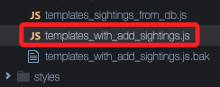
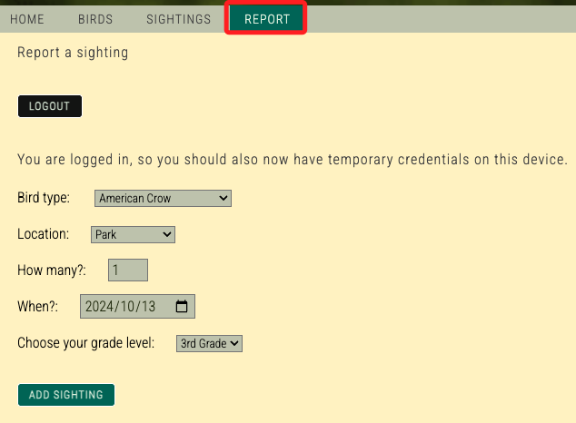
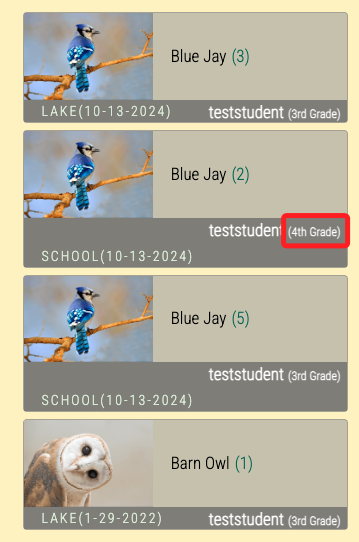

_特別注意，這個 Lab 錯誤將 Task 5 標註為 Task 6，所以有兩個 Task 6_

<br>

# Task 5：使用 put 方法將單筆記錄新增至資料表

_在此任務中，將更新 `Birds` 應用程式，讓學生可以透過 `Report` 頁面新增觀察記錄。_

<br>

## 檢視腳本

_觀察腳本 `templates_with_add_sighting.js`，這裡不做任何編輯。_

<br>

1. 返回Cloud9 IDE 的瀏覽器標籤，在左側視窗中依據展開 `website` 資料夾、然後並展開 `scripts` 資料夾，接著找到並點擊開啟 `templates_with_add_sighting.js` 檔案。

    

<br>

2. 觀察其中的 `addSighting` 函數，該函數包含參數變數 `params`，該變數指定了 `put` 方法將接收新記錄的資料表名稱；另外，此函數還將學生在網頁上輸入的數據對應到資料表的屬性。

    ```javascript
    var params = {
        TableName: '<table_name>',
        Item: {
            '<table-partition-key>': id,
            '<table-sort-key>': username,
            'bird_name_str': bird_name,
            'location_str': location,
            'count_int': parseInt(count),
            'date_int': date_int,
            'class_level_str': grade_level
        }
    };
    ```

<br>

3. 觀察 `addItem` 函數，該函數通過 `params` 變數將參數傳遞給 `put` 方法，並將單筆記錄新增至資料表。

    ```javascript
    async function addItem(){
        try {
            const data = await docClient.put(params).promise();
            return data;
        } catch (err) {
            return err;
        }
    }
    ```

<br>

## 編輯腳本

_替換其中的佔位符_

<br>

1. 更新腳本中的三個佔位符。

    ```javascript
    `<table_name>`：`BirdSightings`
    `<table-partition-key>`：`id`
    `<table-sort-key>`：`student_name_str`
    ```

<br>

2. 更新後的程式碼如下，儲存更改並關閉檔案。

    ```javascript
    var params = {
        TableName: 'BirdSightings',
        Item: {
            'id': id,
            'student_name_str': username,
            'bird_name_str': bird_name,
            'location_str': location,
            'count_int': parseInt(count),
            'date_int': date_int,
            'class_level_str': grade_level
        }
    };
    ```

<br>

## 更新網站程式碼並上傳至 S3

1. 運行命令更新網站程式碼。

    ```bash
    cp /home/ec2-user/environment/website/scripts/templates_with_add_sightings.js /home/ec2-user/environment/website/scripts/templates.js
    ```

<br>

2. 將更新的網站程式碼上傳至 S3：

    ```bash
    python /home/ec2-user/environment/resources/upload_website_code.py
    ```

<br>

## 測試 Report 頁面

1. 返回 Birds 應用程式的瀏覽器標籤，並選擇 `REPORT` 頁面，頁面會顯示一個表單，允許用戶報告新的鳥類觀察數據；如果表單未顯示，可能需要多次刷新頁面。

    

<br>

2. 使用表單新增兩、三筆新的觀察記錄。確保每個欄位都正確填寫；特別注意，在年級欄位中，選擇 `3rd Grade`；在這裡刻意誤植一個 `4rd Grade`，稍後來觀察看看會有什麼不同。

<br>

3. 選擇 `SIGHTINGS` 頁面檢視新增的觀察記錄；除了前一任務中已經找到的鳥類觀察記錄外，現在還能看到新添加的記錄。

    

<br>

___

_EDN_