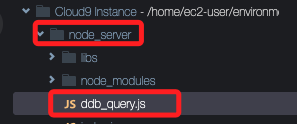
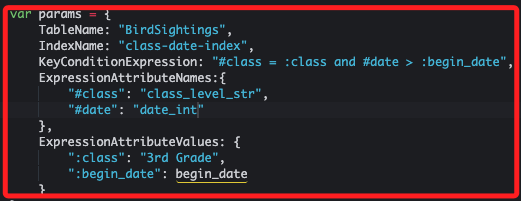
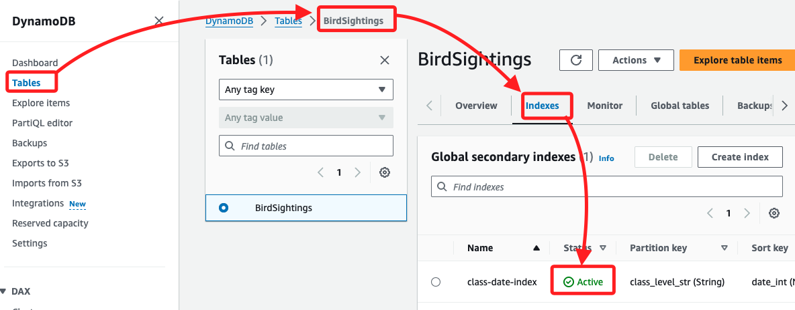

# Task 7：使用 GSI 進行 DynamoDB 查詢操作

_完成建立 `BirdSightings` 資料表的 `GSI` 後，現在可以使用此索引來進行查詢操作。這將使查詢變得更加高效，僅檢索符合條件的數據，而不是像 `scan` 方法那樣掃描整個資料表。_

<br>

## 檢視並更新 `ddb_query.js` 檔案

_返回 Cloud9 IDE_

<br>

1. 在左側的視窗中展開 `node_server` 資料夾，找到並點擊開啟 `ddb_query.js` 檔案。

    

<br>

2. 該程式碼與之前載入記錄的腳本類似，查詢的關鍵參數配置如下。

    ```javascript
    var params = {
        TableName: "BirdSightings",
        IndexName: "<index-name>",
        KeyConditionExpression: "#class = :class and #date > :begin_date",
        ExpressionAttributeNames:{
            "#class": "<index-partition-key>",
            "#date": "<index-sort-key>"
        },
        ExpressionAttributeValues: {
            ":class": "3rd Grade",
            ":begin_date": begin_date
        }
    };
    ```

<br>

## 關鍵說明

_先不急著操作，這裡簡單說明一下代碼內容_

<br>

1. `IndexName` 指定了 GSI 的名稱，因此查詢方法會使用 GSI 的分區鍵和排序鍵進行查詢。

<br>

2. `ExpressionAttributeNames` 是一個選項，可以解決 DynamoDB 保留字的問題。例如，如果欄位名稱是保留字，這個參數可以用來替代欄位名稱。這裡的 `#class` 和 `#date` 被替代為實際的欄位名稱。

<br>

3. `KeyConditionExpression` 用於指定查詢條件。在這裡，查詢三年級的觀察記錄，且日期必須大於指定的 `begin_date`（即過去 7 天內的記錄）。

<br>

4. `ExpressionAttributeValues` 則指定了查詢時的實際值，例如篩選三年級 (`"3rd Grade"`) 和開始日期 (`begin_date`)。

<br>

## 繼續說明代碼

1. 查詢請求會通過以下代碼發送至 DynamoDB。

    ```javascript
    docClient.query(params, onQuery);
    ```

<br>

2. DynamoDB 查詢操作會限制每次返回的資料大小，最多為 1 MB。如果有更多的記錄未被處理，會使用 `LastEvaluatedKey` 來判斷，並繼續查詢下一批記錄。

    ```javascript
    if (typeof data.LastEvaluatedKey != "undefined") {
        console.log("Scanning for more...");
        params.ExclusiveStartKey = data.LastEvaluatedKey;
        docClient.scan(params, onScan);
    }
    ```

<br>

3. 將以下三個佔位符替換為實際的值，修改後記得儲存腳本。

    ```javascript
    `<index-name>`：`class-date-index`
    `<index-partition-key>`：`class_level_str`
    `<index-sort-key>`：`date_int`
    ```

<br>

4. 更新後的程式碼如下；記得儲存更改。

    

<br>

## 查看 GSI 狀態

_進入 DynamoDB_

<br>

1. 在執行查詢之前，進入 Tables 並點擊進入 `BirdSightings`，然後切換到 `Indexes` 頁籤中觀察，確保 GSI `class-date-index` 的狀態顯示為 `Active`。

    

<br>

## 測試 `ddb_query.js` 腳本

_回到 Cloud9_

<br>

1. 執行以下命令測試查詢腳本。

    ```bash
    cd /home/ec2-user/environment/node_server
    node ddb_query.js
    ```

<br>

3. 確認輸出結果；輸出的記錄會根據 Task 6 中的 `Report` 頁面輸入的資料而有所不同。如果在過去 7 天內有輸入觀察記錄，這些記錄將顯示在輸出中。

    ```bash
    {
        class_level_str: '3rd Grade',
        location_str: 'Home',
        bird_name_str: 'Eastern Bluebird',
        student_name_str: 'Maria Garcia',
        date_int: 1645401600,
        id: '0bdf1bdd-185b-4a66-b3d3-51926c7bbc0b',
        count_int: 2
    }
    {
        class_level_str: '3rd Grade',
        location_str: 'Home',
        bird_name_str: 'Eastern Bluebird',
        student_name_str: 'Maria Garcia',
        date_int: 1645401600,
        id: 'cdb2243e-d11e-4e6c-83fb-dd3772c4ecaf',
        count_int: 2
    }
    ```

<br>

## 總結

1. 完成此任務後，已成功利用 GSI 在 `BirdSightings` 資料表中進行高效查詢。使用 GSI 使得應用程式能夠根據 `class_level_str` 和 `date_int` 快速篩選出符合條件的記錄，進而生成 Ms. García 所需的報告。這種方法提高了查詢效率並節省了資源。在後續的實驗中，將進一步學習如何利用 AWS Step Functions 來讓教師從應用程式中安全地按需生成報告。

<br>

___

_END_