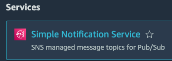
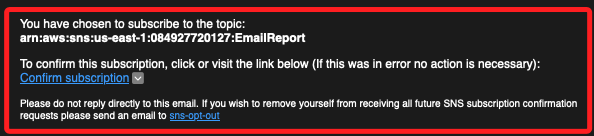

# Task 2：訂閱 SNS 主題

_`SNS`，就是 `Simple Notification Service` 的縮寫；在這個任務中，將會訂閱一個 SNS 主題，當應用程式用戶請求報告時，該主題將會發送通知給訂閱者。_

 

## 進入 SNS 主題頁面

1. 搜尋並進入 `Simple Notification Service`；搜尋 `SNS` 也可以。

    

 

2. 在左側欄選擇 `Topics`。

 

3. 在清單中點擊進入 `Name` 為 `EmailReport` 的 `SNS 主題`。

 

## 建立 Email 訂閱

1. 預設會進入 `Subscriptions` 頁籤，點擊 `Create subscription`。

 

2. 在 `Topic ARN` 對話框中會自動填寫無需更改；在 `Protocol` 選擇 `Email`；在 `Endpoint` 輸入一個有效的電子郵件地址，這將是在 Lab 期間接收通知的地址，這裡我輸入自己的 Email 信箱 `gsam6238@gmail.com`。

3. 點擊右下角 `Create subscription`。

## 確認電子郵件訂閱

1. 此時電子郵件信箱會收到來自 AWS 通知服務的電子郵件，打開郵件並在內容中點擊 `Confirm subscription`。

    

 

2. 此時瀏覽器將打開一個網頁，顯示訂閱成功的訊息；可關閉通知網頁。

## 發佈測試訊息以確認訂閱

_返回 `SNS` 主題 `EmailReport` 的頁面_

1. 在頁面頂部，點擊 `EmailReport`，回到該主題的詳細頁面。

2. 選擇右側 `Publish message`。

3. 進行配置頁面，在 `Subject` 輸入 `Test`。

4. 在 `Message body` 部分，保持預選的 `Message structure`，在下方輸入 `Hello! This is a test.`。

5. 點擊右下方 `Publish message`。

## 確認收到測試訊息

1. 此時在之前提供的電子郵件信箱中會收到主題為 `Test` 的測試郵件，查看並確認郵件的主題與訊息內容是否與先前配置的內容一致。

2. 以上步驟的目的是確認 SNS 訂閱功能是否正常運作，並確保未來的報告通知能夠正確傳送給指定的對象。

 

___

_END_