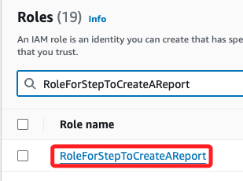
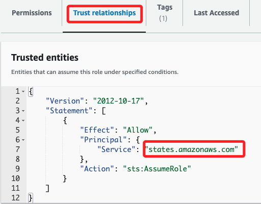
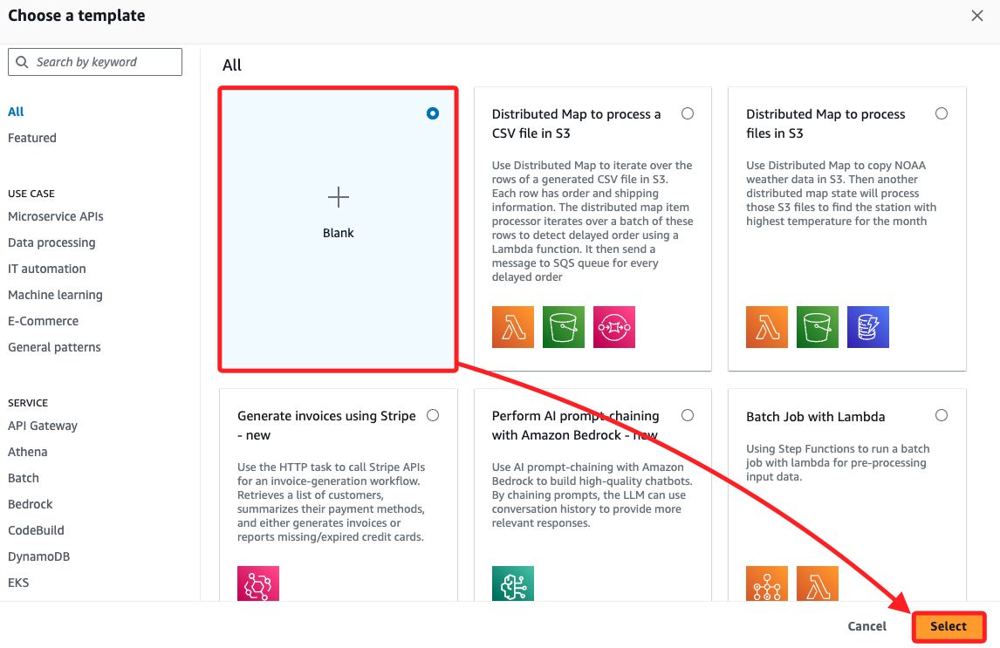
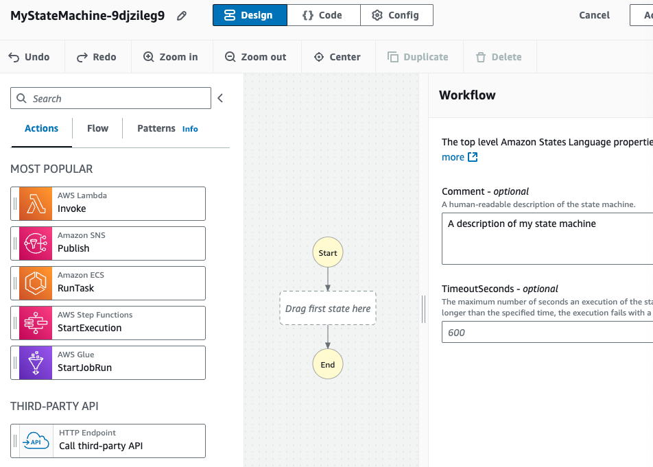
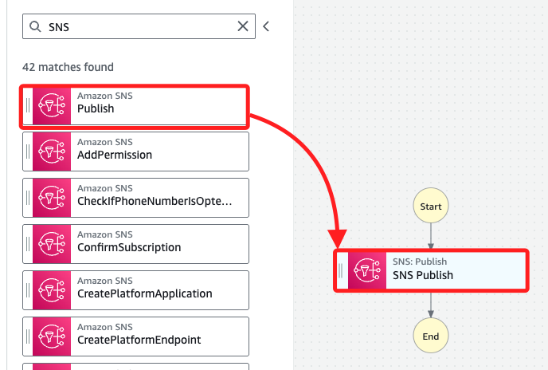
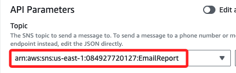
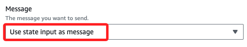
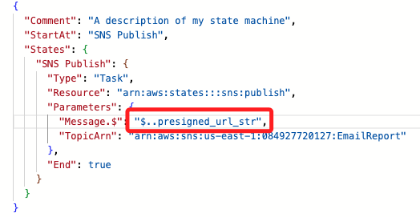
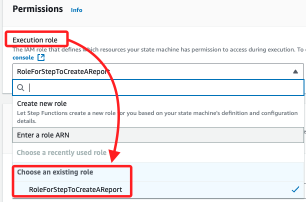

# Task 3：建立一個用於發送電子郵件的 State Machine

_在此任務中，將建立一個 AWS Step Functions 狀態機，該狀態機將透過 SNS 主題發送電子郵件通知。需要首先確保這個狀態機具備訪問 Lambda 服務的權限，並且訂閱 SNS 主題的電子郵件會正確接收報告通知。_

## 查看 Step Functions 的 IAM 角色

1. 進入 `IAM`，在左側欄中選擇 `Roles`。

2. 搜尋並點擊進入 `RoleForStepToCreateAReport`。



3. 預設進入 `Permissions` 頁籤，展開 `stepPolicyForCreateReport` 政策查看，這些權限允許對特定 `Lambda` 函數執行多個 `Lambda` 操作，並對所有資源執行日誌操作。

```json
{
    "Version": "2012-10-17",
    "Statement": [
        {
            "Action": [
                "lambda:Get*",
                "lambda:Invoke*",
                "lambda:List*"
            ],
            "Resource": [
                "arn:aws:lambda:us-east-1:084927720127:function:GeneratePresignedURL",
                "arn:aws:lambda:us-east-1:084927720127:function:generateHTML",
                "arn:aws:lambda:us-east-1:084927720127:function:getRealData"
            ],
            "Effect": "Allow"
        },
        {
            "Action": [
                "logs:*"
            ],
            "Resource": "*",
            "Effect": "Allow"
        }
    ]
}
```

4. 展開 `AWSLambdaRole` 政策，該政策允許 `lambda:InvokeFunction` 操作，這將允許從 `Lambda` 控制台測試函數。

```json
{
    "Version": "2012-10-17",
    "Statement": [
        {
            "Effect": "Allow",
            "Action": [
                "lambda:InvokeFunction"
            ],
            "Resource": [
                "*"
            ]
        }
    ]
}
```

5. 切換到頁籤 `Trust relationships`，_確認這個信任關係允許 `Step Functions` 服務（states.amazonaws.com）假設該角色；也就是說，這個 IAM 角色的信任關係允許 `AWS Step Functions` 服務來扮演這個角色，這個服務也就是 `states.amazonaws.com`；這樣一來，`Step Functions` 就能夠獲取這個角色的權限來執行它需要的操作。



## 建立發送電子郵件的狀態機

1. 搜尋並進入 `Step Functions`。

2. 在左側欄中，選擇 `State machines`。

3. 接著點擊 `Create state machine`。

4. 在模板選擇頁面選擇 `Blank`，然後點擊 `Select`。



5. `Workflow Studio` 將以 `設計模式` 顯示。



## 設計工作流程

1. 在左側的 States 中，搜尋 `SNS`。

2. 將 `Publish` 物件拖到標記為 `Drag first state here` 的框內。



3. 在 `SNS Publish` 面板中進行配置，其中 `Topic` 選擇之前建立的 `EmailReport` SNS 主題的 ARN。



4. `Message` 設置為 `Use state input as message`。



## 修改狀態機代碼

1. 切換到 `Code` 頁籤進入 `代碼模式`，會見到如下的預設代碼。

```json
{
    "Comment": "A description of my state machine",
    "StartAt": "SNS Publish",
    "States": {
        "SNS Publish": {
        "Type": "Task",
        "Resource": "arn:aws:states:::sns:publish",
        "Parameters": {
            "Message.$": "$",
            "TopicArn": "arn:aws:sns:us-east-1:084927720127:EmailReport"
        },
        "End": true
        }
    }
}
```

2. 在代碼中將 `"Message.$"` 的值從 `"$"` 更改為 `"$..presigned_url_str"`；這表示應用程式將傳入一個 `JSON` 負載，包含 `presigned_url_str`，這會作為郵件內容發送。



## 設定狀態機

1. 切換頂部頁籤到 `Config` 進入配置模式。

2. 狀態機名稱輸入 `MyStateMachine`。

3. 在 `Execution role` 展開選單並點擊 `Choose an existing role`，選擇其中 `RoleForStepToCreateAReport`。



4. 將 `Log level` 切換為 `ALL`，這會記錄每次狀態機執行的詳細資訊。

#### 6. 建立並測試狀態機
1. 完成設置後，點擊 Create 建立狀態機。
2. 建立完成後，選擇 Start execution 開始執行。
3. 在代碼編輯器中，將預設的 JSON 替換為以下內容：

```json
{
  "presigned_url_str": "Testing that my email message works"
}
```

4. 點擊 Start execution 開始執行狀態機。
5. 檢查執行詳細頁面，並確認執行狀態。
6. 檢查的電子郵件，應該收到一封內容為 `Testing that my email message works` 的電子郵件。

### 結論
已成功建立了一個基本的狀態機，該狀態機通過 SNS 主題發送電子郵件。接下來，可以進一步優化應用程式，讓老師 Ms. Garcia 獲取所有學生觀察記錄的安全報告通知。