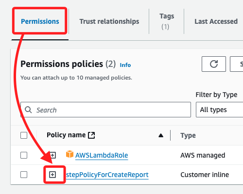
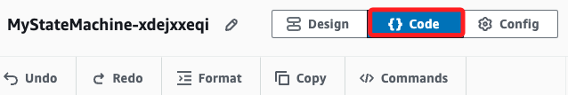
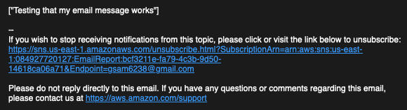

# Task 3：建立一個用於發送電子郵件的 State Machine

_在此任務中，將建立一個 AWS Step Functions 狀態機，該狀態機將透過 SNS 主題發送電子郵件通知。需要首先確保這個狀態機具備訪問 Lambda 服務的權限，並且訂閱 SNS 主題的電子郵件會正確接收報告通知。_

<br>

## 查看 Step Functions 的 IAM 角色

1. 進入 `IAM`，在左側欄中選擇 `Roles`。

<br>

2. 搜尋並點擊進入 `RoleForStepToCreateAReport`。

    

<br>

3. 預設進入 `Permissions` 頁籤，點擊 `stepPolicyForCreateReport` 政策前面的加號 `+` 展開查看。

    

<br>

4. 這些權限允許對特定 `Lambda` 函數執行多個 `Lambda` 操作，並對所有資源執行日誌操作。

    ```json
    {
        "Version": "2012-10-17",
        "Statement": [
            {
                "Action": [
                    "lambda:Get*",
                    "lambda:Invoke*",
                    "lambda:List*"
                ],
                "Resource": [
                    "arn:aws:lambda:us-east-1:084927720127:function:GeneratePresignedURL",
                    "arn:aws:lambda:us-east-1:084927720127:function:generateHTML",
                    "arn:aws:lambda:us-east-1:084927720127:function:getRealData"
                ],
                "Effect": "Allow"
            },
            {
                "Action": [
                    "logs:*"
                ],
                "Resource": "*",
                "Effect": "Allow"
            }
        ]
    }
    ```

<br>

4. 展開 `AWSLambdaRole` 政策，該政策允許 `lambda:InvokeFunction` 操作，這將允許從 `Lambda` 控制台測試函數。

    ```json
    {
        "Version": "2012-10-17",
        "Statement": [
            {
                "Effect": "Allow",
                "Action": [
                    "lambda:InvokeFunction"
                ],
                "Resource": [
                    "*"
                ]
            }
        ]
    }
    ```

<br>

5. 切換到頁籤 `Trust relationships`，_確認這個信任關係允許 `Step Functions` 服務（states.amazonaws.com）假設該角色；也就是說，這個 IAM 角色的信任關係允許 `AWS Step Functions` 服務來扮演這個角色，這個服務也就是 `states.amazonaws.com`；這樣一來，`Step Functions` 就能夠獲取這個角色的權限來執行它需要的操作。

    

<br>

## 建立發送電子郵件的狀態機

1. 搜尋並進入 `Step Functions`。

<br>

2. 在左側欄中，選擇 `State machines`。

<br>

3. 接著點擊 `Create state machine`。

<br>

4. 在模板選擇頁面選擇 `Blank`，然後點擊 `Select`。

    

<br>

5. `Workflow Studio` 將以 `設計模式` 顯示。

    

<br>

## 設計工作流程

1. 在左側搜尋框中輸入 `SNS` 進行搜尋。

<br>

2. 將 `Publish` 物件拖到標記為 `Drag first state here` 的框內。

    

<br>

3. 點擊選取 `SNS Publish`，接著在右側面板中進行配置，其中 `Topic` 選擇之前建立的 `EmailReport` SNS 主題的 ARN。

    

<br>

4. `Message` 使用預設選取的 `Use state input as message`。

    

<br>

## 編輯預設的狀態機代碼

1. 切換到 `Code` 頁籤進入 `代碼模式`。

    

<br>

2. 顯示如下的預設代碼。

    ```json
    {
        "Comment": "A description of my state machine",
        "StartAt": "SNS Publish",
        "States": {
            "SNS Publish": {
            "Type": "Task",
            "Resource": "arn:aws:states:::sns:publish",
            "Parameters": {
                "Message.$": "$",
                "TopicArn": "arn:aws:sns:us-east-1:084927720127:EmailReport"
            },
            "End": true
            }
        }
    }
    ```

<br>

3. 修改代碼中的鍵 `"Message.$"` 的值，將原本的 `"$"` 更改為 `"$..presigned_url_str"`；這表示應用程式將傳入一個 `JSON` 格式的 `payload`，內容包含了 `presigned_url_str`，這會作為郵件內容發送。

    

<br>

## 設定狀態機

1. 切換頂部頁籤到 `Config` 進入配置模式。

<br>

2. 將預設的狀態機名稱改為 `MyStateMachine`。

<br>

3. 展開在 `Permissions` 區塊中的 `Execution role`，選取其中 `Choose an existing role` 項目下的 `RoleForStepToCreateAReport`。

    

<br>

4. 將 `Log level` 切換為 `ALL`，這會記錄每次狀態機執行的詳細資訊。

<br>

5. 完成設置點擊右上角 `Create`。

<br>

## 建立並測試狀態機

1. 完成後，點擊右上角 `Execute` 開始執行測試，這會自動開啟新的瀏覽頁面。

<br>

2. 在代碼編輯器中貼上以下內容。

    ```json
    {
    "presigned_url_str": "Testing that my email message works"
    }
    ```

3. 點擊右下角 `Start execution` 開始執行狀態機。

<br>

4. 這時會收到一封內容為 `Testing that my email message works` 的電子郵件；至此成功建立一個基本的狀態機，通過 SNS 主題發送電子郵件。

    

<br>

___

_END_