# Task 5：將 Lambda 加入狀態機

_在此任務中，將測試用於生成 HTML 報告的 Lambda 函數，該函數將生成的報告文件寫入到 S3 Bucket 中。隨後，將把這個 Lambda 函數添加到狀態機的工作流程中，並與之前的 GeneratePresignedURL 函數並行運行，以提高效率。_

<br>

## 查看並測試 Lambda 函數

1. 進入 Lambda，點擊名為 `generateHTML` 的函數。

    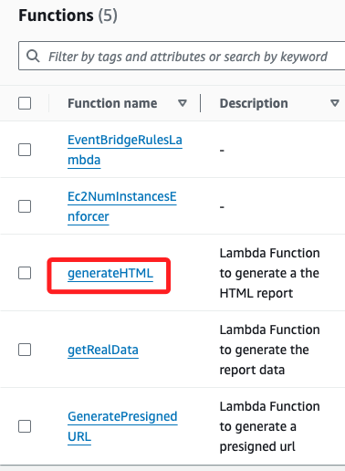

<br>

2. 切換到 `Configuration` 頁籤，選擇 `Permissions`。

    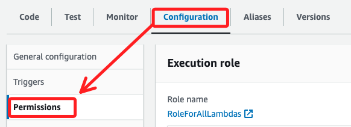

<br>

3. 確認該函數使用的角色為 `RoleForAllLambdas`，這與之前的 `GeneratePresignedURL` 函數使用的角色相同，這個 Role 允許 Lambda 函數與 Amazon S3、Amazon SNS 以及 DynamoDB 進行互動。

    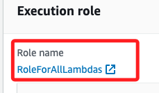

<br>

## 測試 Lambda 函數

1. 切換到 `Code` 標籤，然後點擊 `Test`。

    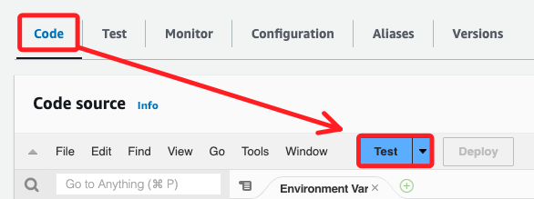

<br>

2. 將事件名稱設為 `test2`，並將以下代碼貼上作為輸入，然後點擊 `Save`。

    ```json
    {
        "bird_obj_arr": [
            {
                "class_level_str": "3rd Grade",
                "location_str": "Home",
                "bird_name_str": "Northern Cardinal",
                "student_name_str": "Maria Garcia",
                "date_str": "2-21-2022",
                "id_str": "373453bd-722d-454f-8b4b-1ec53e2df9b0",
                "count_int": 2
            },
            {
                "class_level_str": "3rd Grade",
                "location_str": "Home",
                "bird_name_str": "Baltimore Oriole",
                "student_name_str": "Li Juan",
                "date_str": "12-20-2021",
                "id_str": "bd6560ac-ee19-4ef4-ac73-8deb61520601",
                "count_int": 1
            },
            {
                "class_level_str": "3rd Grade",
                "location_str": "Lake",
                "bird_name_str": "American Kestrel",
                "student_name_str": "Jorge Souza",
                "date_str": "01-30-2022",
                "id_str": "591d0b66-87ba-4e15-aadf-b0db6e63f089",
                "count_int": 5
            }
        ]
    }
    ```

<br>

3. 完成儲存後，點擊 `Test` 進行測試；查看返回的 JSON 消息，假如出現如下的內容，表示 Lambda 函數成功運行並覆蓋了 S3 中的 `report.html` 文件。

    ```json
    {
        "msg_str": "Report published to S3"
    }
    ```

<br>

## 將函數添加到狀態機

_返回 Step Functions 控制台_

<br>

1. 選擇 `MyStateMachine`，然後選擇 `Edit`。

<br>

2. 切換到 `Flow` 標籤，將 `Parallel` 對象拖到 `Lambda: Invoke GeneratePresignedURL` 上方。

    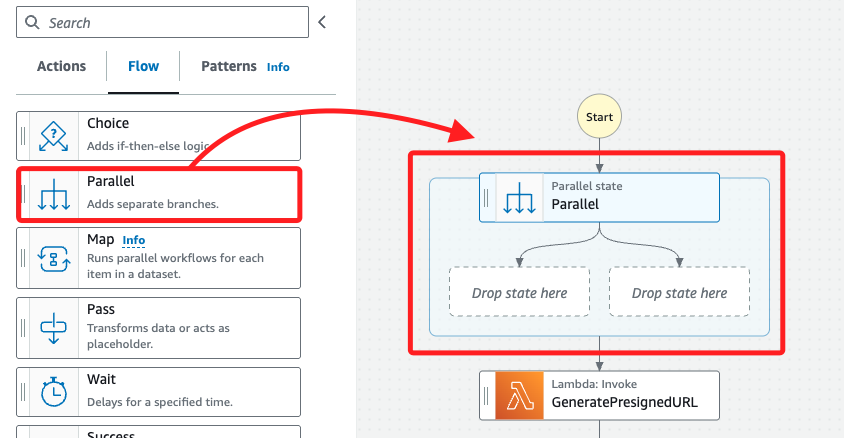

<br>

3. 將 `Lambda: Invoke GeneratePresignedURL` 拖到 `Parallel`狀態的右側區域。

    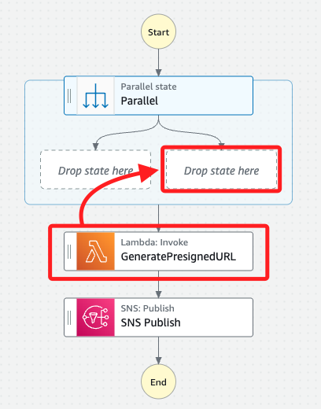

<br>

4. 在左側搜尋框中輸入 `Lambda`，拖曳新的 `Invoke` 對象到 `Parallel` 狀態的左側區域。

    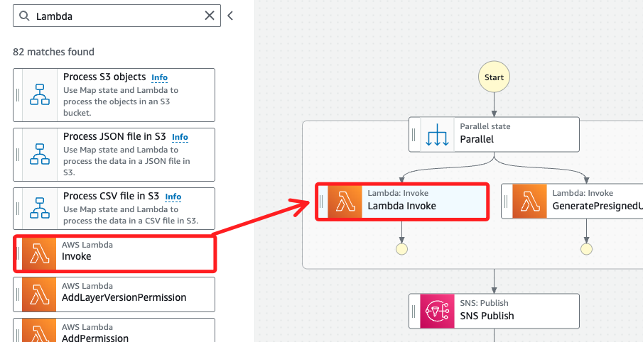

<br>

5. 選取新加入的 `Lambda Invoke`，在右側區域進行設置；在 `State name` 輸入 `generateHTML`，`Function name` 選擇 `generateHTML:$LATEST`。

    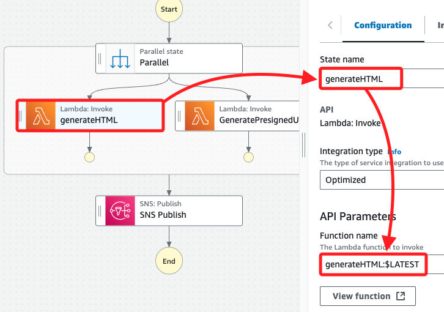

<br>

6. 在 `Payload` 使用預設選擇的 `Use state input as payload`，`Next state` 使用預設選擇 `Go to end`。

<br>

7. 選擇 `Parallel` 狀態對象，並設置 `State name` 為 `Process Report`。

    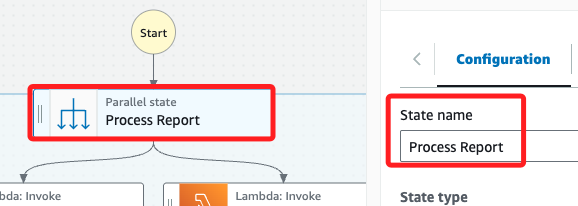

<br>

## 修改 SNS Publish 狀態中的消息設置

_在早先的步驟中，將 `Message.$` 設為 `$.presigned_url_str`，這是用於測試的。但現在要將來自 `GeneratePresignedURL` 和 `generateHTML` 的數據一併發送給 `SNS`，故需要將 `Message.$` 恢復為 `$.`。_

<br>

1. 切換到 `Code` 頁籤，在 JSON 編輯區塊中找到 `"Message.$": "$.presigned_url_str",`。

    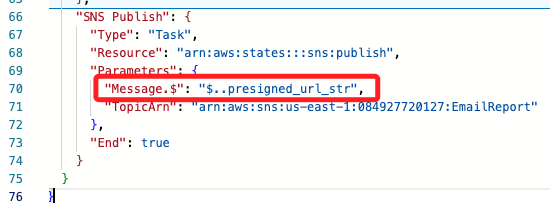

<br>

2. 並將其更改回 `"$"`，然後點擊右上角 `Save` 保存更改。

    ```json
    "SNS Publish": {
        "Type": "Task",
        "Resource": "arn:aws:states:::sns:publish",
        "Parameters": {
            "Message.$": "$",
            "TopicArn": "arn:aws:sns:us-east-1:1234567890:EmailReport"
        },
        "End": true
    }
    ```

<br>

## 測試更新後的狀態機

1. 點擊右上角 `Execution`。

2. 將 `Input` 的 JSON 代碼更改為以下內容。

    ```json
    {
        "bird_obj_arr": [
            {
                "class_level_str": "3rd Grade",
                "location_str": "Home",
                "bird_name_str": "Northern Cardinal",
                "student_name_str": "Maria Garcia",
                "date_str": "2-21-2022",
                "id_str": "373453bd-722d-454f-8b4b-1ec53e2df9b0",
                "count_int": 2
            },
            {
                "class_level_str": "3rd Grade",
                "location_str": "Home",
                "bird_name_str": "Baltimore Oriole",
                "student_name_str": "Li Juan",
                "date_str": "12-20-2021",
                "id_str": "bd6560ac-ee19-4ef4-ac73-8deb61520601",
                "count_int": 1
            },
            {
                "class_level_str": "3rd Grade",
                "location_str": "Lake",
                "bird_name_str": "American Kestrel",
                "student_name_str": "Jorge Souza",
                "date_str": "01-30-2022",
                "id_str": "591d0b66-87ba-4e15-aadf-b0db6e63f089",
                "count_int": 5
            }
        ]
    }
    ```

<br>

2. 點擊右下角 `Start execution` 開始執行。

<br>

3. 確認電子郵件中包含 `msg_str` 和 `presigned_url` 兩個鍵值對，分別來自 `generateHTML` 和 `GeneratePresignedURL`。

    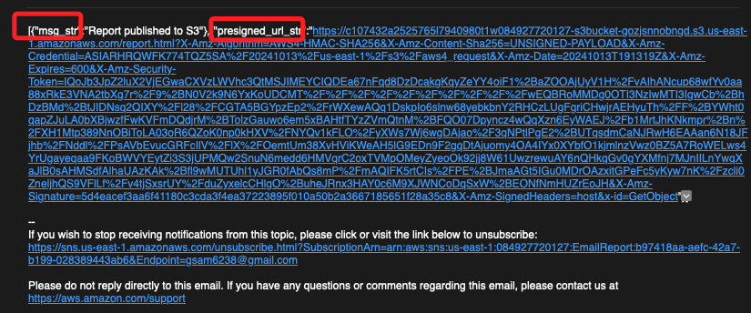

<br>

4. 至此完成此階段任務，成功測試了 `generateHTML` Lambda 函數，並將其添加到狀態機中與 `GeneratePresignedURL` 函數並行運行。這樣可以加快報告生成和 URL 預簽名過程，並將這些結果通過 SNS 發送給用戶。

<br>

___

_END_