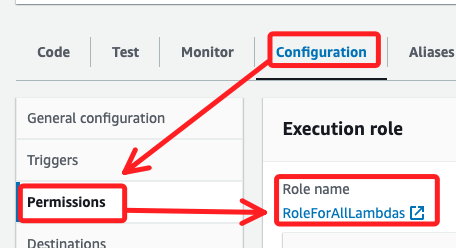
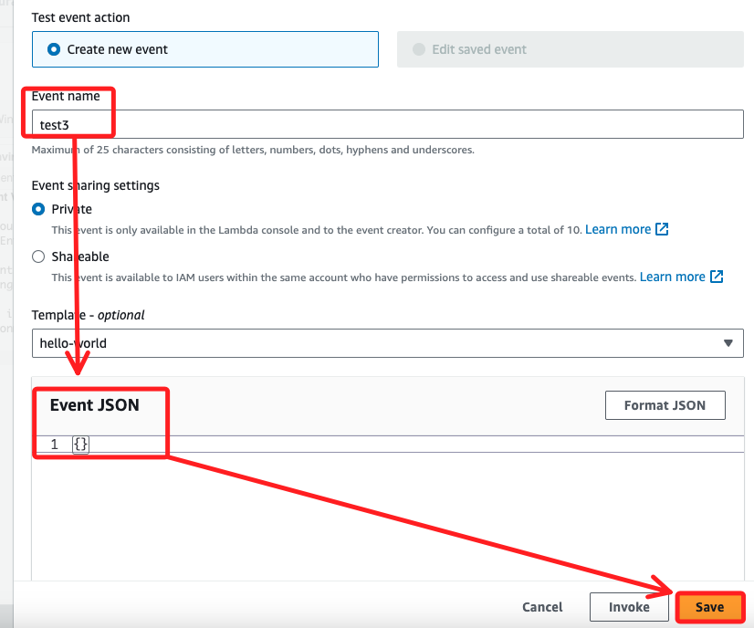
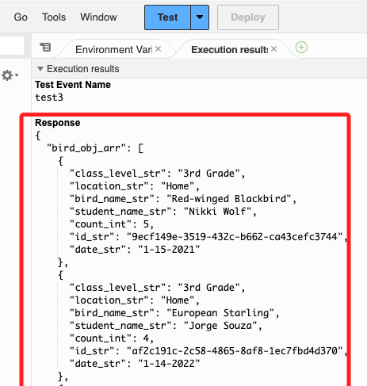
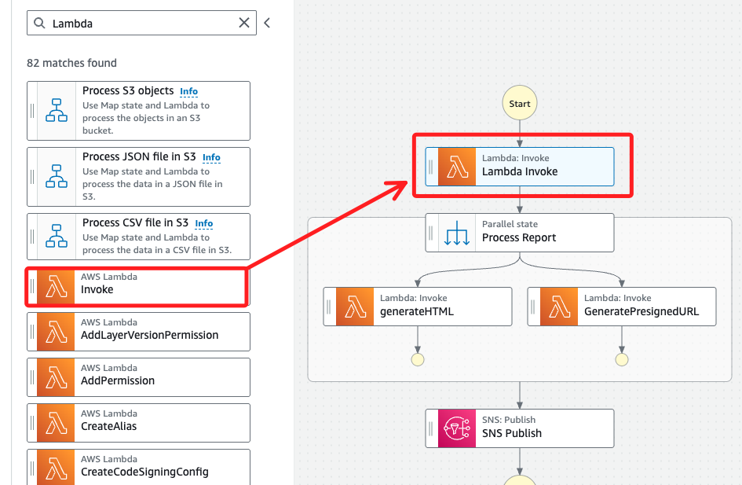
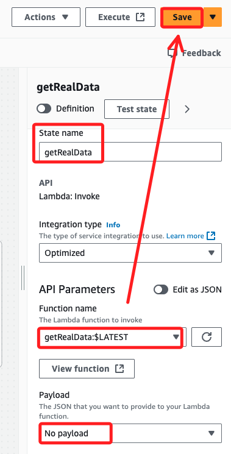
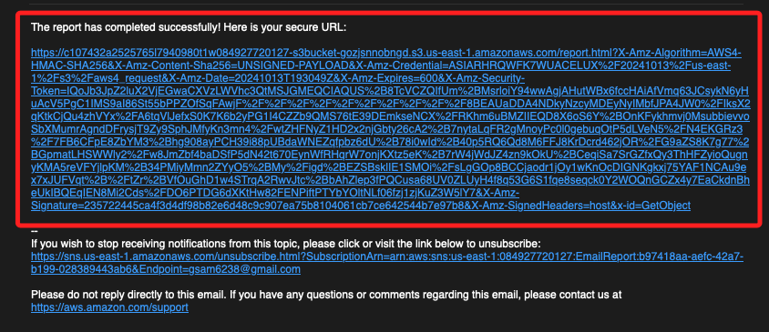

# Task 6：將 `getRealData` Lambda 函數添加到狀態機

_在這個任務中，將測試並加入一個 Lambda 函數來從 DynamoDB 表中檢索實際的鳥類觀察紀錄，並將該函數集成到現有的狀態機中，讓 `generateHTML` 狀態使用真實的數據來生成報告。_

<br>

## 測試 `getRealData` Lambda 函數

1. 搜尋並進入 `Lambda`，點擊進入 `getRealData`函數。

<br>

2. 切換到 `Configuration` 頁籤，點擊左側 `Permissions`，查看函數的 IAM Role 使用的是 `RoleForAllLambdas`。

    

<br>

3. 這個角色允許 Lambda 與 Amazon S3、Amazon SNS 和 Amazon DynamoDB 互動。該函數的代碼將從 DynamoDB 中檢索所有鳥類觀察紀錄，並以 JSON 格式返回。

<br>

## 測試 Lambda 函數

1. 選擇 `Code` 標籤，然後選擇 `Test`。

<br>

2. 將事件名稱設為 `test3`，並將測試事件輸入設為 `{}`，點擊右下角 `Save`。

    

<br>

3. 再次選擇 `Test`；在執行結果中，應該會看到返回的鳥類觀察紀錄數據。

    

<br>

## 將 Lambda 函數添加到狀態機

_返回 Step Functions 控制台_

<br>

1. 選擇 MyStateMachine，然後選擇 Edit。

<br>

2. 在左側搜尋 `Lambda`，將 `Invoke` 對象拖到 `Parallel` 狀態（`Process Report`）上方，作為它之前執行的一步。

    

<br>

3. 點選 `Lambda Invoke` 進行設置，`State name` 輸入 `getRealData`，`Function name` 選擇 `getRealData:$LATEST`，`Payload` 選擇 `No payload`，然後點擊右上角 `Save`。

    

<br>

## 更新 SNS Publish 物件的消息格式

1. 切換到 `Code` 頁籤，定位到接近底部的 `SNS Publish` 狀態。

<br>

2. 將 `Message.$` 的值從 `"$"` 修改為以 `States.Format` 開頭的設置字串如下，這樣 SNS 消息將以格式化文本發送 URL 給收件人。

    ```json
    "Message.$": "States.Format('The report has completed successfully! Here is your secure URL:\n\n{}', $[1].presigned_url_str)"
    ```

<br>

3. 點擊右上角 `Save` 保存。

<br>

## 測試完整的狀態機

1. 點擊右上角 `Execute`。

<br>

2. 在 `Input` 編輯器中只保留 `{}` 作為輸入。

<br>

3. 點擊右下角 `Start execution` 開始執行狀態機。

<br>

4. 會收到一封包含格式化的消息和預簽名 URL 的電子郵件，至此確認可以通過該 URL 加載生成的報告。

    

<br>

5. 在這個任務中，成功將 `getRealData` Lambda 函數添加到狀態機中，並使其在 `generateHTML` 之前運行，以檢索實際的數據來生成報告。此外，還更新了 SNS Publish 狀態，使用格式化消息來更清晰地向用戶傳遞報告 URL。最後，通過電子郵件驗證了整個工作流程的正確性。

<br>

___

_END_