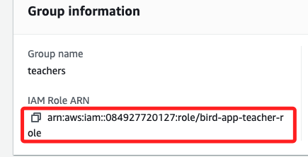

# Task 7：審查 Amazon Cognito 群組配置

_在這個任務中，將審查 Amazon Cognito user pool中的群組配置，並瞭解如何通過 IAM 角色來控制應用程式訪問 Step Functions 狀態機。接著，您將更新應用程式代碼以調用狀態機。_

<br>

## 審查 Amazon Cognito user pool群組配置

1. 搜尋並進入 `Cognito` 服務。

<br>

2. 在 User pools 頁面中，點擊進入 `bird_app`。

<br>

3. 選擇 `Groups` 頁籤，然後點擊 `teachers` 群組。

<br>

4. 在群組資訊面板中可看到分配給 teachers 群組的 IAM 角色為 `bird-app-teacher-role`。

    

<br>

## 檢查 `bird-app-teacher-role` IAM 角色

1. 搜尋並進入 IAM。

<br>

2. 選擇 Roles，並在搜尋框中搜尋 `bird-app-teacher-role`。

<br>

3. 選擇該角色，然後進入 `Permissions` 標籤，展開 `bird-app-teacher-policy`。

<br>

4. 該策略允許對 `Amazon DynamoDB` 中的 `BirdSightings` 表，以及 `Amazon Step Functions` (`states`) 中的 `MyStateMachine` 狀態機進行操作。

<br>

## 審查信任關係

1. 選擇 Trust relationships 標籤。

<br>

2. 注意到該角色允許 `Amazon Cognito Identity` 服務在經過身份驗證後，通過 `Web` 身份來假設這個角色。

<br>

3. 當使用者以 `teacher` 身份登錄應用程式時，他們的應用程式會話將使用 `bird-app-teacher-role` IAM 角色來調用 AWS 服務。

<br>

## 更新代碼以調用狀態機

_返回 AWS Cloud9 IDE_

<br>

1. 展開 `node_server` 資料夾，然後展開 `libs` 資料夾。

<br>

2. 打開名為 `mw.js` 的文件，找到用於配置登錄使用者 IAM 憑證的代碼片段。

    ```javascript
    AWS.config.credentials = new AWS.CognitoIdentityCredentials({
        IdentityPoolId: process.env.COGNITO_IDENTITY_POOL_ID,
        Logins: {
            "cognito-idp.us-east-1.amazonaws.com/<cognito-user-pool-id>": bearer_str
        }
    });
    ```

<br>

3. 確認 `<cognito-user-pool-id>` 已被替換為真實的 `Cognito` user pool ID，這是在 Lab 環境中已自動設置的。

<br>

4. 下一段代碼配置了 Step Functions AWS SDK 客戶端。

    ```javascript
    var stepFunction = new AWS.StepFunctions({apiVersion: '2016-11-23'});
    ```

<br>

5. 定義調用參數，包括 `stateMachineArn`、`input` 和 `name`，使用 `AWS Account ID` 替換 `<aws-account>` 占位符。

    ```javascript
    var params = {
        stateMachineArn: 'arn:aws:states:us-east-1:<aws-account>:stateMachine:MyStateMachine',
        input: '{}',
        name: 'CreateReport' + id
    };
    ```

<br>

6. 啟動狀態機調用。

    ```javascript
    async function callStateMachine(){
        console.log('runReport');
        try {
            const data = await stepFunction.startExecution(params).promise()
            return data
        } catch (err) {
            return err
        }
    }
    ```

<br>

7. 在 `mw.js` 中找到 `<aws-account>` 占位符，並使用真實的 AWS 帳戶 ID 進行替換。

    ```javascript
    stateMachineArn: 'arn:aws:states:us-east-1:1234567890:stateMachine:MyStateMachine',
    ```

<br>

8. 保存您的更改，並關閉文件。

<br>

## 啟動 Node Server

1. 在 AWS Cloud9 終端中運行以下指令啟動 Node 服務器。

    ```bash
    cd /home/ec2-user/environment/node_server
    npm start
    ```

<br>

2. 成功啟動服務後，終端應顯示類似於以下的輸出；至此成功更新了代碼以調用狀態機，並啟動了 Node 服務器以支持應用程式的運行。

    ```bash
    > start
    > REGION_STR=us-east-1 node index.js
    Live on port: 8080
    ```

<br>

___

_END_