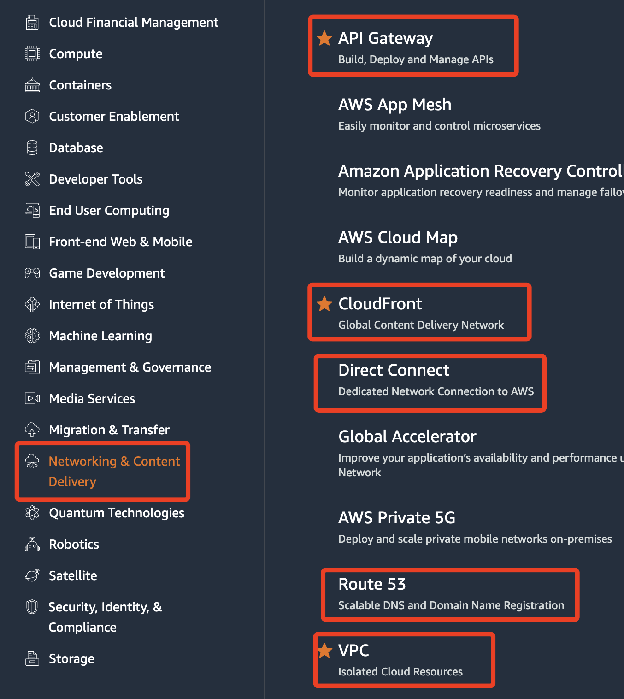
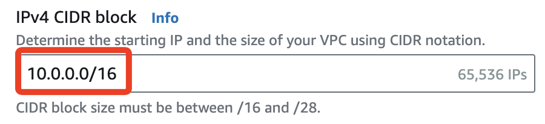
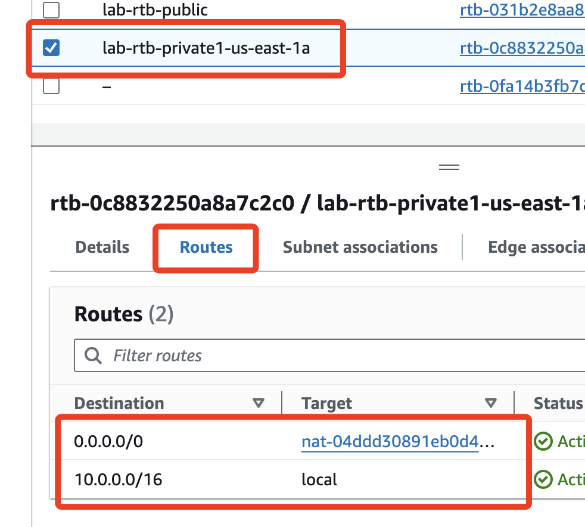

# VPC

_虛擬私有雲，也就是 `機房`_

##

1. 可將多台路由串接起來
2. 安全群組就是防火牆，為何？
3. 考試會考的項目

4. CIDR

# 關於 IP

`10.0.0.0/16` 中的 `16` 代表 `10.0` 前面的 `16.0` 是不可動的，也就是 `16` 個 `bit` 不可動。

同理，`10.0.0.0/24` 所代表的就是 `10.0.0` 是不可動的，至多有 256 台電腦，但因為部份 IP 被固定座指定功能，所以只有 251 個 IP。

整體來說，也就是可以有 256 個子網路、每個子網路可以有 256 個設備，也就是 256 個 IP。
我有個疑惑，為何 `10.0.0.0/16` 只可以有 256 個子網？

6. `us-east-1a` 中的 `a` 所代表的就是第幾個 `Region`，依照英文小寫字母順序排列，`a` 就是第一個。

##

切換到 Routes，其中 `nat` 指的是訪問外網，`10.0.0.0/16` 指的是內網，所以是 `local`

一個 route table 可以掛在兩個子網上，但一個子網不可以有兩個 route table