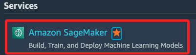
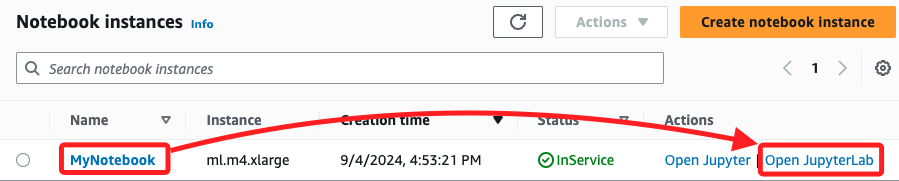
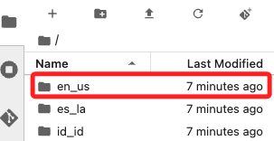
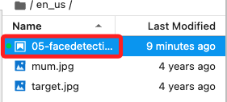
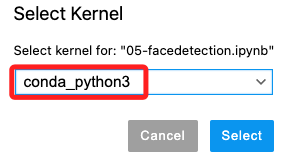
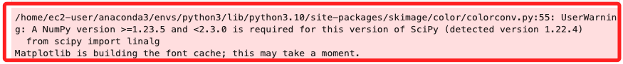
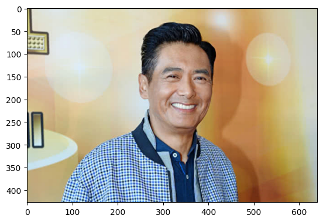
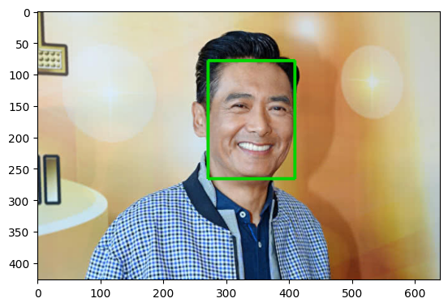
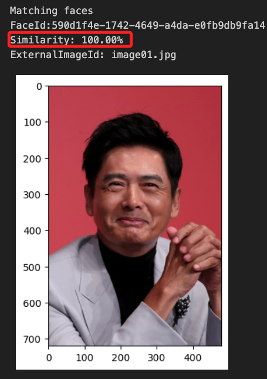
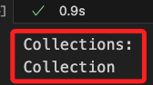

# 人臉識別

_Module 5 – Introducing Computer Vision (CV)，使用 Amazon SageMaker 建立 Jupyter Notebook 實例，以及使用 Amazon Rekognition 進行已知人臉檢測的步驟_

<br>

## 簡介

1. `Amazon SageMaker` 是一個完全托管的 `機器學習` 平台，可快速構建、訓練和部署機器學習模型，以及其他服務和工具來進行數據準備、模型訓練到最終部署的完整機器學習工作流；特別注意，在以下的範例中，並未直接使用到 `SageMaker` 的核心功能，僅使用 `SageMaker Notebook` 建立 Jupyter Notebook 實例，然後在其中調用 Rekognition API 進行操作，而實際的圖片檢測功能是由 `Rekognition` 提供的。

<br>

2. `Amazon Rekognition` 是一個完全托管的計算機視覺服務，使用 `深度學習` 模型來執行圖像和視頻的分析和處理，能夠進行各種圖像處理任務，如人臉檢測與識別、物體和場景檢測、文本檢測、情感分析等；在以下範例中，將使用 `Rekognition` 建立人臉集合，然後將人臉圖像添加到集合中，接著搜索目標圖像中的人臉；專案的最後步驟將對集合中的數據進行刪除。

<br>

## SageMaker

_若從 Lab 進入，直接進入 `Lab 5 - Guided Lab: Facial Recognition`，然後 `Start Lab` 並進入 `AWS`_

<br>

1. 在 Services 搜尋並開啟 `Amazon SageMaker`。

    

<br>

2. 點擊左側的 Notebooks。

    

<br>

3. 預設會有一個 `MyNotebook` 的 Notebook 實例，點擊末端 `Open JupyterLab` 打開實例。

    

<br>

4. 在左側文件瀏覽器中找到 `en_us` 並點擊進入。

    

<br>

5. 點擊 `05-facedetection.ipynb` 文件。

    

<br>

6. 預設已經選好 `內核（Kernel）` 為 `conda_python3`。

    

<br>

## 運作步驟

1. 建立人臉集合（Collection）：在 Notebook 中運行指令建立一個新的 Amazon Rekognition 人臉集合。

<br>

2. 上傳影像並添加到集合：上傳包含已知人臉的影像，並將其添加到人臉集合中。

<br>

3. 檢測人臉：使用人臉集合來檢測影像中的已知人臉，並查看檢測結果，包括人臉的邊界框（Bounding Box）。

<br>

4. 列出集合中的人臉：查看集合中儲存的所有人臉數據。

<br>

5. 刪除人臉集合：完成操作後，刪除集合以清理實驗環境。

<br>

6. 完成以上步驟後，將可建立一個自定義的 Amazon Rekognition 人臉集合，將影像添加到自定義集合中，在影像中檢測已知的人臉。

<br>

## 若在本地運行

_確認已完成本地 AWS 憑證配置；以下比照 Lab 中的程序分段操作。_

1. 安裝必要的 Python 庫。

    ```bash
    pip install boto3 numpy matplotlib scikit-image Pillow
    ```

<br>

2. 導入庫。

    ```python
    # 影像處理功能
    from skimage import io
    from skimage.transform import rescale
    from matplotlib import pyplot as plt
    # AWS 的 Python SDK
    import boto3
    import numpy as np
    # 影像操作
    from PIL import (
        Image, ImageDraw, ImageColor, ImageOps
    )
    ```

<br>

3. 在雲端運作時，會出現套件兼容性問題，但不影響後續代碼；另外，在本機運行代碼並沒問題，所以忽略不予處理。

    

<br>

4. 建立人臉集合。

    ```python
    client = boto3.client('rekognition')
    collection_id = 'Collection'
    response = client.create_collection(
        CollectionId=collection_id
    )
    print('Collection ARN: ' + response['CollectionArn'])
    print('Status Code:' + str(response['StatusCode']))
    print('Done...')
    ```

<br>

4. 上傳人臉圖片。

    ```python
    filename = "image01.jpg"

    # 加載影像
    faceimage = io.imread(filename)
    plt.imshow(faceimage)

    # 添加代碼，確保影像尺寸不超過 4096x4096 像素
    if faceimage.shape[0] > 4096 or faceimage.shape[1] > 4096:
        # 太大的話進行縮小
        faceimage = rescale(
            faceimage,
            0.50,
            mode='constant'
        )
        io.imsave(filename, faceimage)
    ```

    

<br>

5. 添加圖片到集合，`Rekognition` 會自動分析集合中的圖片，提取圖片特徵，然後將這些特徵數據儲存在集合中，這個過程稱為 `人臉索引（Face Indexing）`，也就是一個向量索引的步驟，有利於後續步驟的進行；輸出訊息中的 `Faces not indexed:` 的結果為空，代表全部圖像都加入成功。

    ```python
    externalimageid = filename

    with open(filename, 'rb') as fimage:
        response = client.index_faces(
            CollectionId=collection_id,
            Image={'Bytes': fimage.read()},
            ExternalImageId=externalimageid,
            MaxFaces=1,
            QualityFilter="AUTO",
            DetectionAttributes=['ALL']
        )

    print('Results for ' + filename)
    print('Faces indexed:')

    for faceRecord in response['FaceRecords']:
        print('Face ID: ' + faceRecord['Face']['FaceId'])
        print('Location: {}'.format(faceRecord['Face']['BoundingBox']))

    print('Faces not indexed:')

    for unindexedFace in response['UnindexedFaces']:
        print('Location: {}'.format(unindexedFace['FaceDetail']['BoundingBox']))
        print('Reasons:')
        for reason in unindexedFace['Reasons']:
            print('   ' + reason)
    ```

<br>

6. 查看檢測到的人臉邊界框。

    ```python
    img = Image.open(filename)
    imgWidth, imgHeight = img.size

    draw = ImageDraw.Draw(img)
    for faceRecord in response["FaceRecords"]:
        box = faceRecord["Face"]["BoundingBox"]
        left = imgWidth * box["Left"]
        top = imgHeight * box["Top"]
        width = imgWidth * box["Width"]
        height = imgHeight * box["Height"]

        points = (
            (left, top),
            (left + width, top),
            (left + width, top + height),
            (left, top + height),
            (left, top),
        )
        draw.line(points, fill="#00d400", width=5)

    plt.imshow(img)
    ```

    

<br>

7. 列出集合中的人臉。

    ```python
    maxResults = 2
    faces_count = 0
    tokens = True

    response = client.list_faces(
        CollectionId=collection_id,
        MaxResults=maxResults
    )
    print('Faces in collection ' + collection_id)

    while tokens:
        faces = response['Faces']

        for face in faces:
            print(face)
            faces_count += 1

        if 'NextToken' in response:
            nextToken = response['NextToken']
            response = client.list_faces(
                CollectionId=collection_id,
                NextToken=nextToken,
                MaxResults=maxResults
            )
        else:
            tokens = False
    ```

<br>

8. 提供一張人臉圖片，然後在集合中透過相似度比對人臉。

    ```python
    targetfilename = "image02.jpg"
    targetimage = Image.open(targetfilename)
    plt.imshow(targetimage)

    threshold = 70
    maxFaces = 2

    with open(targetfilename, 'rb') as timage:      
        response2 = client.search_faces_by_image(
            CollectionId=collection_id,
            Image={'Bytes': timage.read()},
            FaceMatchThreshold=threshold,
            MaxFaces=maxFaces)

    faceMatches = response2['FaceMatches']
    print('Matching faces')
    for match in faceMatches:
        print('FaceId:' + match['Face']['FaceId'])
        print('Similarity: ' + "{:.2f}".format(match['Similarity']) + "%")
        print('ExternalImageId: ' + match['Face']['ExternalImageId'])
    ```

    

<br>

9. 對人臉繪製邊框。

    ```python
    imgWidth, imgHeight = targetimage.size

    draw = ImageDraw.Draw(targetimage)
    box = response2["SearchedFaceBoundingBox"]
    left = imgWidth * box["Left"]
    top = imgHeight * box["Top"]
    width = imgWidth * box["Width"]
    height = imgHeight * box["Height"]

    points = (
        (left, top),
        (left + width, top),
        (left + width, top + height),
        (left, top + height),
        (left, top)
    )
    draw.line(points, fill="#00d400", width=5)

    plt.imshow(targetimage)
    ```

<br>

## 查詢

1. 列出全部集合。

    ```python
    import boto3

    # 建立 Rekognition 客戶端
    client = boto3.client(
        'rekognition', region_name='us-east-1'
    )

    # 列出所有集合
    response = client.list_collections()

    print('Collections:')
    for collection_id in response['CollectionIds']:
        print(collection_id)
    ```

    

<br>

2. 集合中的資訊。

    ```python
    import boto3

    # 建立 Rekognition 客戶端
    client = boto3.client(
        'rekognition', region_name='us-east-1'
    )

    # 指定集合 ID
    collection_id = 'Collection'

    # 查詢集合中的人臉信息
    try:
        response = client.list_faces(
            CollectionId=collection_id,
            # 可自訂 MaxResults 參數
            MaxResults=2)

        print('Faces in collection:')
        for face in response['Faces']:
            print(f"FaceId: {face['FaceId']}")
            print(f"ExternalImageId: {face['ExternalImageId']}")
            print(f"Confidence: {face['Confidence']}")
            print(f"BoundingBox: {face['BoundingBox']}")
            print('---')

    except client.exceptions.ResourceNotFoundException:
        print(f"The collection {collection_id} does not exist.")
    except Exception as e:
        print(f"An error occurred: {e}")
    ```

<br>

3. 前項檢查的輸出如下，集合中儲存的這些信息提供全面的支持，以便在各種應用場景中高效地進行檢測、識別和管理。

    ```bash
    Faces in collection:
    # 唯一識別符
    FaceId: 590d1f4e-1742-4649-a4da-e0fb9db9fa14
    ExternalImageId: image01.jpg
    # Rekognition 檢測到該人臉的置信度分數
    Confidence: 99.99979400634766
    # 描述所檢測到的人臉在原始圖像中的位置和大小
    BoundingBox: {'Width': 0.21446099877357483, 'Height': 0.44067901372909546, 'Left': 0.42469900846481323, 'Top': 0.18304799497127533}
    ```

<br>

4. 刪除人臉集合。

    ```python
    print('Attempting to delete collection ' + collection_id)
    status_code = 0
    try:
        response = client.delete_collection(CollectionId=collection_id)
        status_code = response['StatusCode']
        print('All done!')
        print(status_code)

    except boto3.exceptions.Boto3Error as e:
        if e.response['Error']['Code'] == 'ResourceNotFoundException':
            print('The collection ' + collection_id + ' was not found')
        else:
            print('Error other than Not Found occurred: ' + e.response['Error']['Message'])
        status_code = e.response['ResponseMetadata']['HTTPStatusCode']
    ```

<br>

___

_END_