# Lab 4: Working with EBS

_建立 EBS 卷，並附加到 EC2 實例，設置文件系統，以及建立快照備份_

<br>

## 簡介

1. `Elastic Block Store` 服務簡稱 `EBS`，是 EC2 的一部分，可在 EC2 服務的側邊欄位中查看。

    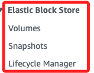

<br>

2. 提供了高可用性、高性能的持久性儲存解決方案，其中 EBS 卷可以在 EC2 實例停止後仍保留數據，實現持久儲存。

<br>

3. 快照提供增量備份功能，也可用來還原卷或在不同區域間進行數據遷移。

<br>

4. 用戶可與其他 AWS 帳號共享快照，方便數據傳輸和協作，也可設置自動快照政策，定期備份數據，或使用跨區域快照複製到不同的區域，提供災難恢復能力。

<br>

## 查詢 `Availability Zone`

1. 搜尋並進入服務 `EC2`，點擊左側欄或畫面中央的 `Instances`；點擊清單中的 `Lab` 的 `Instance ID`。

    

<br>

2. 進入後點擊清單中的 `Subnet ID`。

    

<br>

3. 滾動到右側 `Availability Zone`，確認顯示子網所在區域 `us-east-1a`。

    

<br>

4. 或是在 `Details` 訊息中也會顯示相關資訊。

    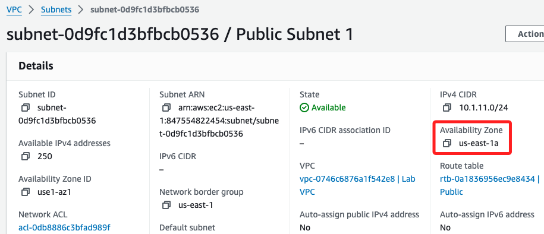

<br>

## 建立 `Volumes`

1. 回到 `EC2` 控制台中，點擊左側欄的 `Volumes`。

    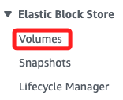

<br>

2. 點擊右上角 `Create Volume`

    

<br>

## 進行設定

1. 進行配置，`Volume Type` 為 `General Purpose SSD (gp2)`、`Size` 為 `1 GiB`、`Availability Zone` 與 EC2 實例相同的區域，也就是 `us-east-1a`。

    

<br>

2. 添加標籤。

    

<br>

3. 分別設置 Key 為 `Name`、Value 為 `My Volume`。

    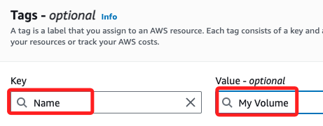

<br>

4. 點擊右下角的建立卷 `Create Volume`。

    

<br>

5. 系統會自動回到清單，手動滑到右側，先點擊上方的 `Refresh` 圖標刷新畫面以確認狀態 `Volume state` 變為 `Available`。

    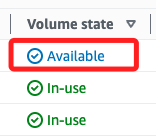

<br>

## 將卷附加到實例

1. 勾選建立的 `My Volume`，然後在 Actions 選單中選擇 `Attach Volume`。

    

<br>

2. 選擇實例 `Lab`。

    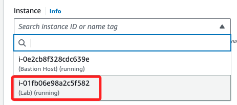

<br>

3. 裝置名稱選擇 `/dev/sdf`，然後點擊 `Attach Volume`；使用 `/dev/sdf` 是為了與 AWS 平台的預設行為一致，防止裝置名稱衝突，如果附加多個 EBS 卷，可選擇 `/dev/sdg`、`/dev/sdh` 等未被使用的裝置名稱。

    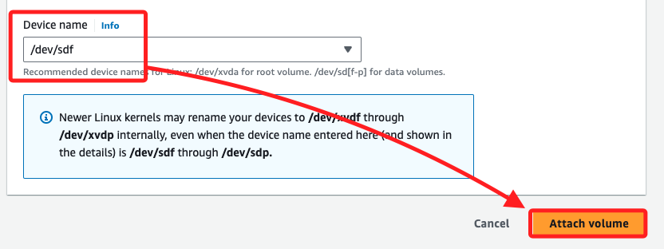

<br>

## 連接到 EC2 實例

1. 回到 EC2 控制台，點擊 `Instances` 進入實例清單，勾選前面步驟附加卷的實例 `Lab`，然後點擊 `Connect`。

    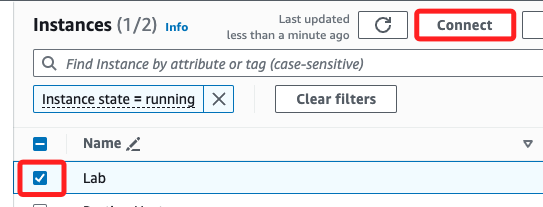

<br>

2. 相關設定都使用預設值，所以滾動到下方點擊 `Connect`。

    

<br>

## 配置文件系統

1. 檢查實例的儲存情況。

    ```bash
    df -h
    ```

    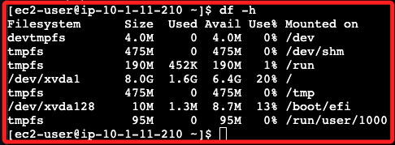

<br>

2. 在新卷上建立 `ext3` 文件系統。

    ```bash
    sudo mkfs -t ext3 /dev/sdf
    ```

    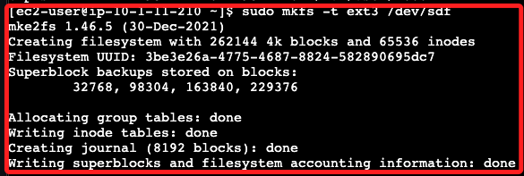

<br>

3. 建立掛載點。

    ```bash
    sudo mkdir /mnt/data-store
    ```

<br>

4. 掛載卷。

    ```bash
    sudo mount /dev/sdf /mnt/data-store
    ```

<br>

5. 將掛載設置保存到 `/etc/fstab`：

    ```bash
    echo "/dev/sdf /mnt/data-store ext3 defaults,noatime 1 2" | sudo tee -a /etc/fstab
    ```

    

<br>

6. 驗證儲存，從輸出可看出已經成功將 EBS 卷 `/dev/xvdf` 掛載到了路徑 `/mnt/data-store`，並且該卷的容量為 975MB，目前僅使用了 60KB，佔用了 1% 的儲存空間。

    ```bash
    df -h
    ```

    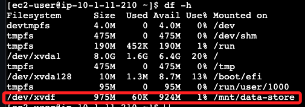

<br>

7. 建立文件並驗證。

    ```bash
    sudo sh -c "echo some text has been written > /mnt/data-store/file.txt"
    cat /mnt/data-store/file.txt
    ```

    

<br>

## 建立 EBS 快照

1. 返回 EC2 控制台並點擊左側欄進入 `Volumes`，勾選建立的 `My Volume`，展開右側 `Actions` 選單並點擊 `Create Snapshot`。

    

<br>

2. 添加標籤，將 Key 設置為 `Name`、Value 設置為 `My Snapshot`，然後點擊右下角的 `Create snapshot`。

    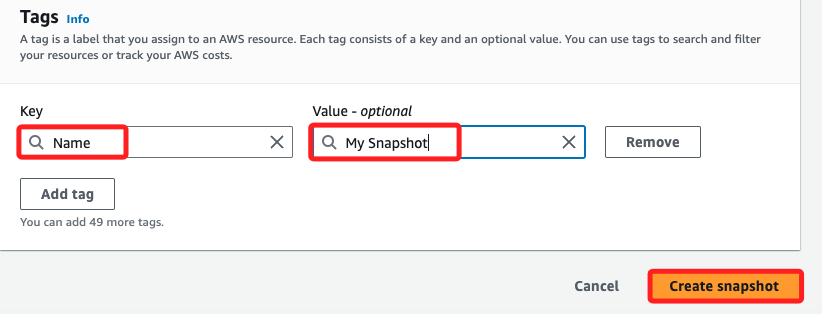

<br>

3. 點擊左側欄中的 `Snapshots`，進入後狀態會是 `Pending`，很快就會變為 `Completed`。

    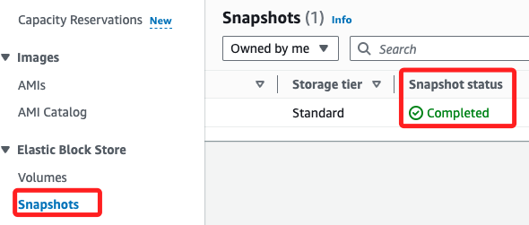

<br>

## 恢復 EBS 快照

_AMI（Amazon Machine Image）_

<br>

1. 回到 `EC2` 控制台中的 `Snapshots`，勾選 `My Snapshot`，從下拉選單中選取 `Create Volumn from snapshot`。

    

<br>

2. 選擇相同的 Volumn type，其他用預設值。

    

<br>

3. 添加標籤， Key 設置為 `Name`，Value 設定為 `Restored Volume`。

    

<br>

4. 點擊 `Create Volumn`。

    

<br>

5. 進入 Volumns，勾選前面建立的 `Restored Volumn`。

    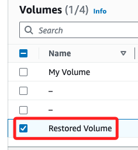

<br>

6. 狀態會顯示為 `Available`。

    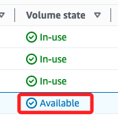

<br>

7. 然後在 Actions 選單中點擊 `Attach volumn` 掛載卷。

    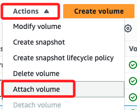

<br>

8. 實例選取 `Lab`。

    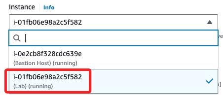

<br>

9. Device name 選擇 `/dev/sdg`，然後點擊 `Attach volume`。

    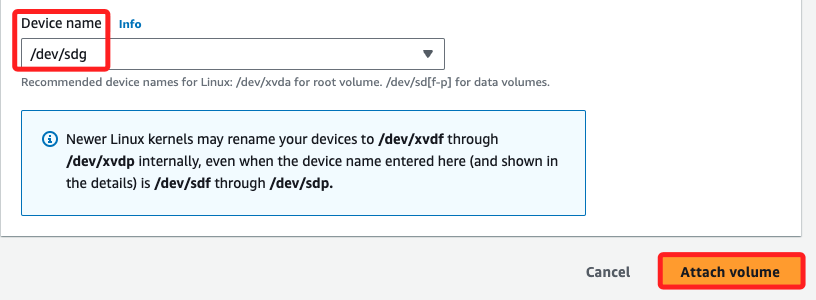

<br>

10. 回到清單中，這時全部 Volumns 都使用中。

    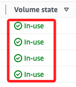

<br>

## 掛載到 EC2 實例

_回到終端機中_

<br>

1. 使用 EC2 Instance Connect 或 SSH 連接到您的 EC2 實例；或使用前面步驟尚未關閉的終端機，執行以下指令檢查新卷是否可用。

    ```bash
    lsblk
    ```

    

<br>

2. 建立掛載點。

    ```bash
    sudo mkdir /mnt/data-store2
    ```

<br>

3. 附加恢復的卷並掛載。

    ```bash
    sudo mount /dev/sdg /mnt/data-store2
    ```

<br>

4. 驗證文件是否存在。

    ```bash
    ls /mnt/data-store2/
    ```

    

<br>

## 完成並提交

_Submit & End Lab；發現一個問題，似乎命名也必須依照教程來做才會判定完成_

<br>

___

_END_