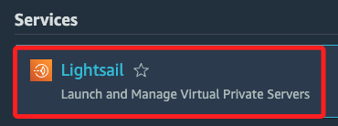
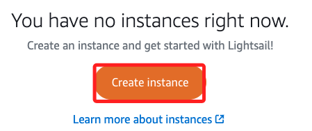
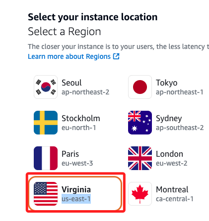
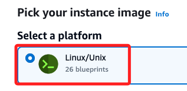
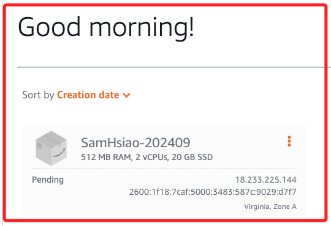
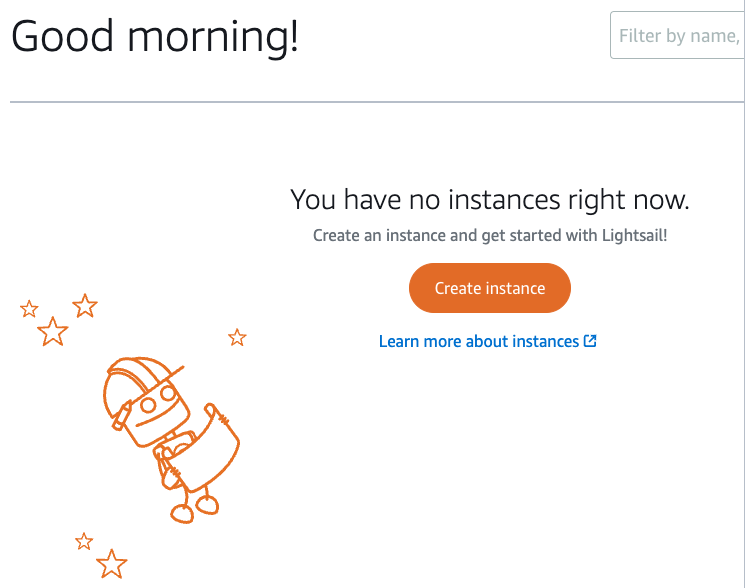

# Lightsail 簡介

_Academy 帳號似乎無權限使用，切換到個人帳號完成以下筆記_

<br>

## 簡介

_看了 Lightsail 介紹，簡單來說就像是一個簡化版的 EC2，適用於初學或是小型專案，相關細節不再贅述。_

<br>

## 操作記錄

_以下示範建立實例、SSH 連線、Python 腳本操作等_

<br>

1. 搜尋並進入 `Lightsail`。

    

<br>

2. 點擊 `Create instance` 建立實例。

    

<br>

3. 選擇區域，預設在新加坡，切換到 `us-east-1`。

    

<br>

4. 選擇 Platform `Linux/Unix`。

    

<br>

5. 選擇 OS，基本上都與建立 EC2 相同。

    

<br>

6. 選擇伺服器方案；其中 `Dual-stack` 允許實例同時支持 IPv4 和 IPv6，也就是實例將擁有公共的 IPv4 地址以及公共的 IPv6 地址，並可以通過兩種協議訪問；另外一個選項則限用 `IPv6`。

    

<br>

7. 任意命名如 `SamHsiao-202409`，這個命名也必須是唯一識別。

    

<br>

8. 點擊下方 `Create instance`。

    

<br>

9. 完成；顯示為 `Pending`。

    

<br>

10. 等待一下，直到顯示 `Running`。

    

<br>

## 連接實例

1. 建立實例後，點擊終端機圖標可自動透過 SSH 連接實例。

    

<br>

2. 展開實例右側選單，點擊其中 `Manage` 可進入細節畫面。

    

<br>

3. 點擊下方 `Download default key` 可下載 `*.pem` 文件。

    

<br>

4. 預設的使用者名稱依舊是 `ec2-user`；同時會顯示公共 IP。

    

<br>

5. 與 EC2 操作相同，可編輯遠端的 `authorized_keys` 文件，讓本機進行遠端連線且無需輸入密碼。

    ```bash
    sudo ~/.ssh/authorized_keys
    ```

<br>

6. 查詢本機的 `*.pub` 文件，這將用於貼到遠端主機上進行認證使用。

    ```bash
    cat ~/.ssh/id_rsa.pub
    ```

<br>

7. 貼到遠端後，使用本機終端進行連線。

    ```bash
    ssh ec2-user@18.233.225.144
    ``` 

<br>

8. 完成連線；其餘操作如設置靜態 IP 或寫入密鑰等，與之前前面 EC2 相同，此處不再贅述。

    

<br>

## 使用 Python 控制 Lightsail

_Lightsail 支援 boto3 進行自動化操作，以下示範簡單的查詢與刪除程序_

<br>

1. 安裝 `boto3`。

    ```bash
    pip install boto3
    ```

<br>

2. 建立 Python 腳本，對當前 `Lightsail` 實例進行查詢。

    ```python
    import boto3

    # 初始化 Lightsail 客戶端
    client = boto3.client('lightsail')

    # 列出所有實例並回傳其狀態資訊
    def list_instances():
        try:
            # 調用 Lightsail API 來獲取實例資訊
            response = client.get_instances()
            instances = response.get('instances', [])
            
            if not instances:
                print("目前沒有任何 Lightsail 實例。")
            else:
                for instance in instances:
                    # 使用 .get() 方法來避免 KeyError
                    instance_name = instance.get('name', '無')
                    instance_state = instance.get('state', {}).get('name', '無')
                    instance_id = instance.get('instanceId', '無')
                    blueprint_id = instance.get('blueprintId', '無')
                    bundle_id = instance.get('bundleId', '無')
                    public_ip = instance.get('publicIpAddress', '無')

                    # 顯示每個實例的名稱、狀態和其他相關資訊
                    print(f"實例名稱: {instance_name}")
                    print(f"狀態: {instance_state}")
                    print(f"實例ID: {instance_id}")
                    print(f"藍圖ID（系統映像）: {blueprint_id}")
                    print(f"伺服器配置: {bundle_id}")
                    print(f"公有IP地址: {public_ip}")
                    print("-" * 40)
        except Exception as e:
            print(f"列出實例時出現錯誤: {e}")

    if __name__ == "__main__":
        # 查詢並列出所有實例
        list_instances()
    ```

    _輸出_

    ```bash
    實例名稱: SamHsiao-202409
    狀態: running
    實例ID: 無
    藍圖ID（系統映像）: amazon_linux_2023
    伺服器配置: nano_3_0
    公有IP地址: 18.233.225.144
    ```

<br>

3. 刪除實例。

    ```python
    import boto3

    # 初始化 Lightsail 客戶端
    client = boto3.client('lightsail')

    # 列出所有 Lightsail 實例並回傳其狀態資訊
    def list_instances():
        try:
            # 調用 Lightsail API 來獲取實例資訊
            response = client.get_instances()
            instances = response.get('instances', [])
            
            if not instances:
                print("目前沒有任何 Lightsail 實例。")
            else:
                for instance in instances:
                    # 使用 .get() 方法來避免 KeyError
                    instance_name = instance.get('name', '無')
                    instance_state = instance.get('state', {}).get('name', '無')
                    instance_id = instance.get('instanceId', '無')
                    blueprint_id = instance.get('blueprintId', '無')
                    bundle_id = instance.get('bundleId', '無')
                    public_ip = instance.get('publicIpAddress', '無')

                    # 顯示每個實例的名稱、狀態和其他相關資訊
                    print(f"實例名稱: {instance_name}")
                    print(f"狀態: {instance_state}")
                    print(f"實例ID: {instance_id}")
                    print(f"藍圖ID（系統映像）: {blueprint_id}")
                    print(f"伺服器配置: {bundle_id}")
                    print(f"公有IP地址: {public_ip}")
                    print("-" * 40)
        except Exception as e:
            print(f"列出實例時出現錯誤: {e}")

    # 刪除指定的 Lightsail 實例
    def delete_instance(instance_name):
        try:
            # 調用 Lightsail API 來刪除實例
            response = client.delete_instance(
                instanceName=instance_name
            )
            print(f"實例 {instance_name} 刪除成功。")
        except Exception as e:
            print(f"刪除實例 {instance_name} 時出現錯誤: {e}")

    if __name__ == "__main__":
        # 列出所有實例
        list_instances()

        # 刪除實例
        instance_to_delete = input("請輸入要刪除的實例名稱: ")
        delete_instance(instance_to_delete)
    ```

<br>

2. 執行後會先顯示當前實例資訊。

    ```bash
    實例名稱: SamHsiao-202409
    狀態: running
    實例ID: 無
    藍圖ID（系統映像）: amazon_linux_2023
    伺服器配置: nano_3_0
    公有IP地址: 18.233.225.144
    ```

<br>

3. 最上方會顯示對話窗，可複製 Cell 所輸出的 `實例名稱`，複製貼在上方對話框中，然後按下 `ENTER` 進行刪除。

    

<br>

4. 顯示刪除結果。

    ```bash
    實例 SamHsiao-202409 刪除成功。
    ```

<br>

5. 再次透過第一個腳本進行查詢。

    

<br>

6. 進入主控台查看，不存在已刪除的實例。

    

<br>

___

_END_
