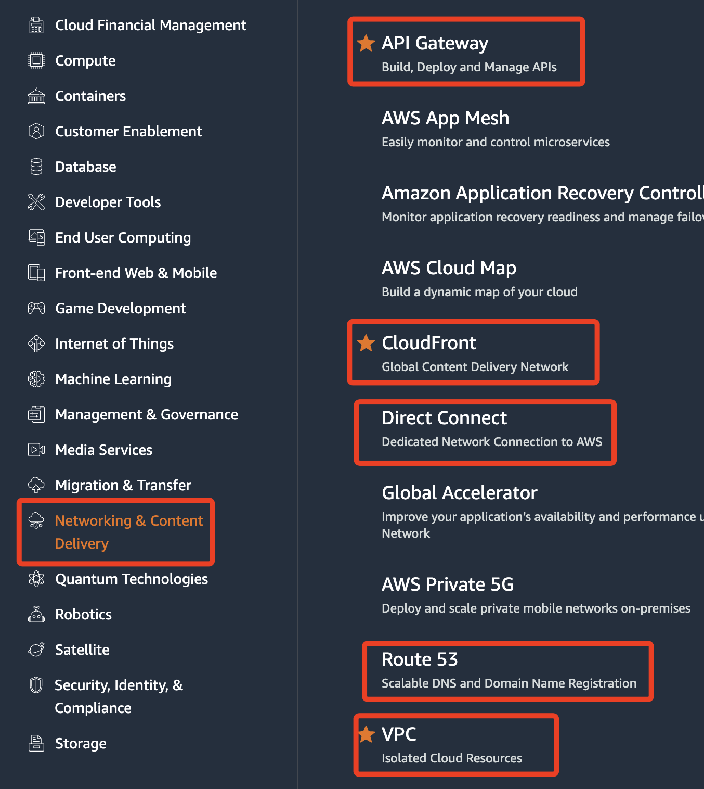
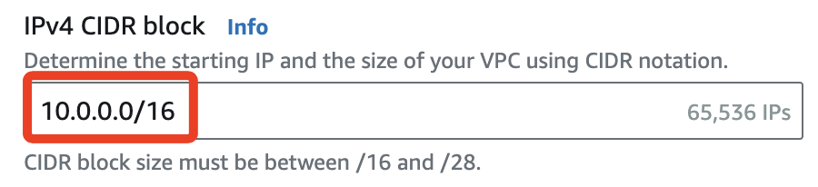
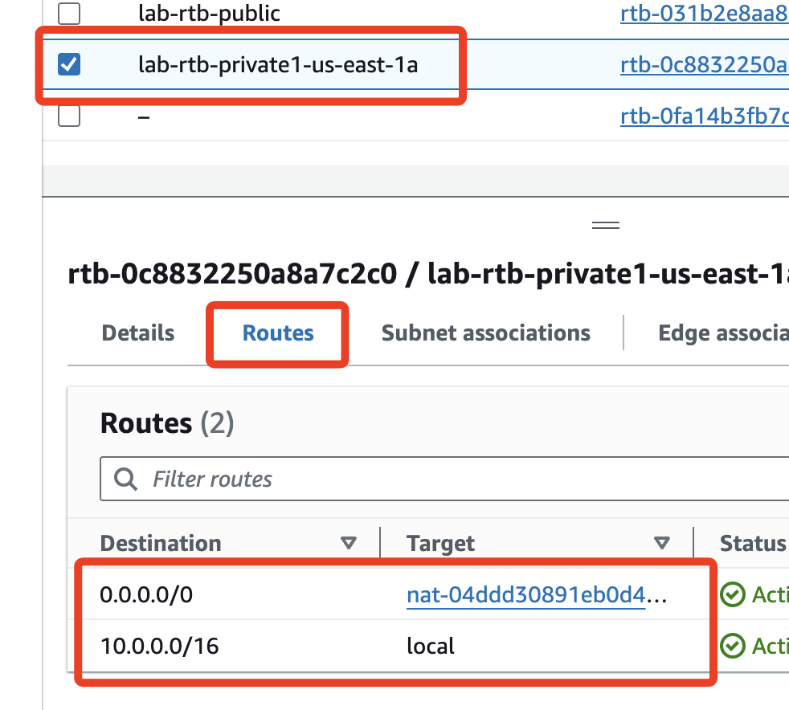

# VPC

_虛擬私有雲，也就是 `機房`_

##

1. 可將多台路由串接起來
2. 安全群組就是防火牆，為何？
3. 考試會考的項目

4. CIDR

# 關於 IP

`10.0.0.0/16` 中的 `16` 代表 `10.0` 前面的 `16.0` 是不可動的，也就是 `16` 個 `bit` 不可動。

同理，`10.0.0.0/24` 所代表的就是 `10.0.0` 是不可動的，至多有 256 台電腦，但因為部份 IP 被固定座指定功能，所以只有 251 個 IP。

整體來說，也就是可以有 256 個子網路、每個子網路可以有 256 個設備，也就是 256 個 IP。
我有個疑惑，為何 `10.0.0.0/16` 只可以有 256 個子網？

6. `us-east-1a` 中的`us-east-1` 就是 `Region` 的編號，尾綴 `a` 所代表的就是第幾個 AZ，依照英文小寫字母順序排列，`a` 就是第一個 AZ。

##

切換到 Routes，其中 `nat` 指的是訪問外網，`10.0.0.0/16` 指的是內網，所以是 `local`

一個 route table 可以掛在兩個子網上，但一個子網不可以有兩個 route table

# AWS 網路

## `10.0.0.0/16` 與子網遮罩的原理

1. `10.0.0.0/16` 表示這個網路使用 16 位元 (bit) 的子網遮罩。

2. 這個 `/16` 表示網路的前 16 個位元是固定的，代表的是 `網路位址 (Network Address)` 的部分，也就是 `10.0` 這一段。

3. 剩下的 16 個位元可以用來指派 `主機 (Host)`  位址，因此主機位址範圍是從 `10.0.0.0` 到 `10.0.255.255`。

4. 理論上，這樣的子網可以容納 `65,536` 個 IP 位址 `(2^16 = 65536)`，但實際上，兩個 IP 是保留的，第一個是 `網路位址 (Network Address) 10.0.0.0`，用來表示這個子網本身。
     - 廣播位址 (Broadcast Address): `10.0.255.255`，用來在子網內向所有主機廣播訊息。
   - 因此，實際上可以分配的 IP 位址為 65,534 個。

5. `10.0.0.0/24` 中的 `/24` 表示前 24 個位元是固定的。
   - 這表示 `10.0.0` 部分代表網路位址，剩下的 8 個位元 (即最後一個八位元組) 可用於主機位址。
   - 主機 IP 位址範圍是 `10.0.0.1` 到 `10.0.0.254`，其中 `10.0.0.0` 是網路位址，`10.0.0.255` 是廣播位址。
   - 這樣的子網可容納 256 個 IP 位址，但實際上，只能分配 254 個，因為 `10.0.0.0` 和 `10.0.0.255` 分別作為網路位址和廣播位址。

### 計算可分配的 IP 位址

- 網路位址 是一個 IP 區段的開始，用來表示這個子網，不會被分配給設備。
- 廣播位址 用來在這個子網上向所有設備傳送廣播訊息，也不能分配給設備。
- 因此，在每個子網中，實際可分配的 IP 位址數量 = `總位址數 - 2`。

### 關於 "至多 256 台電腦，實際上只有 251 台" 的說法

這個描述有些不正確。在 `/24` 子網中，實際上能夠分配 254 個 IP 位址，而不是 251 個。可能是因為有些設備保留了一些特定的 IP 位址用於網關、路由器等用途，所以有人會說實際可用的會少於 254 台，但這是基於網路管理上的需求，而非技術上的限制。

### 總結

1. `/16` 中的 `16` 是指前 16 個位元表示網路位址，後 16 個位元用於主機位址，因此可以有 65,534 個可用 IP。
2. `/24` 中的 `24` 是指前 24 個位元表示網路位址，後 8 個位元用於主機位址，因此可以有 254 個可用 IP。

這樣的子網劃分 (subnetting) 是基於 IP 位址和子網遮罩的原理進行的，不是簡單地將每段 IP 拆解為某個數字固定不可動。