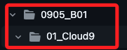
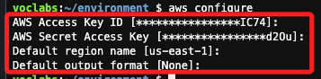
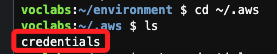
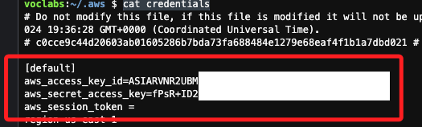
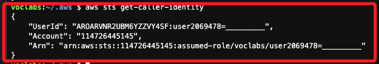
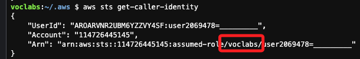
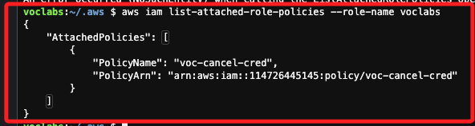
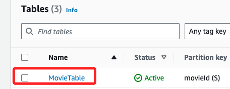

_以下先參考課程筆記中的 0905_B01_



<br>

## 說明

_在 AWS Cloud9 中，可使用 AWS CLI 與 DynamoDB 互動_

<br>

1. 在 Cloud9 環境中，AWS CLI 已經預設安裝好，並且會自動配置權限連接到 AWS 資源；可檢查是否有適當的權限來操作 DynamoDB，例如 `AmazonDynamoDBFullAccess` 權限的 IAM 角色。

<br>

2. 檢查 AWS CLI 設置。

    ```bash
    aws configure
    ```

    

<br>

3. 切換到所在路徑。

    ```bash
    cd ~/.aws && ls
    ```

    

<br>

4. 依據結果顯示文件內容。

    ```bash
    cat credentials
    ```

    

<br>

5. 使用以下 AWS CLI 命令來查詢當前 IAM 角色的權限。

    ```bash
    aws sts get-caller-identity
    ```

    

<br>

6. 可知使用的角色是 `voclabs`。

    

<br>

7. 列出附加到該角色的策略。

    ```bash
    aws iam list-attached-role-policies --role-name voclabs
    ```

    

<br>

## 創建 DynamoDB 表格

1. 使用 AWS CLI 創建一個新的 DynamoDB 表格，這將創建一個名為 `MovieTable` 的表格，使用 `movieId` 作為主鍵。

    ```bash
    aws dynamodb create-table \
        --table-name MovieTable02 \
        --attribute-definitions AttributeName=movieId,AttributeType=S \
        --key-schema AttributeName=movieId,KeyType=HASH \
        --provisioned-throughput ReadCapacityUnits=5,WriteCapacityUnits=5
    ```

    

<br>

2. 使用 `put-item` 命令插入資料到 DynamoDB 表格。

    ```bash
    aws dynamodb put-item \
        --table-name MovieTable \
        --item '{"movieId": {"S": "26"},
            "title": {"S": "黑客帝國"},
            "genres": {"S": "科幻片"}
        }'
    ```

<br>

3. 查詢所有資料（使用 `scan`）。

    ```bash
    aws dynamodb scan --table-name MovieTable
    ```

<br>

4. 查詢特定資料（使用 `get-item`），這會查詢 `movieId` 為 `26` 的項目，並返回該電影的所有資料。

    ```bash
    aws dynamodb get-item \
        --table-name MovieTable \
        --key '{"movieId": {"S": "26"}}'
    ```

<br>

5. 如果要更新某個項目中的屬性，可以使用 `update-item` 命令；這會將 `movieId` 為 `26` 的電影標題更新為 `黑客帝國重啟`。

    ```bash
    aws dynamodb update-item \
        --table-name MovieTable \
        --key '{"movieId": {"S": "26"}}' \
        --update-expression "SET title = :t" \
        --expression-attribute-values '{":t": {"S": "黑客帝國重啟"}}'
    ```

<br>

6. 可以使用 `delete-item` 命令刪除某個特定的項目；這會刪除 `movieId` 為 `26` 的項目。

    ```bash
    aws dynamodb delete-item \
        --table-name MovieTable \
        --key '{"movieId": {"S": "26"}}'
    ```

<br>

7. 刪除表格。

    ```bash
    aws dynamodb delete-table --table-name MovieTable
    ```

<br>

___

_END_