# 今日課程

_今天使用 Learner Lab `90630`；以下結合 EC2、終端機、VSCode、FileZilla 進行各種連線與檔案傳輸操作。_

<br>

## 建立 EC2 實例

1. 進入 `EC2` -> `Launch instance`；任意命名如 `_ex0926_`，其餘按預設（略）。

<br>

2. `Key pair` 要點擊 `Create new key pair` 建立，因為預設的 `vockey` 無法下載密鑰文件到本地，在後續操作中可使用 `.ppk` 或 `.pem` 文件；另外，假如不使用 AWS 密鑰也無妨，可將本地公鑰複製到 EC2 的 `.ssh` 資料夾內的 `authorized_keys` 文件中，這樣操作甚至在連線時無需再透過 `-i` 參數指定密鑰，可參考之前的講義。

    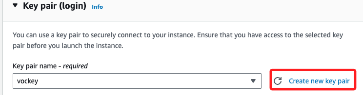

<br>

3. 自訂名稱如 `MyKey0926`；在 `type` 部分選擇 `.pem` 或 `.ppk` 皆可，因為這兩個文件是可以互轉的，但若是已知用途則可下載指定格式，其中 `.pem` 用於 Linux 和 MacOS，`.ppk` 則用於 `Windows 上的 PuTTY SSH`，這裡示範使用 `.pem`。

    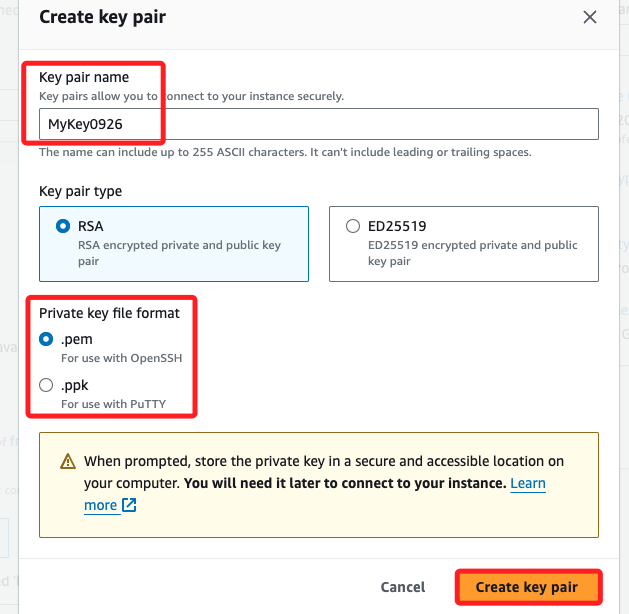

<br>

4. 點擊 `Create key pair` 後，密鑰文件會被自動下載。

    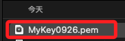

<br>

5. 在網路設定 `Network settings` 部分，選擇預設的 `Create security group` 或是 `Select existing security group` 皆可，兩者在 Lab 中的差異在於預設的安全群組並未設定必要的入站規則 `Inbound Rules`，假如選擇 `Create security group` 時，後續需要手動設定。

    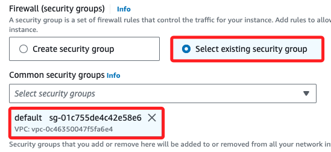

<br>

6. 或是選取建立新的安全群組，並將下方 `HTTPS` 及 `HTTP` 勾選；其中 `SSH` 端口 `22` 預設已經開啟。

    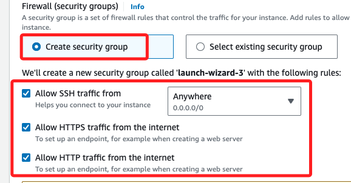

<br>

7. 接下來在 `Advanced details` 部分，可以參考 _副校長_ 在 `Lab2` 的 `VPC` 中講述的，直接在這裡寫腳本來安裝所需套件；這裡並未安裝 MariaDB 或 MySQL 相關套件，之後可透過終端機來練習；貼上腳本後點擊 `Launch instance`。

    ```bash
    #!/bin/bash
    # 更新系統
    dnf update -y

    # 安裝 httpd 和 wget
    dnf install -y httpd wget

    # 下載並解壓縮網站檔案
    wget https://aws-tc-largeobjects.s3.us-west-2.amazonaws.com/CUR-TF-100-ACCLFO-2/2-lab2-vpc/s3/lab-app.zip
    unzip lab-app.zip -d /var/www/html/

    # 啟用並啟動 HTTP 伺服器
    systemctl enable httpd
    systemctl start httpd
    ```

<br>

## 在 AWS 中連線 EC2

_進入 AWS 預設的終端機中_

<br>

1. 先進入實例中，點擊 `Connect` 確認運行狀態。

    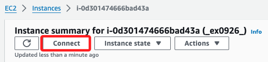

<br>

2. 進入終端機後，檢查服務運行狀態。

    ```bash
    systemctl status httpd
    ```

    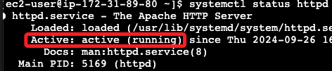

<br>

## 在本機使用 `SSH` 連線 EC2

1. 可檢查 `.pem` 文件的權限。

    ```bash
    ls -l <將密鑰文件拖曳進入終端機>
    ```

<br>

2. 顯示預設權限是 `644`，按照官方手冊，必須下修到 `400`。

    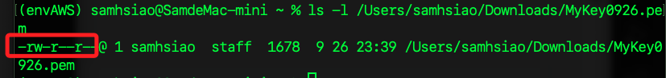

<br>

3. 透過下指令下修權限。

    ```bash
    chmod 400 <將密鑰文件拖曳進入終端機>
    ```

<br>

4. 然後使用 `ssh` 指令進行連線，並透過參數 `-i` 指令密鑰。

    ```bash
    ssh -i <密鑰文件>  ec2-user@<使用EC2的公共IP>
    ```

    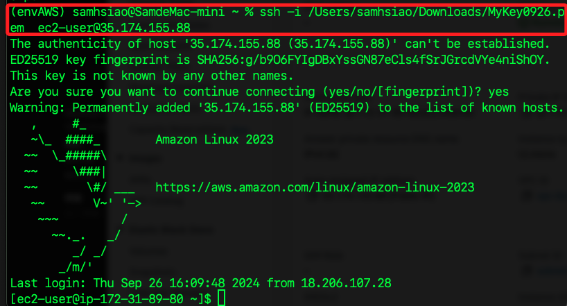

<br>

## 使用 FileZilla 連線 EC2

1. 新增站台，在 `一般設定` 頁籤中，設定以下必要項目。

    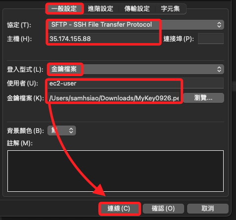

<br>

2. 彈窗中點擊 `確認`。

    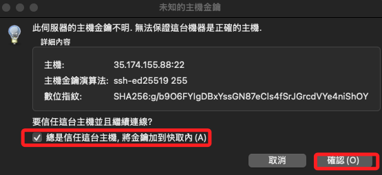

<br>

3. 順利連線會顯示遠端站台的內容。

    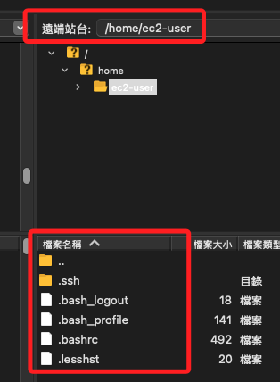

<br>

## 使用 VSCode 連線 EC2

1. 點擊 `遠端總管`。

    

<br>

2. 直接在 `SSH` 中點擊齒輪圖標來編輯設定文件。

    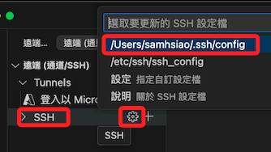

<br>

3. 添加以下設定。

    ```bash
    Host MyEC2
        HostName 35.174.155.88 
        User ec2-user
        IdentityFile "/Users/samhsiao/Downloads/MyKey0926.pem"
        Port 22
    ```

<br>

4. 很快便會完成連線。

    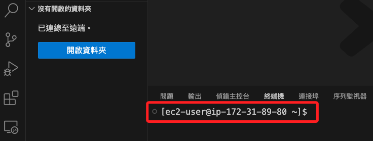

<br>

## 設置 EC2 目錄權限

_接下來要進行網頁編輯，為了在 Terminal、Putty、VSCode 等環境下皆可編輯，在此先進行權限設定；特別說明，AWS 並無 `www-data` 群組，所以 `chown` 的時候直接指定新的擁有者。_

<br>

1. 將目錄的擁有者設為 `ec2-user`，不指定群組。

    ```bash
    sudo chown -R ec2-user /var/www/html/
    ```

<br>

2. 設置目錄的權限。

    ```bash
    sudo chmod -R 755 /var/www/html/
    ```

<br>

3. 完成後，先嘗試在 VSCode 中進入 `/var/www/html/`，點擊右側 `確定`。

    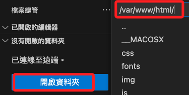

<br>

4. 直接添加 `index.html` 文件，可以完成代表已具備權限。

    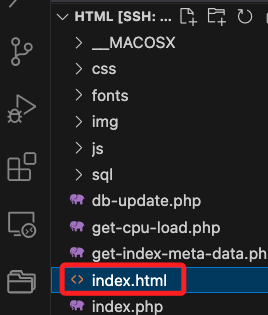

<br>

## 使用 VSCode 編輯遠端站台

_延續前面步驟操作

<br>

1. 使用 VSCode 快速鍵 `!` 編輯簡單內容，更改 `title`、在 `body` 添加 `H1` 標籤。

    ```html
    <!DOCTYPE html>
    <html lang="en">
    <head>
        <meta charset="UTF-8">
        <meta name="viewport" content="width=device-width, initial-scale=1.0">
        <title>AWS EC2</title>
    </head>
    <body>
        <H1>測試網頁內容</H1>
    </body>
    </html>
    ```

<br>

2. 直接訪問 EC2 公共 IP。

    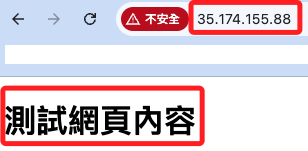

<br>

## 在本地終端機編輯站台

1. 開啟終端機，進入桌面並建立臨時目錄如 `_ex0927_`。

    ```bash
    cd ~/Desktop && mkdir _ex0927_ && cd _ex0927_
    ```

<br>

2. 編輯 `index.html` 文件。

    ```bash
    sudo nano index.html
    ```

<br>

3. 貼上以下內容，然後點擊 `control+o`、`control+x`。

    ```html
    <!DOCTYPE html>
    <html lang="en">
    <head>
        <meta charset="UTF-8">
        <meta name="viewport" content="width=device-width, initial-scale=1.0">
        <title>AWS EC2</title>
    </head>
    <body>
        <H1>測試網頁內容 02</H1>
    </body>
    </html>
    ```

<br>

4. 透過 scp 指令傳送。

    ```bash
    scp -i <密鑰文件> ./index.html ec2-user@<EC2公共IP>:/var/www/html/
    ```

    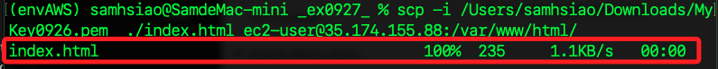

<br>

5. 刷新頁面。

    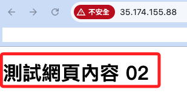

<br>

## 使用 FileZilla 上傳站台文本

1. 先使用 `nano` 在資料夾中將 `index.html` 文件修改為 `測試網頁內容 03` 或任意可識別修改的文字。

<br>

2. 可使用 `pwd` 查詢腳本所在路徑。

    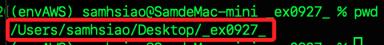

<br>

3. 複製路徑貼到 `本地站台` 路徑中。

    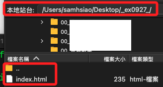

<br>

4. 遠端站台路徑則是 `/var/www/html`。

    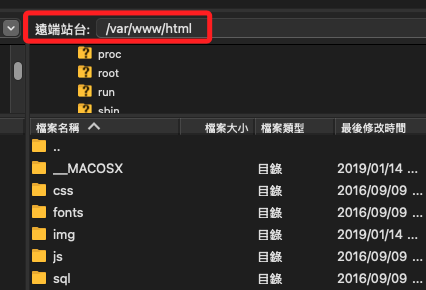

<br>

5. 點擊上傳。

    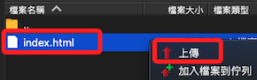

<br>

6. 覆寫。

    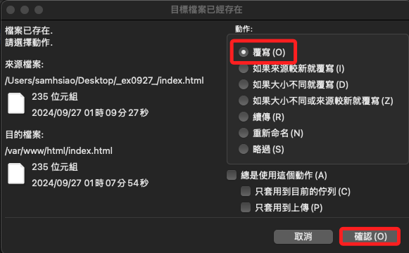

<br>

7. 再次刷新 EC2 網站。

    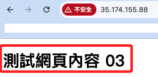

<br>

## 透過本地終端機在 EC2 安裝套件

_關於安裝 MariaDB，結合 副校長在 `0903` 講述 `EC2` 的內容；無論是在 AWS 內建終端機、本地電腦終端機、或是 VSCode 中的終端機操作皆可。_

<br>

1. 開啟終端機，並完成連線，首先安裝 `MariaDB`。

    ```bash
    sudo dnf install -y mariadb105-server
    ```

<br>

2. 啟動並設置 MariaDB 在開機時啟動。

    ```bash
    sudo systemctl start mariadb && sudo systemctl enable mariadb
    ```

<br>

3. 檢查 MariaDB 伺服器的運行狀態。

    ```bash
    sudo systemctl status mariadb
    ```

    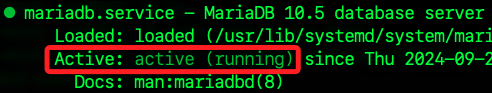

<br>

4. 執行 MariaDB 安全設置腳本來配置 root 密碼和其他安全選項。

    ```bash
    sudo mysql_secure_installation
    ```

<br>

5. 設定與一般 MySQL 初始設定皆相同；第一個設定預設無密碼直接按下 `ENTER`；後續設定除了最後一個刷新授權設定輸入 `y` 以外，其餘皆輸入 `n` 即可；完成顯示如下。

    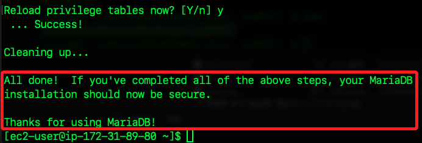

<br>

6. 添加進站規則，記得點擊儲存。

    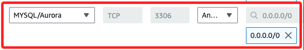

<br>

7. 編輯編輯 MariaDB 配置文件。

    ```bash
    sudo nano /etc/my.cnf.d/mariadb-server.cnf
    ```

<br>

8. 找到以下行，將預設的註解取消，表示 MariaDB 將接受所有 IP 的連接。

    ```bash
    bind-address = 0.0.0.0
    ```

<br>

9. 修改設定文件後都要重啟服務。

    ```bash
    sudo systemctl restart mariadb
    ```

<br>

10. 因爲預設下是禁止 root 進行遠端連線的，所以要建立新的資料庫使用者；先連線 EC2，並使用 root 權限登入 MariaDB 資料庫；注意，預設無密碼，按下 `ENTER` 即可。

    ```bash
    sudo mysql -u root -p
    ```

<br>

11. 建立任意名稱使用者，這裡示範同名的 ec2-user，密碼設定為 112233，並授予來自任何主機的訪問權限。

    ```sql
    CREATE USER 'ec2-user'@'%' IDENTIFIED BY '112233';
    GRANT ALL PRIVILEGES ON *.* TO 'ec2-user'@'%' WITH GRANT OPTION;
    FLUSH PRIVILEGES;
    ```

<br>

12. 從本機進行連線。

    ```bash
    mysql -h <EC2公共IP> -u ec2-user -p
    ```

<br>

13. 若本機 MySQL 與遠端的 MariaDB 存在兼容性或其他 SSL 的問題將無法連線，排除方式很多，這裡暫時不處置。

    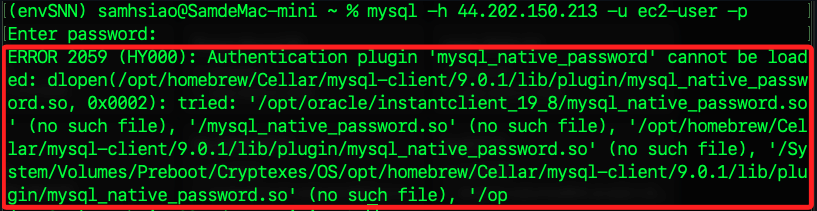

<br>

## 使用 Workbench 連線 EC2

1. 添加連線，簡易設定。

    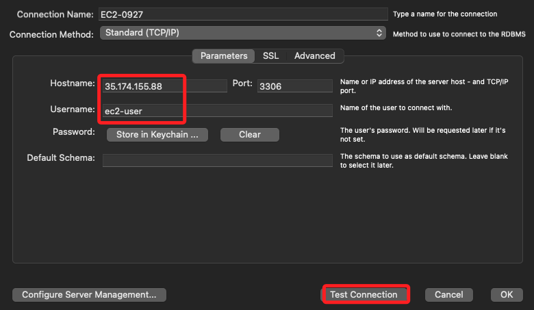

<br>

2. 連線，點擊 `OK`。

    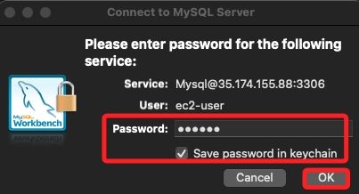

<br>

3. 成功時會出現警告。

    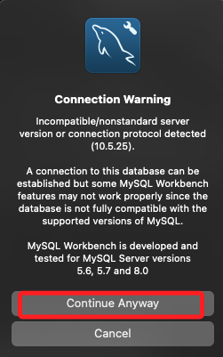

<br>

4. 點擊清單中的連線。

    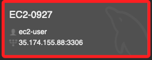

<br>

5. 順利完成連線，資料庫操作部分這裡不做贅述。

    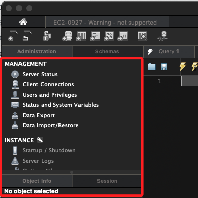

<br>

___

_END_